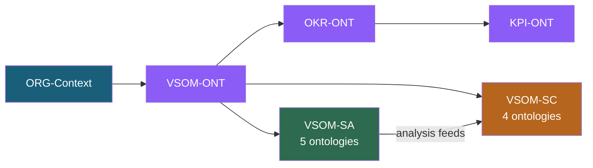

# VE-Series (Value Engineering Series)

**Status:** Active — 15 ontologies across 6 core + 2 sub-series
**OAA Schema Version:** 6.1.0
**Registry:** ont-registry-index.json v7.0.0
**Last Updated:** 2026-02-13

## Overview

The Value Engineering (VE) Series is a collection of **15 interconnected ontologies** modelling value engineering across strategic, operational, market, and organisational dimensions. All ontologies connect via the OrganizationContext hub from ORG-ONT.

The series comprises:

- **6 Core Ontologies** — strategic spine covering [VSOM](VSOM-ONT/), [OKR](OKR-ONT/), [KPI](KPI-ONT/), [VP](VP-ONT/), [PMF](PMF-ONT/), and [RRR](RRR-ONT/)
- **5 [VSOM-SA](VSOM-SA/BRIEFING-VSOM-Strategy-Analysis.md) Ontologies** (Strategy Analysis) — rigorous strategic analysis frameworks layered on the VSOM spine
- **4 [VSOM-SC](VSOM-SC/BRIEFING-VSOM-Strategy-Communication.md) Ontologies** (Strategy Communication) — strategy communication, audience cascade, culture alignment, and visual artefacts

**SA + SC together = strategy that is both rigorous and understood.**

## Series Architecture

```
ORG-Context (hub)
    └── hasValueEngineering
            │
            ├── VE-VSOM ──────────► VSOM-ONT
            │       │
            │       ├── VE-OKR ───► OKR-ONT
            │       │       │
            │       │       └── VE-KPI ──► KPI-ONT
            │       │
            │       ├── VSOM-SA (Strategy Analysis)      "How we think"
            │       │     L1 MACRO-ONT      → environmental scanning
            │       │     L2 INDUSTRY-ONT   → competitive positioning
            │       │     L3 BSC-ONT        → organisational alignment
            │       │     L4 REASON-ONT     → analytical reasoning
            │       │     L5 PORTFOLIO-ONT  → portfolio execution
            │       │
            │       └── VSOM-SC (Strategy Communication) "How we tell"
            │             C1 NARRATIVE-ONT  → strategic storytelling
            │             C2 CASCADE-ONT    → audience translation & fidelity
            │             C3 CULTURE-ONT    → strategic culture alignment
            │             C4 VIZSTRAT-ONT   → visual strategy artefacts
            │
            ├── VE-VP ────────────► VP-ONT
            │       │
            │       └── VE-PMF ───► PMF-ONT
            │
            └── VE-RRR ───────────► RRR-ONT (Roles/RACI/RBAC)
```

### SA → SC Handoff

VSOM-SA produces analytical outputs (synthesis findings, recommendations, scorecards, investment maps, direction summaries). VSOM-SC takes those outputs and organises them into structures that teams can evolve, share, and act on — audience-appropriate, structurally consistent, fidelity-tracked.

```
SA outputs (structured data) ──► SC inputs (communication structure)

pfl:StrategicDirectionSummary  ───► Narrative content source
rsn:AnalysisSynthesis          ───► Evidence chain for storytelling
bsc:StrategyMap                ───► Visual artefact source
rrr:ExecutiveRole              ───► Audience definition & cascade routing
```

## Core Ontology Sequence

| Order | Ontology | Full Name | Status | OAA | Dependencies |
|-------|----------|-----------|--------|-----|--------------|
| 1 | **[VSOM-ONT](VSOM-ONT/)** | Vision-Strategy-Objectives-Metrics | Compliant | v6.1.0 | ORG-Context |
| 2 | **[OKR-ONT](OKR-ONT/)** | Objectives & Key Results | Compliant | v6.1.0 | ORG-Context, VSOM |
| 3 | **[KPI-ONT](KPI-ONT/)** | Key Performance Indicators | Compliant | v6.1.0 | ORG-Context, OKR |
| 4 | **[VP-ONT](VP-ONT/)** | Value Proposition | Compliant | v6.1.0 | ORG-Context |
| 5 | **[PMF-ONT](PMF-ONT/)** | Product-Market Fit | Compliant | v6.1.0 | ORG-Context, VP |
| 6 | **[RRR-ONT](RRR-ONT/)** | Roles, RACI, RBAC | Compliant | v6.1.0 | ORG-Context, ORG |

## VSOM-SA: Strategy Analysis Sub-Series

**Status:** Implemented — 5 ontologies compliant at OAA v6.1.0
**Briefing:** [BRIEFING-VSOM-Strategy-Analysis.md](VSOM-SA/BRIEFING-VSOM-Strategy-Analysis.md)

VSOM-SA adds 5 strategic analysis ontologies in a concentric layer model. Each layer addresses a different scope and time horizon, and each feeds into specific VSOM components. It transforms VSOM from a strategy *definition* framework into a full strategy *analysis and execution* system.

### Five-Layer Architecture

```
┌─────────────────────────────────────────────────────────────┐
│  L1: MACRO (PESTEL, Scenarios, Futures Funnel, Backcasting) │
│  ┌───────────────────────────────────────────────────────┐  │
│  │  L2: INDUSTRY (Porter 5F, SWOT/TOWS, Ansoff Growth)  │  │
│  │  ┌─────────────────────────────────────────────────┐  │  │
│  │  │  L3: BSC (Balanced Scorecard, Strategy Maps,    │  │  │
│  │  │       Stakeholder, Value Chain, Lifecycle)       │  │  │
│  │  │  ┌───────────────────────────────────────────┐  │  │  │
│  │  │  │  L4: REASON (MECE, Logic Trees,           │  │  │  │
│  │  │  │       Hypothesis-Driven, Synthesis)        │  │  │  │
│  │  │  │  ┌─────────────────────────────────────┐  │  │  │  │
│  │  │  │  │  L5: PORTFOLIO (BCG, Three Horizons,│  │  │  │  │
│  │  │  │  │       Investment Maps, Strategic     │  │  │  │  │
│  │  │  │  │       Lens, Direction Summary)       │  │  │  │  │
│  │  │  │  └─────────────────────────────────────┘  │  │  │  │
│  │  │  └───────────────────────────────────────────┘  │  │  │
│  │  └─────────────────────────────────────────────────┘  │  │
│  └───────────────────────────────────────────────────────┘  │
└─────────────────────────────────────────────────────────────┘
                           │
                    VSOM = SPINE
          (Vision, Strategy, Objectives,
           Metrics, Review Cycle)
```

### SA Ontologies

| Layer | Ontology | Prefix | Frameworks | Time Horizon |
|-------|----------|--------|------------|--------------|
| L1 | **[MACRO-ONT](VSOM-SA/MACRO-ONT/macro-ontology-v1.0.0-oaa-v6.json)** | `mac:` | PESTEL, Scenario Planning, Futures Funnel, Backcasting | 5–10+ years |
| L2 | **[INDUSTRY-ONT](VSOM-SA/INDUSTRY-ONT/industry-ontology-v1.0.0-oaa-v6.json)** | `ind:` | Porter's Five Forces, SWOT/TOWS, Ansoff Growth Matrix | 3–5 years |
| L3 | **[BSC-ONT](VSOM-SA/BSC-ONT/bsc-ontology-v1.0.0-oaa-v6.json)** | `bsc:` | Balanced Scorecard, Strategy Maps, Stakeholder Alignment | 1–3 years |
| L4 | **[REASON-ONT](VSOM-SA/REASON-ONT/reason-ontology-v1.0.0-oaa-v6.json)** | `rsn:` | MECE, Logic Trees, Hypothesis-Driven, Synthesis | Meta-layer |
| L5 | **[PORTFOLIO-ONT](VSOM-SA/PORTFOLIO-ONT/portfolio-ontology-v1.0.0-oaa-v6.json)** | `pfl:` | BCG Matrix, Three Horizons, Investment Maps, Direction Summary | Quarterly–3 years |

### SA Cross-Ontology Bridges

```
                    ┌── MACRO ──► orgctx:Trend (enriches)
                    │             vsom:VisionComponent (feeds)
                    │
                    ├── INDUSTRY ──► orgctx:CompetitiveLandscape (enriches)
                    │                ga:Gap (SWOT weakness = gap)
                    │                vsom:StrategyComponent (feeds)
                    │
VSOM (spine) ───────┤── BSC ──► vsom:VSOMFramework (operationalises)
                    │           kpi:KPI (measures map to metrics)
                    │           okr:Objective (objectives drive OKR)
                    │           rrr:ExecutiveRole (stakeholder alignment)
                    │
                    ├── REASON ──► ALL layers (reasoning scaffolding)
                    │              vsom:StrategyComponent (recommendations)
                    │
                    └── PORTFOLIO ──► orgctx:Product (BCG classifies)
                                     ppm:Initiative (horizon execution)
                                     rrr:ExecutiveRole (investment ownership)
                                     vsom:VSOMFramework (capstone summary)
```

**Total SA bridges:** 19 relationships connecting to 9 existing ontologies (VSOM, OKR, KPI, RRR, PPM, ORG-CONTEXT, GA, VP, PMF).

### SA Compliance

| Ontology | Gates Passed | Status | Validated |
|----------|-------------|--------|-----------|
| [MACRO-ONT](VSOM-SA/MACRO-ONT/) (mac:) | 7/7 | Compliant | 2026-02-12 |
| [INDUSTRY-ONT](VSOM-SA/INDUSTRY-ONT/) (ind:) | 7/7 | Compliant | 2026-02-12 |
| [BSC-ONT](VSOM-SA/BSC-ONT/) (bsc:) | 7/7 | Compliant | 2026-02-12 |
| [REASON-ONT](VSOM-SA/REASON-ONT/) (rsn:) | 7/7 | Compliant | 2026-02-12 |
| [PORTFOLIO-ONT](VSOM-SA/PORTFOLIO-ONT/) (pfl:) | 7/7 | Compliant | 2026-02-12 |

## VSOM-SC: Strategy Communication Sub-Series

**Status:** Implemented — 4 ontologies registered, architectural patterns defined
**Briefing:** [BRIEFING-VSOM-Strategy-Communication.md](VSOM-SC/BRIEFING-VSOM-Strategy-Communication.md)

VSOM-SC solves the *organising and sharing* problem — how strategy components are structured, translated, evolved, and sustained so that teams across the entire organisation can plan, adopt, refine, and achieve success together. It is the "how we tell" complement to VSOM-SA's "how we think".

### SC Ontologies

| Domain | Ontology | Prefix | Scope |
|--------|----------|--------|-------|
| C1 | **[NARRATIVE-ONT](VSOM-SC/NARRATIVE-ONT/narrative-ontology-v1.0.0-oaa-v6.json)** | `nar:` | Strategic narrative arc (context → challenge → choice → commitment → cadence), evidence-linked storytelling, narrative versioning |
| C2 | **[CASCADE-ONT](VSOM-SC/CASCADE-ONT/cascade-ontology-v1.0.0-oaa-v6.json)** | `csc:` | Audience cascade (board → C-suite → leadership → teams → individuals), translation rules, fidelity tracking |
| C3 | **[CULTURE-ONT](VSOM-SC/CULTURE-ONT/culture-ontology-v1.0.0-oaa-v6.json)** | `cul:` | Culture-strategy alignment matrix (aligned/aspirational/legacy/conflicting), observable signals, culture shift targets |
| C4 | **[VIZSTRAT-ONT](VSOM-SC/VIZSTRAT-ONT/vizstrat-ontology-v1.0.0-oaa-v6.json)** | `viz:` | Visual strategy grammar, standardised artefact patterns (strategy maps, investment charts, portfolio matrices), diagram rendering |

### SC Communication Patterns

SC defines structured approaches for different communication objectives:

| Pattern | Purpose | Audience |
|---------|---------|----------|
| **30-Second Answer** | Instant, evidence-backed position statement | All levels |
| **Rented Brain** | Empathetic thinking-partner framing | Sceptical executives |
| **Ars Rhetorica** | Ethos → Logos → Pathos persuasion | Board, investors |
| **Fait Accompli** | Momentum-framed, early-wins evidence | Adoption-resistant teams |
| **Dramatic Structure** | Five-act narrative for transformations | Major change comms |
| **Deconstruction** | Bottom-up component-by-component understanding | Technical audiences |
| **Scalable Business Machines** | Strategy-as-system (acquisition/delivery/retention) | Operations leaders |

### SC Template & Deck Outputs

**Templates** (atomic artefacts): One Slider, Use Case Map, Directional Costing, Priority Map, Technology Radar, Build/Buy/Partner, Due Diligence, Audit & Traceability, Architectural Definition.

**Decks** (composed artefacts): Ghost Deck, Ask Deck, Strategy Deck, Roadmap, Tactical Plan, Strategy Plan.

### SC Cross-Ontology Architecture

```
VSOM-SA (analysis outputs)          VSOM-SC (communication inputs)
─────────────────────────           ─────────────────────────────
pfl:StrategicDirectionSummary  ───► Narrative content source
rsn:AnalysisSynthesis          ───► Evidence chain for storytelling
rsn:StrategicRecommendation    ───► Decision rationale
bsc:StrategyMap                ───► Visual artefact source
bsc:BSCPerspective             ───► Audience framing by perspective
pfl:StrategicInvestmentMap     ───► Resource allocation narrative
mac:ScenarioSet                ───► Futures context for narrative arc

Existing ontologies                 VSOM-SC (communication structure)
───────────────────                 ─────────────────────────────────
rrr:ExecutiveRole              ───► Audience definition, cascade routing
okr:Objective                  ───► Team/individual strategy connection
kpi:KPI                        ───► Progress evidence for cadence comms
vsom:StrategicReviewCycle      ───► Communication trigger events
orgctx:OrganizationContext     ───► Culture context, org structure
```

## AI Agent Traversal Workflow

The combined SA + SC pipeline enables a 17-step end-to-end strategic workflow:

### Steps 1–10: Strategy Analysis (VSOM-SA)

| Step | Action | Layer | Creates/Updates |
|------|--------|-------|----------------|
| 1 | Context Load | Foundation | Load `orgctx:OrganizationContext` |
| 2 | Question Formulate | L4 | `rsn:StrategicQuestion` |
| 3 | MECE Decompose | L4 | `rsn:MECETree` with framework-tagged branches |
| 4 | Parallel Analysis | L1-L5 | Execute framework analyses across MECE branches |
| 5 | Hypothesis Test | L4 | `rsn:StrategicHypothesis` with evidence chains |
| 6 | Scenario Stress-Test | L1 | `mac:ScenarioSet` with robustness scores |
| 7 | Synthesise | L4 | `rsn:AnalysisSynthesis` (convergent/divergent/blind-spot) |
| 8 | Strategy Update | VSOM | Update `vsom:VSOMFramework` with evidence chain |
| 9 | Operationalise | L3/L5 | `bsc:BalancedScorecard`, `pfl:StrategicInvestmentMap`, OKR cascade |
| 10 | Monitor | VSOM | KPI breach → `vsom:StrategicReviewCycle` → loop to step 2 |

### Steps 11–17: Strategy Communication (VSOM-SC)

| Step | Action | Description |
|------|--------|-------------|
| 11 | Narrative Build | Construct strategic narrative arc from SA outputs |
| 12 | Audience Map | Identify cascade levels from `rrr:ExecutiveRole` hierarchy |
| 13 | Cascade Translate | Generate audience-appropriate versions, compute fidelity scores |
| 14 | Culture Assess | Map strategic values against observable cultural signals |
| 15 | Visual Render | Generate standardised visual artefacts from SA data |
| 16 | Cadence Schedule | Set communication rhythm tied to VSOM Review Cycle |
| 17 | Fidelity Monitor | Track communication fidelity, flag drift |

**HITL Principle:** At every step, the AI agent drafts and surfaces — the human reviews, refines, and decides. AI augments. Humans succeed.

## Dependency Chain

### Strategic Value Track



### Market Value Track


### Operational Track


## Directory Structure

```
VE-Series/
├── README.md                          # This file
│
├── VSOM-ONT/                          # Vision-Strategy-Objectives-Metrics
│   ├── vsom-ontology-v3.0.0-oaa-v6.json
│   ├── Entry-ONT-VSOM-001.json
│   └── ...
│
├── OKR-ONT/                           # Objectives & Key Results
│   ├── okr-ontology-v2.0.0-oaa-v6.json
│   ├── Entry-ONT-OKR-001.json
│   └── ...
│
├── KPI-ONT/                           # Key Performance Indicators
│   ├── PF-CORE-Ontology-Metrics-VE-VSOM-v1.0.0.json
│   ├── Entry-ONT-KPI-001.json
│   └── ...
│
├── VP-ONT/                            # Value Proposition
│   ├── value-proposition-ontology-v1.2.3-oaa-v6.jsonld
│   ├── Entry-ONT-VP-001.json
│   └── ...
│
├── PMF-ONT/                           # Product-Market Fit
│   ├── pmf-ontology-v2.0.0-oaa-v6.json
│   ├── Entry-ONT-PMF-001.json
│   └── ...
│
├── RRR-ONT/                           # Roles, RACI, RBAC
│   ├── pf-RRR-ONT-v4.0.0.jsonld
│   ├── Entry-ONT-RRR-001.json
│   └── ...
│
├── VSOM-SA/                           # Strategy Analysis Sub-Series (5 ontologies)
│   ├── BRIEFING-VSOM-Strategy-Analysis.md
│   ├── BSC-ONT/
│   │   ├── bsc-ontology-v1.0.0-oaa-v6.json
│   │   └── Entry-ONT-BSC-001.json
│   ├── INDUSTRY-ONT/
│   │   ├── industry-ontology-v1.0.0-oaa-v6.json
│   │   └── Entry-ONT-IND-001.json
│   ├── REASON-ONT/
│   │   ├── reason-ontology-v1.0.0-oaa-v6.json
│   │   └── Entry-ONT-RSN-001.json
│   ├── MACRO-ONT/
│   │   ├── macro-ontology-v1.0.0-oaa-v6.json
│   │   └── Entry-ONT-MAC-001.json
│   └── PORTFOLIO-ONT/
│       ├── portfolio-ontology-v1.0.0-oaa-v6.json
│       └── Entry-ONT-PFL-001.json
│
├── VSOM-SC/                           # Strategy Communication Sub-Series (4 ontologies)
│   ├── BRIEFING-VSOM-Strategy-Communication.md
│   ├── NARRATIVE-ONT/
│   │   ├── narrative-ontology-v1.0.0-oaa-v6.json
│   │   └── Entry-ONT-NAR-001.json
│   ├── CASCADE-ONT/
│   │   ├── cascade-ontology-v1.0.0-oaa-v6.json
│   │   └── Entry-ONT-CSC-001.json
│   ├── CULTURE-ONT/
│   │   ├── culture-ontology-v1.0.0-oaa-v6.json
│   │   └── Entry-ONT-CUL-001.json
│   └── VIZSTRAT-ONT/
│       ├── vizstrat-ontology-v1.0.0-oaa-v6.json
│       └── Entry-ONT-VIZ-001.json
│
└── archive/                           # Legacy VE content
    ├── PF-Core_VE_GTM_Diagram-Ontology_v0.1.0.mermaid
    ├── PF-Core_VE_PMF_Diagram-Ontology_v2.0.0.mermaid
    ├── VE-AgentSDK-Scope-v1.0.0.md
    └── readme.md
```

## Cross-Ontology Relationships

### Core VE Relationships

| Relationship | Domain | Range | Description |
|--------------|--------|-------|-------------|
| hasValueEngineering | org:OrganizationContext | VE-* | Bridge from ORG-ONT |
| engineersValue | VE-VSOM | vsom:VSOMFramework | Strategic value engineering |
| engineersOKRValue | VE-OKR | okr:OKRFramework | OKR value engineering |
| engineersVP | VE-VP | vp:ValueProposition | Value proposition engineering |
| engineersPMF | VE-PMF | pmf:ProductMarketFit | PMF value engineering |
| engineersRoles | VE-RRR | rrr:Role | Role value engineering |
| cascadesValue | VE-VSOM | VE-OKR | Value cascade |
| refinesValue | VE-OKR | VE-KPI | Value refinement |
| validatesValue | VE-VP | VE-PMF | Value validation |

### SA → Existing Ontology Bridges

| SA Ontology | Bridge Target | Relationship |
|-------------|---------------|-------------|
| MACRO-ONT | orgctx:Trend | PESTEL factors enrich trends |
| MACRO-ONT | vsom:VisionComponent | Backcasting from VSOM vision |
| MACRO-ONT | ind:SWOTFactor | PESTEL evidence for SWOT externals |
| INDUSTRY-ONT | orgctx:CompetitiveLandscape | Porter's enriches competitive context |
| INDUSTRY-ONT | ga:Gap | SWOT weaknesses = capability gaps |
| INDUSTRY-ONT | vsom:StrategyComponent | Growth paths feed strategy |
| BSC-ONT | vsom:VSOMFramework | BSC operationalises VSOM |
| BSC-ONT | kpi:KPI | BSC measures map to KPI metrics |
| BSC-ONT | okr:Objective | BSC objectives drive OKR cascade |
| BSC-ONT | rrr:ExecutiveRole | Stakeholder alignment |
| REASON-ONT | vsom:VSOMFramework | Questions address VSOM components |
| REASON-ONT | ind:SWOTAnalysis | MECE branches route to frameworks |
| REASON-ONT | vsom:StrategyComponent | Recommendations feed strategy |
| PORTFOLIO-ONT | orgctx:Product | BCG classifies products/brands |
| PORTFOLIO-ONT | ppm:Initiative | Horizon initiatives via PPM |
| PORTFOLIO-ONT | rrr:ExecutiveRole | Investment ownership |
| PORTFOLIO-ONT | vsom:VSOMFramework | Capstone direction summary |

### SC → SA/Existing Ontology Bridges

| SC Input Source | SC Usage |
|-----------------|----------|
| pfl:StrategicDirectionSummary | Narrative content source |
| rsn:AnalysisSynthesis | Evidence chain for storytelling |
| rsn:StrategicRecommendation | Decision rationale |
| bsc:StrategyMap | Visual artefact source |
| bsc:BSCPerspective | Audience framing by perspective |
| pfl:StrategicInvestmentMap | Resource allocation narrative |
| mac:ScenarioSet | Futures context for narrative arc |
| rrr:ExecutiveRole | Audience definition, cascade routing |
| okr:Objective | Team/individual strategy connection |
| kpi:KPI | Progress evidence for cadence comms |
| vsom:StrategicReviewCycle | Communication trigger events |
| orgctx:OrganizationContext | Culture context, org structure |

## Registry Configuration

```json
"VE-Series": {
  "name": "Value Engineering Series",
  "description": "Strategic value definition, measurement, analysis, and communication ontologies",
  "ontologies": ["VSOM", "OKR", "VP", "RRR", "PMF", "KPI"],
  "subSeries": {
    "VSOM-SA": {
      "name": "VSOM Strategy Analysis",
      "description": "Strategic analysis frameworks layered on VSOM spine",
      "ontologies": ["BSC", "INDUSTRY", "REASON", "MACRO", "PORTFOLIO"]
    },
    "VSOM-SC": {
      "name": "VSOM Strategy Communication",
      "description": "Strategy communication, audience cascade, culture alignment, and visual artefact ontologies",
      "ontologies": ["NARRATIVE", "CASCADE", "CULTURE", "VIZSTRAT"]
    }
  }
}
```

## Related Documentation

| Document | Path | Purpose |
|----------|------|---------|
| VSOM-SA Briefing | [BRIEFING-VSOM-Strategy-Analysis.md](VSOM-SA/BRIEFING-VSOM-Strategy-Analysis.md) | 5-layer architecture, 10-step AI agent traversal, SA pipeline |
| VSOM-SC Briefing | [BRIEFING-VSOM-Strategy-Communication.md](VSOM-SC/BRIEFING-VSOM-Strategy-Communication.md) | SC patterns, templates & decks, SA+SC patterns map, HITL principles |
| Design System Spec | [DESIGN-SYSTEM-SPEC.md](../../../TOOLS/ontology-visualiser/DESIGN-SYSTEM-SPEC.md) | Normative DR-* design rules, token cascade, theme modes |
| Series/Sub-Series Design Strategy | [BRIEFING-Series-SubSeries-Design-Strategy.md](../../../TOOLS/ontology-visualiser/BRIEFING-Series-SubSeries-Design-Strategy.md) | Tier model, sub-series pattern, DP-SERIES principles |
| VE-AgentSDK-Scope | [VE-AgentSDK-Scope-v1.0.0.md](archive/VE-AgentSDK-Scope-v1.0.0.md) | Agent SDK scope for VE |

---

*Part of the Azlan EA-AAA Ontology Library | OAA v6.1.0*
