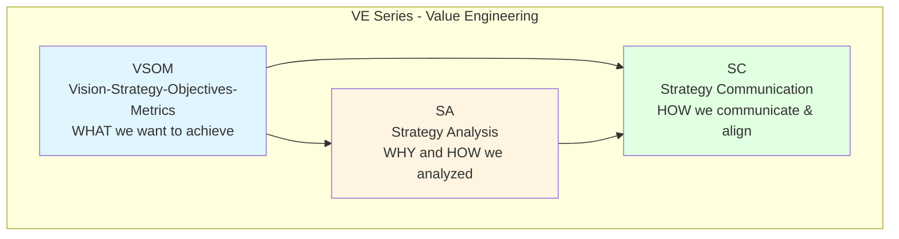
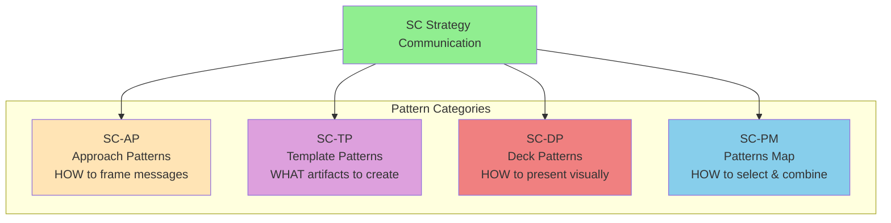
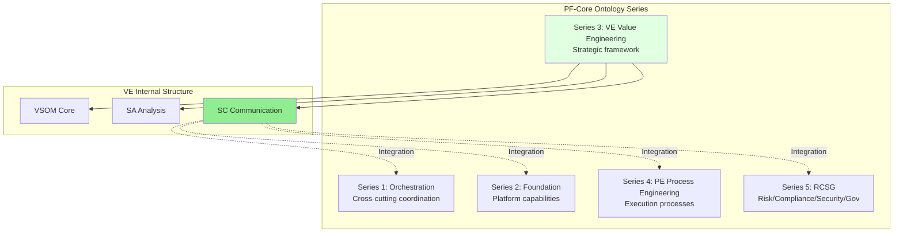
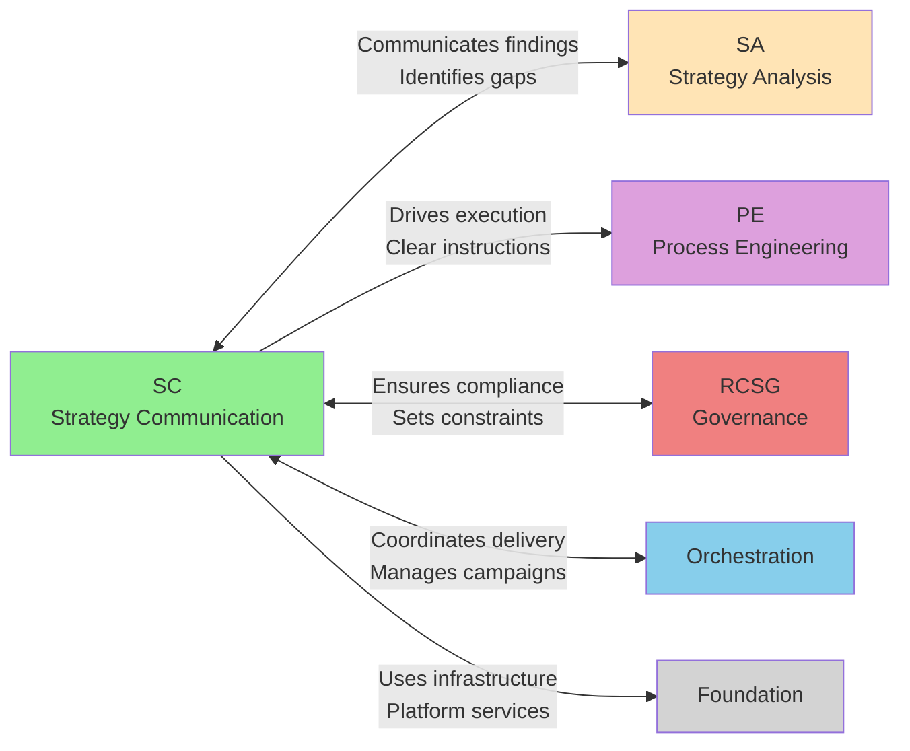
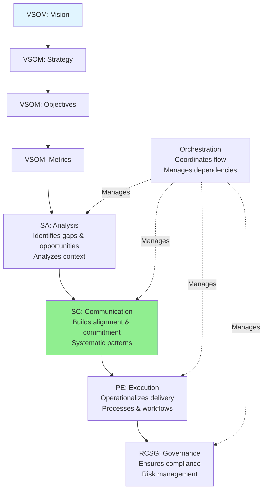
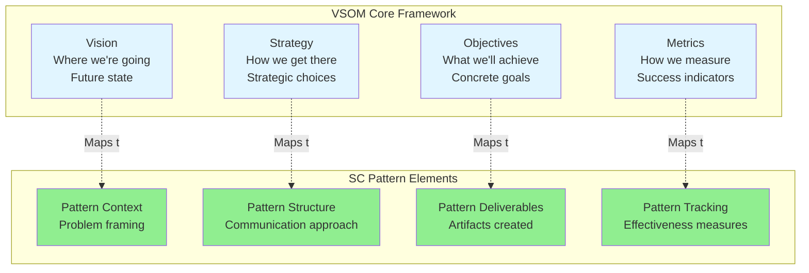
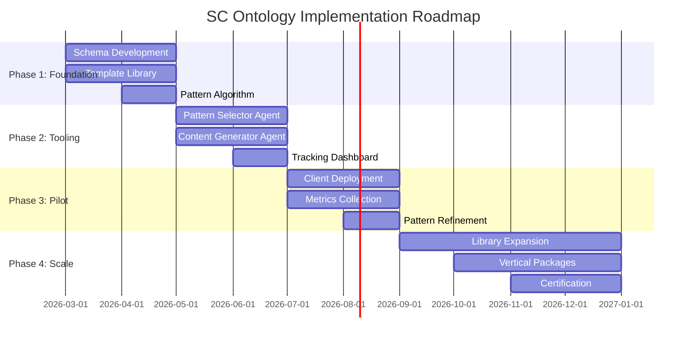
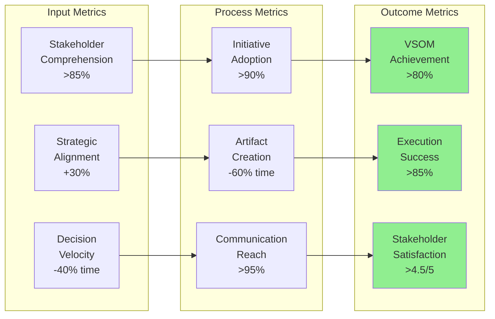

# SC Strategy Communication Ontology - Overview

## Document Information
- **ID**: SC-DOC-001
- **Version**: 1.0
- **Date**: 2026-02-16
- **Series**: VE-03 (Sub-series of Value Engineering)
- **Part of**: PF-Core Ontology Architecture

---

## Executive Summary

The **Strategy Communication (SC) Ontology** is the third sub-series within the VE (Value Engineering) ontology, completing the strategic lifecycle from vision through execution.

**Core Purpose**: Bridge the gap between strategic analysis and organizational execution through systematic communication patterns.

**Core Principle**: *"Strategy is nothing without communication, culture, and execution"*

**Positioning**: SC sits between SA (Strategy Analysis) and PE (Process Engineering), ensuring that strategic insights are effectively communicated to drive organizational action.

---

## Problem Statement

Organizations fail at strategy execution primarily due to communication breakdowns:

- **70% of strategies fail** not due to poor strategy, but poor execution
- **Misalignment** across stakeholders on strategic intent
- **Inconsistent messaging** creates confusion and resistance
- **Lack of systematic communication** patterns for different audiences
- **Gap between analysis and action** - insights don't translate to execution

SC solves this by providing reusable, systematic communication patterns.

---

## SC Ontology Architecture

### Position in VE Series



**VSOM** defines the strategic framework
**SA** analyzes context, gaps, and opportunities
**SC** provides patterns to communicate and execute ← **NEW**

---

### SC Components



---

### Position in PF-Core



**SC integrates with**:
- **Orchestration**: Coordinates multi-stakeholder communication campaigns
- **Foundation**: Uses platform services (collaboration, AI, analytics)
- **PE**: Drives process execution through clear communication
- **RCSG**: Ensures compliant, governed communication

---

## SC Pattern Categories

### 1. SC-AP: Approach Patterns (Rhetorical Frameworks)

**Purpose**: Provide persuasive and rhetorical structures for strategy communication

**Count**: 7 core patterns (extensible)

**Patterns**:
- **SC-AP-001**: 30-Second Answer (elevator pitch clarity)
- **SC-AP-002**: Rented Brain (demonstrate strategic depth)
- **SC-AP-003**: Ars Rhetorica (classical persuasion)
- **SC-AP-004**: Fait Accompli (evidence-based inevitability)
- **SC-AP-005**: Dramatic Structure (narrative arc)
- **SC-AP-006**: Deconstruction (systematic breakdown)
- **SC-AP-007**: Scalable Business Machines (systems thinking)

**Reference**: See `02-SC-AP-Approach-Patterns.md`

---

### 2. SC-TP: Template Patterns (Structured Artifacts)

**Purpose**: Provide reusable templates for strategy articulation

**Count**: 9+ core templates (extensible)

**Patterns**:
- **SC-TP-001**: One Slider (single-page strategic summary)
- **SC-TP-002**: Use Case Map (scenarios to capabilities)
- **SC-TP-003**: Directional Costing (strategic cost framework)
- **SC-TP-004**: Priority Map (initiative prioritization)
- **SC-TP-005**: BSC Strategy Map & Scorecard (canonical VSOM operationalization)
- **SC-TP-006**: Technology Radar (tech positioning)
- **SC-TP-007**: Build-Buy-Partner Decision (sourcing framework)
- **SC-TP-008**: Due Diligence (M&A/partnership assessment)
- **SC-TP-009**: Architecture Definition (EA/TOGAF/MS Stack)

**Reference**: See `03-SC-TP-Template-Patterns.md`

---

### 3. SC-DP: Deck Patterns (Visual Presentations)

**Purpose**: Provide presentation frameworks for different communication contexts

**Count**: 5 core deck patterns + 4 media variants

**Deck Patterns**:
- **SC-DP-001**: Ghost Deck (pre-decisional alignment)
- **SC-DP-002**: Ask Deck (resource/approval requests)
- **SC-DP-003**: Strategy Deck (comprehensive strategic narrative)
- **SC-DP-004**: Roadmap Deck (timeline and dependencies)
- **SC-DP-005**: Tactical Plan Deck (execution detail)

**Media Variants**:
- **SC-DP-M01**: Figma/FigJam Whiteboards
- **SC-DP-M02**: PowerPoint/MS Slide Decks
- **SC-DP-M03**: Google Slides
- **SC-DP-M04**: Miro/Mural Whiteboards

**Reference**: See `04-SC-DP-Deck-Patterns.md`

---

### 4. SC-PM: Patterns Map (Atomic Composition)

**Purpose**: Enable context-specific pattern selection and combination

**Capabilities**:
- Pattern selection algorithm (audience + context → patterns)
- Atomic composition rules (how to combine patterns)
- Use case mapping (situation → pattern recommendations)
- Cross-ontology integration points (SA/PE/RCSG connections)

**Reference**: See `05-SC-PM-Patterns-Map.md`

---

## Integration Architecture

### SC Cross-Ontology Relationships



**Reference**: See `06-SC-Integration-Mappings.md`

---

### Strategy to Execution Flow



**Key insight**: SC is the bridge between analysis (SA) and execution (PE)

---

## Use Case Pattern Mapping

### Communication Context Selection Matrix

| Audience | Context | Primary Pattern | Supporting Patterns | Integration |
|----------|---------|-----------------|---------------------|-------------|
| **Board/C-Suite** | Approval needed | SC-AP-001 (30-Sec)<br/>SC-DP-002 (Ask Deck) | SC-TP-001 (One Slider)<br/>SC-TP-005 (BSC) | SA-Business-Case<br/>SA-Risk-Assessment |
| **Organization** | Transformation | SC-AP-005 (Dramatic)<br/>SC-DP-003 (Strategy Deck) | SC-AP-003 (Ars Rhetorica)<br/>SC-TP-002 (Use Case) | SA-Change-Readiness<br/>PE-Change-Management |
| **Technical Teams** | Architecture | SC-AP-006 (Deconstruction)<br/>SC-TP-009 (Arch Definition) | SC-TP-006 (Tech Radar)<br/>SC-DP-004 (Roadmap) | SA-Technology-Assessment<br/>Foundation-Architecture |
| **Clients** | Advisory/Pitch | SC-AP-002 (Rented Brain)<br/>SC-DP-002 (Ask Deck) | SC-AP-001 (30-Sec)<br/>SC-TP-003 (Dir Cost) | SA-Industry-Analysis<br/>SA-Value-Proposition |
| **Operations** | Scaling | SC-AP-007 (Scalable Machines)<br/>SC-DP-005 (Tactical) | SC-TP-004 (Priority Map) | PE-Process-Engineering<br/>SA-Operating-Model |

---

## VSOM Mapping

Every SC pattern maps back to VSOM components:



**Key principle**: SC patterns are not independent communication tools - they are systematic ways to operationalize VSOM across stakeholders.

---

## Implementation Approach

### 4-Phase Roadmap



**Phase 1 (Months 1-2)**: Build foundation - schemas, templates, algorithms, integration mappings

**Phase 2 (Months 3-4)**: Develop tooling - AI agents, platform integrations, tracking dashboard

**Phase 3 (Months 5-6)**: Pilot deployment - 2-3 client PF-Instances, measure effectiveness, refine patterns

**Phase 4 (Months 7-12)**: Scale - expand library, create vertical packages, build personalization agent, certify practitioners

**Reference**: See `07-SC-Implementation-Guide.md`

---

## Strategic Hypothesis

**Hypothesis**: *"Will the SC Strategy Communication Pattern significantly enhance the ability to deliver and achieve our strategy?"*

### Success Metrics



**Validation Approach**:
1. Baseline measurement (pre-SC deployment)
2. Pattern implementation in 2-3 pilot PF-Instances
3. Comparative analysis (baseline vs SC-enabled)
4. Pattern refinement based on data
5. Scale validated patterns

---

## AI-Led Differentiation

### Agentic Capabilities

SC enables truly AI-led strategic communication through three intelligent agents:

**1. SC-Pattern-Selector-Agent** (Phase 2)
- Analyzes: Audience profile, communication context, VSOM phase
- Recommends: Optimal pattern composition
- Explains: Selection rationale and alternative approaches

**2. SC-Content-Generator-Agent** (Phase 2)
- Populates: Templates with VSOM/SA data
- Generates: Presentation content and narratives
- Adapts: Tone and depth for specific audiences

**3. SC-Personalization-Agent** (Phase 4)
- Creates: Audience-specific message variants
- Orchestrates: Multi-touch communication campaigns
- Optimizes: Message effectiveness through A/B testing

**Key Differentiator**: Most platforms stop at strategy formulation or analysis. SC provides AI-powered communication execution - the hardest part of strategy delivery.

---

## File Structure

This documentation package includes:

```
/mnt/user-data/outputs/
├── SC-Ontology-Complete-Package.md (Master overview)
├── 01-SC-Ontology-Overview.md (THIS FILE)
├── 02-SC-AP-Approach-Patterns.md
├── 03-SC-TP-Template-Patterns.md
├── 04-SC-DP-Deck-Patterns.md
├── 05-SC-PM-Patterns-Map.md
├── 06-SC-Integration-Mappings.md
├── 07-SC-Implementation-Guide.md
├── 08-SC-Schemas.json
└── 09-PF-Core-Summary.md
```

---

## Schema.org Foundation

All SC patterns are built on Schema.org base types for maximum interoperability:

```json
{
  "@context": "https://schema.org",
  "@type": "DefinedTermSet",
  "name": "SC Strategy Communication Patterns",
  "inDefinedTermSet": "VE Value Engineering Ontology",
  "hasDefinedTerm": [
    {"@type": "CategoryCode", "name": "SC-AP: Approach Patterns"},
    {"@type": "CategoryCode", "name": "SC-TP: Template Patterns"},
    {"@type": "CategoryCode", "name": "SC-DP: Deck Patterns"},
    {"@type": "CategoryCode", "name": "SC-PM: Patterns Map"}
  ]
}
```

---

## Next Steps

1. **Deep Dive into Patterns**: Review files 02-05 for detailed pattern specifications
2. **Understand Integrations**: Read file 06 for cross-ontology connections
3. **Plan Implementation**: Follow file 07 for deployment roadmap
4. **Review Technical Specs**: Examine file 08 for JSON-LD schemas
5. **See Big Picture**: Consult file 09 for complete PF-Core context

---

## Summary

SC completes the VE series by providing the **missing link between strategic analysis and organizational execution**. By offering systematic, AI-enabled communication patterns, SC ensures that:

- Strategic intent is clearly communicated
- Stakeholders are properly aligned
- Execution is systematically driven
- Communication effectiveness is measured and improved

This positions PF-Core as a truly end-to-end platform for AI-led strategy execution - not just strategy formulation.

---

**End of SC Ontology Overview**

*Proceed to pattern-specific documentation for implementation details*
