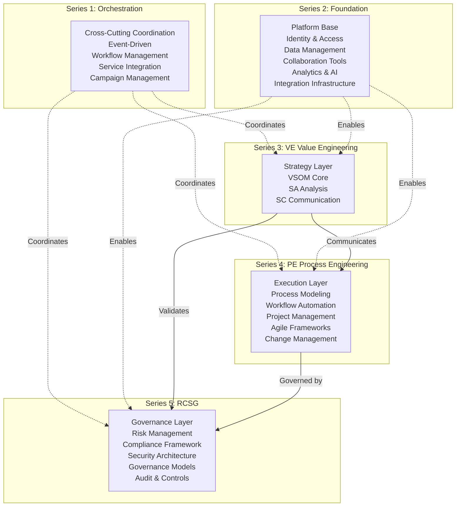
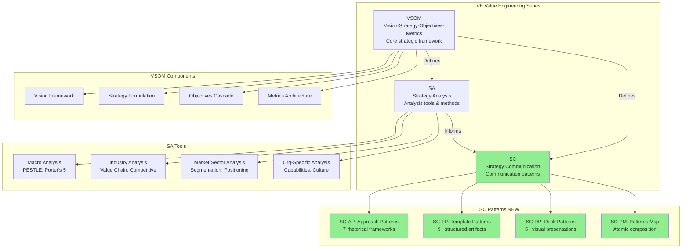
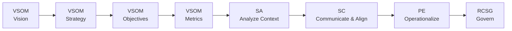
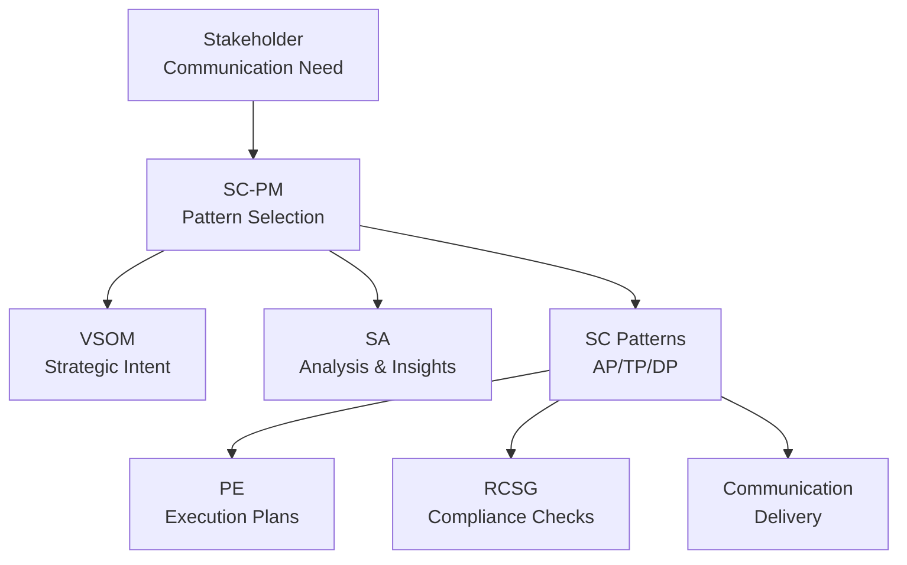
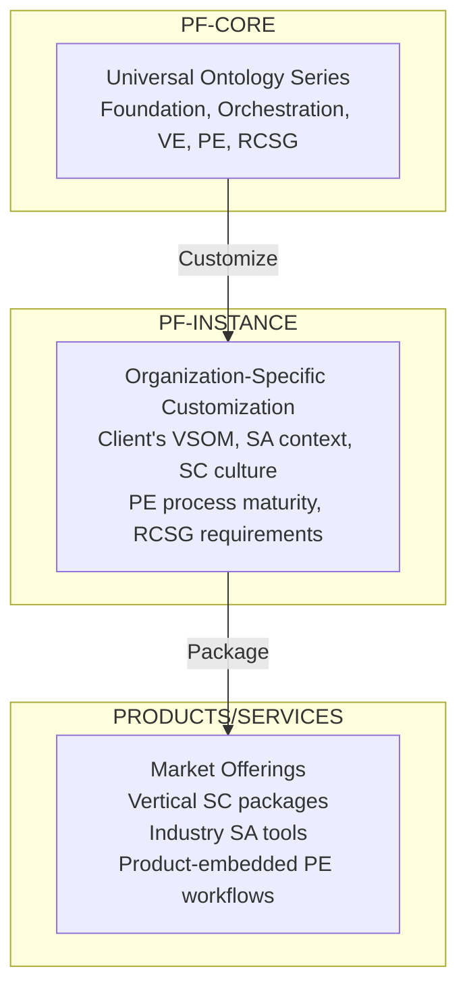
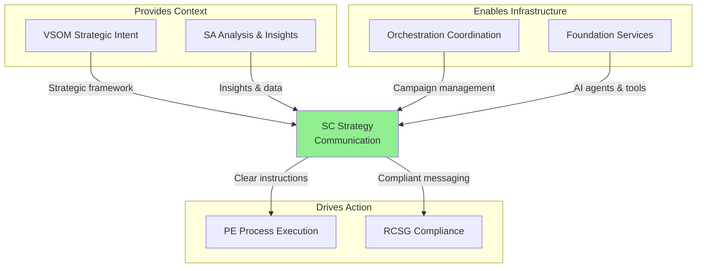
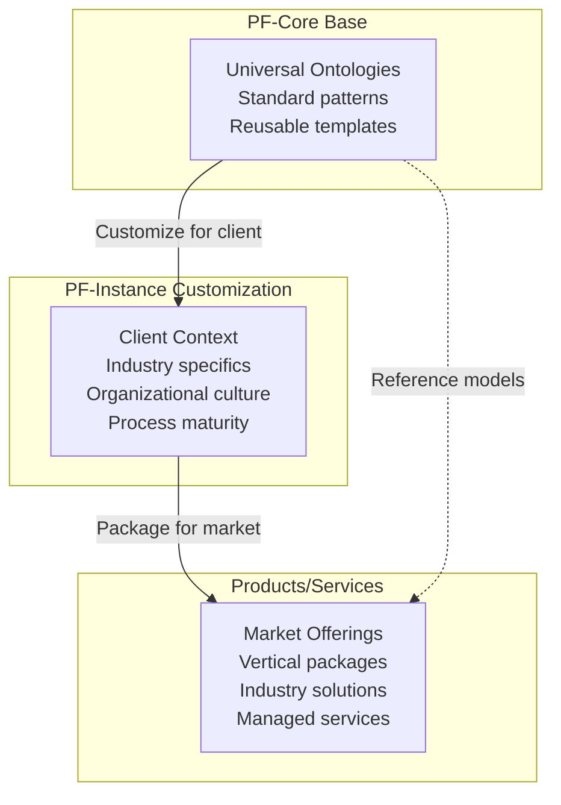

# PF-Core Complete Ontology Summary with SC Addition

## Document Information
- **ID**: PFCORE-SUM-001
- **Version**: 1.0 with SC Addition
- **Date**: 2026-02-16
- **Purpose**: Complete PF-Core ontology architecture reference

---

## PF-Core Architecture Overview



---

## VE Series Detailed Structure (with SC)



---

## Complete Ontology Series Definitions

### Series 1: Orchestration (Cross-Cutting)

**Purpose**: Coordinate workflows, events, and service interactions across all other series

**Key Components**:
- Event-driven architecture patterns
- Workflow orchestration engine
- Service mesh integration
- Multi-stakeholder campaign management

**Role with SC**: Coordinates deployment of SC communication patterns across stakeholder groups

---

### Series 2: Foundation (Platform Base)

**Purpose**: Provide core platform capabilities and infrastructure services

**Key Components**:
- Identity & Access Management (IAM)
- Data management and storage
- Collaboration platforms (Figma, Slack, Teams)
- Analytics and AI services (GenAI, ML)
- Integration infrastructure (APIs, webhooks)

**Role with SC**: Hosts SC templates, powers AI agents, tracks communication effectiveness

---

### Series 3: VE - Value Engineering (Strategy Layer)

**Purpose**: Define and operationalize organizational strategy

#### VSOM (Core)
- Vision: Where we're going
- Strategy: How we get there
- Objectives: What we'll achieve
- Metrics: How we measure success

#### SA (Strategy Analysis)
- Macro analysis (PESTLE, Porter's Five Forces)
- Industry analysis (value chain, competitive landscape)
- Market/sector analysis (segmentation, positioning)
- Organization-specific (capabilities, culture, readiness)

#### SC (Strategy Communication) ← **NEW**
- **SC-AP**: Approach Patterns (rhetorical frameworks)
- **SC-TP**: Template Patterns (structured artifacts)
- **SC-DP**: Deck Patterns (visual presentations)
- **SC-PM**: Patterns Map (atomic composition)

**Role of SC**: Bridges gap between strategic analysis (SA) and process execution (PE) through systematic communication patterns

---

### Series 4: PE - Process Engineering (Execution Layer)

**Purpose**: Operationalize strategy through systematic processes and workflows

**Key Components**:
- Process modeling and design
- Workflow automation
- Project and program management
- Agile and delivery frameworks
- Change management processes

**Role with SC**: SC communicates strategic intent; PE operationalizes it into executable workflows

---

### Series 5: RCSG - Risk, Compliance, Security, Governance

**Purpose**: Ensure compliant, secure, and governed operations

**Key Components**:
- Risk identification and mitigation
- Regulatory compliance frameworks
- Security architecture and controls
- Governance models and policies
- Audit trails and controls

**Role with SC**: SC ensures communication complies with disclosure, approval, and security requirements

---

## Ontology Traversal Patterns

### Pattern 1: Strategy to Execution (Linear Flow)



**Use Case**: New strategic initiative from vision through governed execution

---

### Pattern 2: Communication-Centric (SC as Hub)



**Use Case**: Board approval, organization-wide announcement, client pitch

---

### Pattern 3: PF-Core to PF-Instance to Products



**Use Case**: Platform deployment for new client organization or market vertical

---

## SC's Unique Value in PF-Core

### Completes the Strategic Lifecycle

**Before SC**:
```
VSOM (What) → SA (Why/Analyze) → ??? → PE (Execute)
                    ↑
              Strategy-Execution Gap
```

**After SC**:
```
VSOM (What) → SA (Why/Analyze) → SC (Communicate/Align) → PE (Execute)
                                       ↑
                                  Gap Bridged
```

---

### Strategic Hypothesis: SC's Impact

**Hypothesis**: *"Will SC significantly enhance the ability to deliver and achieve our strategy?"*

#### Key Differentiators

| Traditional Approach | With SC Ontology |
|---------------------|------------------|
| Ad-hoc communication | Systematic patterns |
| Inconsistent messaging | Standardized frameworks |
| Manual artifact creation | AI-powered generation |
| No effectiveness tracking | Metrics-driven improvement |
| Strategy-execution gap | Seamless bridge |
| Generic presentations | Audience-optimized communication |

#### Success Metrics

| Metric | Target | Impact |
|--------|--------|--------|
| Stakeholder Comprehension | >85% | Clear understanding |
| Strategic Alignment | +30% | Unified direction |
| Decision Velocity | -40% time | Faster execution |
| Initiative Adoption | >90% | Higher success rate |
| Artifact Creation Time | -60% | Efficiency gain |
| VSOM Achievement | >80% | Strategic delivery |

---

## Integration Summary

### SC Cross-Ontology Connections



**Key Integration Points**:

**SC ↔ SA**: SC communicates SA findings; SA informs SC pattern selection
- Example: SA-Industry-Analysis → SC-AP-002 (Rented Brain) for client pitch

**SC ↔ PE**: SC drives PE execution; PE enables SC delivery
- Example: SC-DP-005 (Tactical Plan) → PE-Project-Management processes

**SC ↔ RCSG**: SC ensures compliant communication; RCSG sets constraints
- Example: SC-TP-008 (Due Diligence) → RCSG-Legal-Review requirements

**SC ↔ Orchestration**: Orchestration coordinates SC campaigns
- Example: O-Campaign-Management sequences SC-DP-001, SC-DP-002, SC-DP-003

**SC ↔ Foundation**: Foundation provides SC infrastructure
- Example: F-AI-Services powers SC-Content-Generator-Agent

---

## Platform Architecture: PF-Core → PF-Instance → Products

### Deployment Model



**PF-Core**: Universal, reusable ontology series (Foundation, Orchestration, VE, PE, RCSG)

**PF-Instance**: Client-specific deployment
- Client's VSOM (vision, strategy, objectives, metrics)
- Client's SA context (industry, market, org-specific)
- Client's SC culture (communication norms, patterns)
- Client's PE maturity (process sophistication)
- Client's RCSG requirements (compliance, risk tolerance)

**Products/Services**: Market-facing offerings
- Vertical SC pattern packages (Financial Services, Healthcare, Tech/SaaS)
- Industry SA tool sets (specific analyses for verticals)
- Product-embedded PE workflows (pre-built processes)

---

## Why SC is a Game-Changer

### The Problem SC Solves

**70% of strategies fail** - not because of poor strategy, but because:
1. Strategic intent is poorly communicated
2. Stakeholders are misaligned
3. Translation from strategy to execution is ad-hoc
4. No systematic patterns for different audiences
5. Communication effectiveness is not measured

### SC's Solution

**Systematic Communication Patterns** that:
- Provide reusable frameworks for different contexts
- Ensure consistent, clear messaging
- Enable AI-powered content generation
- Track and improve communication effectiveness
- Bridge the strategy-execution gap

### SC's AI-Led Advantage

1. **SC-Pattern-Selector-Agent**: Recommends optimal patterns based on context
2. **SC-Content-Generator-Agent**: Auto-generates presentation content
3. **SC-Personalization-Agent**: Creates audience-specific variants
4. **Effectiveness Tracking**: Continuous improvement through metrics

**This is the differentiator**: Most platforms stop at strategy formulation or analysis. SC provides AI-powered communication execution - the hardest part.

---

## Summary

### PF-Core Before SC
```
Orchestration (coordinate)
Foundation (enable)
VE (VSOM + SA: define & analyze strategy)
PE (execute processes)
RCSG (govern operations)

Gap: How do we communicate strategy effectively to drive execution?
```

### PF-Core After SC
```
Orchestration (coordinate)
Foundation (enable)
VE (VSOM + SA + SC: define, analyze, & communicate strategy)
PE (execute processes)
RCSG (govern operations)

Bridge: SC provides systematic patterns to communicate, align, and execute
```

---

## File References

Complete SC documentation:
- `01-SC-Ontology-Overview.md` - SC architecture
- `02-SC-AP-Approach-Patterns.md` - 7 rhetorical frameworks
- `03-SC-TP-Template-Patterns.md` - 9+ structured artifacts
- `04-SC-DP-Deck-Patterns.md` - 5+ visual presentations
- `05-SC-PM-Patterns-Map.md` - Pattern selection & composition
- `06-SC-Integration-Mappings.md` - Cross-ontology connections
- `07-SC-Implementation-Guide.md` - 4-phase deployment roadmap
- `08-SC-Schemas.json` - JSON-LD technical specifications

---

**End of PF-Core Complete Summary**

*SC completes PF-Core as a truly end-to-end AI-led platform for strategy execution*
