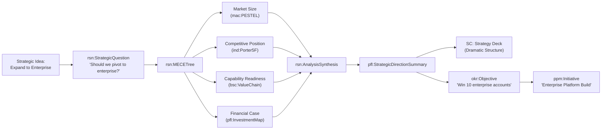

# Team Briefing: VSOM-SC — Strategy Communication Sub-Series

**Date:** 2026-02-13
**Author:** Azlan EA-AAA
**Audience:** Engineering, strategy consultants, AI agent developers, stakeholders
**Status:** Architectural brief — ontology scope to be defined
**Related:** Epic 18 (#190), VE-Series, [VSOM-SA Briefing](../VSOM-SA/BRIEFING-VSOM-Strategy-Analysis.md), [DESIGN-SYSTEM-SPEC.md](../../../../TOOLS/ontology-visualiser/DESIGN-SYSTEM-SPEC.md), ont-registry-index.json v6.0.0

---

## 1. Why Strategy Communication Is Not Optional

> *"Strategy that cannot be clearly communicated and understood is a complete failure."*

This is not a soft-skills problem. It is an architectural one.

VSOM-SC exists to help teams across all levels of the organisation **organise the components of strategy** in a way that people can evolve, share, understand, and succeed — in planning, adopting, refining, and implementing that strategy — **without cognitive overload**.

The goal is human success. AI augments — it does not replace. The Azlan workbench and AI-augmented solutions exist to help humans succeed at the hardest organisational challenge there is: making strategy real across every team, every level, every day.

Consider what happens when strategy communication breaks down:

- **The board** approves a strategy that leadership interprets differently from intent
- **Leadership** cascades objectives that teams translate into conflicting priorities
- **Teams** execute work that drifts from strategy because the connection was never made explicit
- **Individuals** cannot articulate how their work contributes to the organisation's direction
- **Culture** fractures because people optimise for local signals, not shared purpose

These are not communication failures. They are **organisational failures** — failures of structure, of shared language, of tooling that should make strategy accessible but instead makes it opaque.

VSOM-SA solves the *thinking* problem — rigorous, structured, evidence-backed strategic analysis. VSOM-SC solves the *organising and sharing* problem — how strategy components are structured, translated, evolved, and sustained so that teams across the entire organisation can plan, adopt, refine, and achieve success together.

**SA + SC together = strategy that is both rigorous and understood.**

---

## 2. The Relationship Between SA and SC

```text
VSOM (Strategic Spine)
  │
  ├── VSOM-SA: Strategy Analysis          "How we think"
  │     L1 MACRO      → environmental scanning
  │     L2 INDUSTRY   → competitive positioning
  │     L3 BSC        → organisational alignment
  │     L4 REASON     → analytical reasoning
  │     L5 PORTFOLIO  → portfolio execution
  │
  │         ──── SA outputs feed SC inputs ────
  │              (analysis → communication)
  │
  └── VSOM-SC: Strategy Communication     "How we tell"
        C1 NARRATIVE   → strategic storytelling
        C2 CASCADE     → audience translation & fidelity
        C3 CULTURE     → strategic culture alignment
        C4 VIZSTRAT    → visual strategy artefacts
```

SA produces analytical outputs: synthesis findings, strategic recommendations, balanced scorecards, investment maps, direction summaries. SC takes those outputs and **organises them into structures that teams can evolve, share, and act on** — audience-appropriate, structurally consistent, fidelity-tracked — delivered through the Azlan workbench with AI augmentation that helps humans plan, adopt, refine, and succeed.

The handoff point is deliberate:

- `pfl:StrategicDirectionSummary` (SA capstone) → SC narrative input
- `rsn:AnalysisSynthesis` (SA reasoning output) → SC evidence chain for storytelling
- `bsc:StrategyMap` (SA organisational alignment) → SC visual artefact template
- `rrr:ExecutiveRole` (existing) → SC audience definition and cascade routing

---

## 3. The Communication Problem — Structured

Strategy communication fails in predictable, diagnosable ways. VSOM-SC addresses each failure mode:

### Failure Mode 1: Translation Loss

**What happens:** Strategy is written in board-level language. By the time it reaches teams, the meaning has shifted through 3-4 layers of human interpretation.

**SC pattern:** Audience-aware translation with structural fidelity tracking. The same strategic intent is expressed in language appropriate to each level, with explicit traceability back to the source. An AI agent can verify that a team-level communication accurately reflects the board-level intent.

### Failure Mode 2: Evidence Amnesia

**What happens:** The executive summary says "we will pivot to enterprise" but nobody remembers *why*. The PESTEL factors, SWOT analysis, and hypothesis testing that justified the decision are lost.

**SC pattern:** Evidence-linked narrative. Every strategic communication carries a reference chain back to the SA analysis that produced it. The story includes not just the *what* but the *because* — and the *because* is machine-verifiable.

### Failure Mode 3: One-Time Announcement

**What happens:** Strategy is communicated once — at an all-hands, in a slide deck, in an email. Then it fades. People revert to pre-strategy behaviour within weeks.

**SC pattern:** Cadenced communication lifecycle. Strategy communications are not events — they are rhythms. Monthly reinforcement, quarterly refresh, annual renewal. Each cadence point reconnects people to the strategic direction with updated evidence from the VSOM Review Cycle.

### Failure Mode 4: Culture-Strategy Gap

**What happens:** The strategy says "innovation" but the culture rewards compliance. The strategy says "customer-first" but the incentive structure rewards internal metrics. People see the contradiction and disengage.

**SC pattern:** Culture-strategy alignment assessment. Explicit mapping between stated strategic values and observable cultural signals (behaviours, incentives, rituals, symbols). The gap between what we *say* and what we *do* becomes visible and measurable.

### Failure Mode 5: Visual Incoherence

**What happens:** Every department creates its own strategy slides. The CFO's view of strategy looks nothing like the CTO's view. The board sees a different visual language than leadership. There is no shared mental model.

**SC pattern:** Standardised visual strategy artefacts. Strategy maps, investment charts, portfolio matrices, direction summaries — all rendered from the same underlying data (SA ontologies) with consistent visual grammar. One source of truth, multiple audience-appropriate views.

---

## 4. Architectural Patterns for Strategy Communication

These are the structural ideas that VSOM-SC ontologies will formalise. They are patterns, not final entity designs — the exact ontology scope will be defined in F18.1.

### Pattern 1: The Strategic Narrative Arc

Every strategy has a narrative structure. This is not metaphor — it is architecture.

```text
┌─────────────────────────────────────────────────────┐
│                 STRATEGIC NARRATIVE                   │
│                                                       │
│  CONTEXT         Where we are                        │
│  ├── Environmental forces (from MACRO L1)            │
│  ├── Competitive position (from INDUSTRY L2)         │
│  └── Organisational state (from BSC L3)              │
│                                                       │
│  CHALLENGE       Why we must change                  │
│  ├── Strategic tension (from REASON L4 synthesis)    │
│  ├── Evidence chain (from hypothesis testing)        │
│  └── Consequences of inaction                        │
│                                                       │
│  CHOICE          What we will do                     │
│  ├── Strategic direction (from PORTFOLIO L5)         │
│  ├── Where we play / how we win                      │
│  └── What we will NOT do (explicit trade-offs)       │
│                                                       │
│  COMMITMENT      How we will execute                 │
│  ├── BSC objectives and OKR cascade                  │
│  ├── Investment allocation                           │
│  └── Accountability (RRR executive roles)            │
│                                                       │
│  CADENCE         How we will sustain                 │
│  ├── Review rhythm (from VSOM Review Cycle)          │
│  ├── Communication schedule                          │
│  └── Early warning signals to watch                  │
└─────────────────────────────────────────────────────┘
```

The narrative arc is **not a slide deck template**. It is a structural schema that AI agents can populate from SA outputs and render into audience-appropriate formats — board paper, leadership brief, team charter, individual objectives summary.

### Pattern 2: Audience Cascade Model

Strategy must be translated — not diluted — for each audience. The cascade model defines how strategic intent flows through organisational layers while maintaining fidelity.

```text
BOARD                    Strategic direction, risk appetite, investment thesis
  │                      Language: financial, governance, shareholder value
  │  ── translate ──
  │
C-SUITE                  Strategic priorities, BSC perspectives, portfolio bets
  │                      Language: cross-functional, capability-based, KPI-driven
  │  ── translate ──
  │
LEADERSHIP               Functional objectives, team OKRs, resource allocation
  │                      Language: domain-specific, outcome-based, quarterly
  │  ── translate ──
  │
TEAMS                    Sprint goals, feature priorities, success criteria
  │                      Language: task-oriented, user-story framed, measurable
  │  ── translate ──
  │
INDIVIDUALS              Personal objectives, contribution to strategy, growth path
                         Language: personal, motivational, career-connected
```

**Key concept: Fidelity Score.** At each cascade level, the communication references the level above. An AI agent can compute a fidelity score: does the team-level communication accurately reflect the leadership-level intent? Does the leadership-level intent accurately reflect the board-level direction? Drift is detectable and correctable.

### Pattern 3: Culture-Strategy Alignment Matrix

Culture is not a separate concern from strategy. It is the execution environment. If the culture contradicts the strategy, the culture wins.

```text
                    STATED STRATEGY
                    │
    ┌───────────────┼───────────────┐
    │               │               │
    │  ALIGNED      │  ASPIRATIONAL │
    │  Culture      │  Culture says │
    │  reinforces   │  yes but      │
    │  strategy     │  behaviour    │
    │               │  says not yet │
    │               │               │
────┼───────────────┼───────────────┼──── OBSERVABLE
    │               │               │     CULTURE
    │  LEGACY       │  CONFLICTING  │
    │  Culture      │  Culture      │
    │  doesn't      │  actively     │
    │  address      │  contradicts  │
    │  strategy     │  strategy     │
    │               │               │
    └───────────────┼───────────────┘
                    │
```

Each quadrant has a different communication response:

- **Aligned:** Celebrate and reinforce — use case studies of strategy-culture alignment
- **Aspirational:** Bridge narratives — acknowledge the gap, show the path, celebrate early signals
- **Legacy:** Awareness building — connect new strategy to existing cultural strengths
- **Conflicting:** Honest confrontation — name the contradiction, define what must change, set measurable culture shift targets

### Pattern 4: Visual Strategy Grammar

A shared visual language for strategy artefacts. Not a style guide — a structural grammar.

| Artefact Type | Source (SA) | Audience | Purpose |
| -------------- | ------------- | ---------- | --------- |
| Strategy Map | `bsc:StrategyMap` + `bsc:CausalLink` | Leadership, Board | Cause-and-effect chain across BSC perspectives |
| Investment Chart | `pfl:StrategicInvestmentMap` | Board, CFO | Budget-to-strategy alignment by theme |
| Portfolio Matrix | `pfl:GrowthShareMatrix` | C-Suite | Product/brand/BU classification and resource direction |
| Horizon Model | `pfl:ThreeHorizonsModel` | Board, CTO/CIO | Innovation investment balance (core/emerging/transformational) |
| Direction Summary | `pfl:StrategicDirectionSummary` | All levels | Executive one-pager: where we play, how we win, what bets |
| Scenario Landscape | `mac:ScenarioSet` + `mac:FuturesFunnel` | Board, Strategy team | Plausible futures and strategy robustness |
| MECE Analysis Tree | `rsn:MECETree` | Strategy team, analysts | Structured decomposition of strategic question |

Each artefact has:

- A **data source** in SA ontologies (machine-readable)
- An **audience** with appropriate detail level
- A **visual schema** that is structurally consistent across all instances
- A **narrative wrapper** from the Strategic Narrative Arc (Pattern 1)

### Pattern 5: Communication Lifecycle

Strategy communication is not a moment. It is a rhythm.

```text
ANNUAL                                    QUARTERLY
┌──────────┐                              ┌──────────┐
│ Strategy  │                              │ Strategic │
│ Refresh   │ ─── sets direction for ───►  │ Review    │
│           │                              │ Cycle     │
│ Full SA   │                              │           │
│ analysis  │                              │ BSC check │
│ cycle     │                              │ OKR score │
│ New       │                              │ KPI delta │
│ narrative │                              │ Narrative │
│ arc       │                              │ update    │
└──────────┘                              └──────────┘
                                               │
                                     triggers if KPI breach
                                               │
MONTHLY                                   EVENT-DRIVEN
┌──────────┐                              ┌──────────┐
│ Progress  │                              │ Strategic │
│ Pulse     │                              │ Alert     │
│           │                              │           │
│ Team-     │                              │ PESTEL    │
│ level     │                              │ signal    │
│ strategy  │                              │ or early  │
│ connect   │                              │ warning   │
│           │                              │ triggers  │
│ Celebrate │                              │ narrative │
│ alignment │                              │ reframe   │
└──────────┘                              └──────────┘
```

Each cadence point generates communication artefacts from current SA data. The AI agent does not re-analyse from scratch — it pulls the latest state from VSOM and re-renders the narrative and visual artefacts with updated evidence.

---

## 5. How SC Completes the VSOM Ecosystem

Without SC, the VSOM ecosystem has a critical gap:

| Capability | Without SC | With SC |
| ----------- | ----------- | --------- |
| Analysis | VSOM-SA provides rigorous analysis | Same |
| Decision | Analysis produces recommendations | Same |
| Organisation | Strategy components scattered, implicit | Components organised for teams to evolve and share |
| Communication | Ad-hoc, inconsistent, one-time | Structured, audience-aware, sustained |
| Understanding | Varies by proximity to strategy team | Consistent across all levels |
| Adoption | Mandated top-down, resisted | Teams plan, adopt, and refine collaboratively |
| Alignment | Hoped for | Measured (fidelity score) |
| Culture | Ignored or assumed | Explicitly mapped to strategy |
| Sustainability | Decays over time | Cadenced renewal — strategy evolves, not expires |
| Cognitive Load | Overwhelming — too much, too complex | Managed — the right detail at the right level |

**The multiplication effect:** Good analysis multiplied by poor communication equals poor execution. Good analysis multiplied by good communication equals strategic coherence.

```text
SA (thinking) × SC (organising + sharing) = Strategic Coherence

SA alone      = strategy locked in a vault
SC alone      = compelling stories disconnected from evidence
SA + SC       = evidence-backed strategy that teams can evolve, share, and succeed with
```

### 5.1 The Azlan Workbench as Delivery Vehicle

SC is not a set of documents. It is a set of **structures delivered through the Azlan workbench** — interactive, AI-augmented, and designed for human success.

The workbench provides:

| Capability | How It Helps Humans Succeed |
| ----------- | --------------------------- |
| **Strategy Organiser** | Organises SA outputs into navigable components — teams browse strategy like a knowledge graph, not a 60-page PDF |
| **Audience Views** | Same strategy, different lens — the board sees investment and risk, teams see their OKRs and sprint connections |
| **Evolution Tracking** | Strategy is versioned. Teams see what changed, why, and what it means for them. No "I didn't get the memo" |
| **Shared Workspace** | Teams annotate, comment, and propose refinements. Strategy is a conversation, not a broadcast |
| **AI Augmentation** | AI agents help humans — drafting narrative, checking fidelity, flagging culture-strategy gaps, generating visual artefacts — but humans decide |
| **Cognitive Load Management** | Progressive disclosure. Start with the direction summary. Drill into BSC perspectives. Zoom to team OKRs. Never see more than you need at any tier |

The design principle mirrors the visualiser's tier model: **each level reduces scope while increasing relevance**. A team lead sees their team's strategic context, not the entire organisation's PESTEL analysis. But if they want to understand *why* their objectives exist, the evidence chain is one click away.

### 5.2 HITL Agents: Inspire and Support, Never Replace

The AI agents in this architecture are **human-in-the-loop (HITL)** by design. Their role is to inspire and support — not to make humans inert.

| Agent Behaviour | Why It Matters |
| --------------- | -------------- |
| **Drafts, never dictates** | AI generates narrative drafts, visual artefacts, fidelity reports — humans review, refine, and decide |
| **Surfaces, never hides** | AI surfaces evidence chains, culture-strategy gaps, cascade drift — humans interpret context and act |
| **Suggests, never mandates** | AI proposes communication cadence, audience translations, refinement opportunities — humans own the strategy |
| **Enables continuous improvement** | AI tracks what changed, what worked, what didn't — humans learn and adapt. Strategy gets better, not just maintained |
| **Inspires positive innovation** | AI identifies patterns across the graph that humans might miss — new connections, emerging opportunities, untested hypotheses — sparking human creativity |

The risk with any AI-augmented workflow is **learned helplessness** — teams stop thinking because the AI thinks for them. VSOM-SC is designed against this:

- **Fidelity scores** require humans to validate, not just accept
- **Culture-strategy alignment** requires humans to observe and judge, not just compute
- **Narrative arcs** require humans to tell the story, not just read the output
- **Cascade translation** requires humans to understand their audience, not just relay
- **Continuous improvement cycles** require humans to reflect and refine, not just iterate

The principle: **AI augments human capability. Humans drive strategic success.** The workbench makes strategy accessible; the humans make it real. Agents inspire and support — they do not make the humans inert.

**AI augments. Humans succeed.** The workbench is the bridge between ontology structure and human understanding. Continuous integration, improvement, positive innovation — with HITL agents inspiring and supporting teams to achieve more than they could alone.

---

## 6. Cross-Ontology Architecture

VSOM-SC bridges to both VSOM-SA and the existing VE/PE/Foundation ontologies:

```text
VSOM-SA (analysis outputs)          VSOM-SC (communication inputs)
─────────────────────────           ─────────────────────────────
pfl:StrategicDirectionSummary  ───► Narrative content source
rsn:AnalysisSynthesis          ───► Evidence chain for storytelling
rsn:StrategicRecommendation    ───► Decision rationale
bsc:StrategyMap                ───► Visual artefact source
bsc:BSCPerspective             ───► Audience framing by perspective
pfl:StrategicInvestmentMap     ───► Resource allocation narrative
mac:ScenarioSet                ───► Futures context for narrative arc
mac:PESTELFactor               ───► Environmental context framing

Existing ontologies                 VSOM-SC (communication structure)
───────────────────                 ─────────────────────────────────
rrr:ExecutiveRole              ───► Audience definition, cascade routing
okr:Objective                  ───► Team/individual strategy connection
kpi:KPI                        ───► Progress evidence for cadence comms
vsom:StrategicReviewCycle      ───► Communication trigger events
orgctx:OrganizationContext     ───► Culture context, org structure
```

---

## 7. AI Agent Communication Workflow

Building on the SA agent's 10-step analysis workflow, SC adds communication generation:

| Step | Action | Description |
| ------ | -------- | ------------- |
| 11 | NARRATIVE BUILD | Construct strategic narrative arc from SA outputs (Context → Challenge → Choice → Commitment → Cadence) |
| 12 | AUDIENCE MAP | Identify cascade levels from `rrr:ExecutiveRole` hierarchy. Define translation requirements per level |
| 13 | CASCADE TRANSLATE | Generate audience-appropriate versions of the narrative. Compute fidelity scores at each level |
| 14 | CULTURE ASSESS | Map stated strategic values against observable cultural signals. Identify quadrant per value |
| 15 | VISUAL RENDER | Generate standardised visual artefacts from SA data sources using visual strategy grammar |
| 16 | CADENCE SCHEDULE | Set communication rhythm tied to VSOM Review Cycle. Configure triggers for event-driven alerts |
| 17 | FIDELITY MONITOR | Track communication fidelity over time. Flag drift between intended and perceived strategy |

Steps 1-10 (SA) produce the analysis. Steps 11-17 (SC) produce the communications. An AI agent can run the full 17-step pipeline end-to-end, or enter at any step depending on the task.

**Critical:** At every step, the AI agent **drafts and surfaces** — the human **reviews, refines, and decides**. The workflow is a continuous improvement cycle: each strategic review produces better analysis, clearer communication, tighter fidelity, and deeper organisational understanding. The agents learn from human feedback; the humans grow more strategically capable with AI support. Neither is inert.

---

## 8. SC Communication Patterns — Approaches to Evaluate

Strategy communication is not one thing. It is a repertoire of approaches, each suited to different objectives, audiences, and contexts. These are the **SC Patterns** — communication frameworks that VSOM-SC ontologies will represent as traversable graph entities. An AI agent selects the appropriate pattern based on the communication objective, audience, and context.

These are candidates for ontological representation. Each pattern becomes an entity (or entity cluster) that an agent can traverse to meet a specific communication objective.

### 8.1 Verbal & Persuasion Patterns

| Pattern | What It Is | When to Use | SA Source |
| ------- | ---------- | ----------- | --------- |
| **30-Second Answer** | Distil any strategic position into a crisp, memorable statement that survives the elevator, the corridor, and the boardroom interruption. Structure: Position → Because → Therefore. | When any stakeholder asks "so what's the strategy?" — the answer must be instant, clear, and evidence-backed | `pfl:StrategicDirectionSummary` → distilled to position statement |
| **Rented Brain** | Position the strategist (or AI agent) as the audience's thinking partner, not their lecturer. Frame: "If I were in your role, here's how I'd see this..." Builds trust by demonstrating empathy with the audience's constraints before presenting the strategy. | When communicating strategy to sceptical or time-poor executives who need to feel the strategy was designed *with* them, not *at* them | `bsc:BSCPerspective` → role-specific framing via `rrr:ExecutiveRole` |
| **Ars Rhetorica** | Classical rhetorical structure: Ethos (credibility), Logos (logic), Pathos (emotion). Every strategic communication implicitly uses all three — SC makes it explicit and balanced. | When the communication must persuade, not just inform. Board presentations, investor updates, transformation narratives. | Ethos: `rsn:EvidenceItem` chain. Logos: `rsn:LogicTree` decomposition. Pathos: `mac:Scenario` narrative + `pfl:StrategicDirectionSummary` vision |
| **Fait Accompli** | Present the strategic direction as already decided, already in motion, already showing results. Not deceptive — genuinely frontload early wins and momentum evidence. Structure: "We're already doing X, here's what's working, here's what's next." | When adoption resistance is high and the strategy needs momentum framing rather than permission-seeking. Post-decision communication. | `kpi:KPI` (early metrics) + `okr:KeyResult` (progress) + `ppm:Initiative` (in-flight work) |
| **Dramatic Structure** | Five-act narrative: Exposition (context) → Rising Action (tension/opportunity) → Climax (strategic choice) → Falling Action (execution plan) → Resolution (future state). Maps directly to the Strategic Narrative Arc but with explicit dramatic tension. | When the strategy represents a significant change and needs emotional engagement — transformations, pivots, market entries. | Full SA pipeline: `mac:PESTELFactor` → `ind:SWOTAnalysis` → `rsn:AnalysisSynthesis` → `pfl:StrategicDirectionSummary` |
| **Deconstruction** | Break a complex strategy into independently understandable components, communicate each component, then reconstruct the whole. Audience builds understanding bottom-up rather than receiving it top-down. | When the strategy is genuinely complex and top-down communication creates cognitive overload. Technical audiences, engineering leadership, architects. | `rsn:MECETree` branches → communicate per branch → `rsn:AnalysisSynthesis` reconstruction |
| **Scalable Business Machines** | Frame strategy as a system of interconnected machines: acquisition machine, delivery machine, retention machine, innovation machine. Each machine has inputs, processes, outputs, and metrics. Strategy = tuning the machines. | When the audience thinks in systems and processes. Operations leaders, PE-Series stakeholders, programme managers. | `bsc:StrategicValueChain` + `ppm:Portfolio` + `kpi:KPI` per machine |

### 8.2 Evaluation Criteria for Pattern Selection

An AI agent selects patterns based on:

```text
COMMUNICATION OBJECTIVE
  │
  ├── Inform     → 30-Second Answer, Deconstruction
  ├── Persuade   → Ars Rhetorica, Dramatic Structure, Rented Brain
  ├── Mobilise   → Fait Accompli, Scalable Business Machines
  └── Sustain    → Cadenced Lifecycle (Pattern 5 from Section 4)
        │
AUDIENCE PROFILE (from rrr:ExecutiveRole + cascade level)
  │
  ├── Board/Investor    → Ars Rhetorica, 30-Second Answer
  ├── C-Suite           → Rented Brain, Scalable Business Machines
  ├── Leadership        → Deconstruction, Dramatic Structure
  ├── Teams             → 30-Second Answer, Fait Accompli
  └── Individuals       → Rented Brain (personal framing)
        │
CONTEXT (from vsom:StrategicReviewCycle trigger)
  │
  ├── New strategy         → Dramatic Structure
  ├── Strategy refresh     → Fait Accompli (show momentum)
  ├── Crisis/pivot         → Ars Rhetorica (rebuild credibility)
  └── Steady state         → 30-Second Answer (reinforce)
```

This selection logic is itself a graph traversal — the agent walks from communication objective through audience profile and context to select the optimal pattern. **This is what makes it ontological, not just a checklist.**

---

## 9. Template & Deck Patterns — Structured Outputs

SC Patterns (Section 8) define *how* to communicate. Template & Deck Patterns define *what form* the output takes. These are the artefacts that the Azlan workbench renders from SA data through SC patterns.

### 9.1 Single-Artefact Templates

These are standalone strategic artefacts — each one a focused view of a specific strategic dimension.

| Template | What It Produces | SA Data Source | Audience |
| -------- | ---------------- | -------------- | -------- |
| **One Slider / Strategy on a Page** | The entire strategic direction on a single page: where we play, how we win, what we measure, who owns what. The ultimate cognitive load reducer. | `pfl:StrategicDirectionSummary` + `bsc:BalancedScorecard` + `rrr:ExecutiveRole` | All levels — the universal reference |
| **Use Case Map** | Visual map of strategic use cases: who does what, in what context, to achieve what outcome. Connects strategy to observable behaviour. | `bsc:StrategicValueChain` + `orgctx:OrganizationContext` + `ppm:Initiative` | Leadership, teams |
| **Directional Costing** | Rough-order cost model for strategic initiatives. Not a budget — a direction. "This bet is £Xm-scale, not £Xk-scale." Enables resource conversation without false precision. | `pfl:StrategicInvestmentMap` + `pfl:ThreeHorizonsModel` + `ppm:Initiative` | Board, CFO, C-Suite |
| **Priority Map** | 2x2 or ranked view of strategic priorities by impact vs effort, urgency vs importance, or strategic alignment vs feasibility. Makes trade-offs visible. | `rsn:LogicTree` (sensitivity rank) + `bsc:BSCObjective` (perspective weight) + `pfl:GrowthShareEntry` (BCG quadrant) | C-Suite, leadership |
| **Technology Radar** | ThoughtWorks-style radar: Adopt / Trial / Assess / Hold. Applied to strategic capabilities, technologies, or practices. Shows strategic technology direction. | `ind:PortersFiveForces` (technology threat) + `mac:PESTELFactor` (technological factors) + `orgctx:Product` | CTO/CIO, architecture, engineering |
| **Build / Buy / Partner** | Decision framework for capability sourcing: build in-house, buy (acquire/license), or partner. Each option scored against strategic criteria. | `ind:AnsoffGrowthPath` + `bsc:StrategicValueChain` + `pfl:HorizonInitiative` | C-Suite, strategy team, M&A |
| **Due Diligence** | Structured assessment of a strategic opportunity, acquisition target, or partnership. Evidence-backed evaluation against strategic criteria. | Full SA pipeline — `mac:ScenarioStrategyAssessment` + `ind:SWOTAnalysis` + `pfl:GrowthShareMatrix` | Board, M&A, investment committee |
| **Audit & Traceability** | End-to-end traceability from strategic direction through objectives, KPIs, initiatives, and execution. Answers: "Can we trace every activity back to a strategic objective?" | `vsom:VSOMFramework` → `bsc:BSCObjective` → `okr:Objective` → `ppm:Initiative` → `efs:Epic` | Governance, compliance, board |
| **Architectural Definition** | Strategic architecture view: capability map, technology landscape, integration points, target state. Bridges strategy to enterprise architecture. | `bsc:StrategicValueChain` + `ea:BusinessCapability` + `ea:ApplicationService` + `pfl:ThreeHorizonsModel` | CTO/CIO, architecture, engineering |

### 9.2 Deck Patterns

Decks are **composed artefacts** — sequences of templates assembled for a specific communication purpose. Each deck has a structural pattern, not just a slide order.

| Deck Pattern | Purpose | Structure | SC Pattern Used |
| ------------ | ------- | --------- | --------------- |
| **Ghost Deck** | Pre-meeting alignment. Circulated before the meeting so attendees arrive prepared. Sparse — headlines and questions, not answers. Creates the thinking space. | Direction summary → Key questions → Decision points → Pre-read data. Deliberately incomplete — invites contribution. | Rented Brain (positions audience as co-thinker) |
| **Ask Deck** | Secure a specific decision, approval, or resource. Every slide builds toward the ask. No filler, no context that doesn't serve the ask. | Context (30 sec) → Problem/opportunity → Options evaluated → Recommendation → The Ask → Next steps if approved. | Ars Rhetorica (ethos → logos → pathos → ask) |
| **Strategy Deck** | Comprehensive strategic direction presentation. The full narrative. Used at annual strategy off-sites, board strategy sessions, investor updates. | Narrative arc: Context → Challenge → Choice → Commitment → Cadence. Evidence chain throughout. | Dramatic Structure (five-act) |
| **Roadmap** | Time-phased view of strategic execution. Shows what happens when, in what sequence, with what dependencies. Bridges strategy to execution timeline. | Now → Next → Later. Or: Q1-Q4 / H1-H2 / Year 1-3. Each phase linked to strategic objectives and OKRs. | Fait Accompli (show momentum from Now) + Deconstruction (break into phases) |
| **Tactical Plan** | Near-term execution detail. Turns strategic objectives into specific actions, owners, timelines, and success criteria. The "how" behind the "what". | Objective → Actions → Owners → Timeline → Success criteria → Dependencies → Risks. Per-team or per-initiative. | Scalable Business Machines (system of actions) |
| **Strategy Plan** | The full strategic planning document. Not a deck — a structured document that captures the complete SA → SC pipeline output. The authoritative reference. | Executive summary (one slider) → Full narrative arc → SA analysis summaries → BSC + OKR cascade → Investment map → Roadmap → Governance → Appendices. | All patterns — this is the comprehensive output |

### 9.3 How Templates and Decks Relate

Templates are **atomic**. Decks are **composed**.

```text
DECK = ordered sequence of TEMPLATES + SC PATTERN + AUDIENCE

Strategy Deck
  ├── One Slider (opening — direction summary)
  ├── Priority Map (what matters most)
  ├── Directional Costing (what it costs)
  ├── Roadmap (when it happens)
  ├── Audit & Traceability (governance proof)
  └── One Slider (closing — reinforcement)
        │
        └── SC Pattern: Dramatic Structure
            Audience: Board
```

An AI agent composes a deck by:

1. Selecting the deck pattern based on communication objective
2. Selecting the SC communication pattern based on audience and context
3. Rendering each template from SA data sources
4. Assembling templates into deck sequence with narrative transitions
5. Human reviews, refines, delivers

**The templates and decks are ontologically traversable** — each template entity references its SA data sources, each deck entity references its template sequence and SC pattern. The graph connects strategy analysis to communication output with full traceability.

---

## 10. The SA + SC Patterns Map

This is the capstone: a unified map showing how SA analysis patterns flow through SC communication patterns into concrete artefacts. The map is itself a graph — and it is the foundation for ontological traversal.

### 10.1 The Flow

```text
┌─────────────────────────────────────────────────────────────────────┐
│                     SA ANALYSIS PATTERNS                             │
│                                                                      │
│  L1 MACRO ──────┐                                                   │
│  L2 INDUSTRY ───┤                                                   │
│  L3 BSC ────────┼──► rsn:AnalysisSynthesis ──► pfl:StrategicDirection│
│  L4 REASON ─────┤                                                   │
│  L5 PORTFOLIO ──┘                                                   │
└────────────────────────────────┬────────────────────────────────────┘
                                 │
                    SA outputs (structured data)
                                 │
┌────────────────────────────────▼────────────────────────────────────┐
│                     SC COMMUNICATION PATTERNS                        │
│                                                                      │
│  SELECT PATTERN                SELECT TEMPLATE        COMPOSE DECK  │
│  ┌──────────────┐              ┌───────────────┐      ┌──────────┐ │
│  │ 30-Sec Answer│              │ One Slider    │      │Ghost Deck│ │
│  │ Rented Brain │              │ Priority Map  │      │Ask Deck  │ │
│  │ Ars Rhetorica│  ──► apply   │ Directional   │ ──►  │Strategy  │ │
│  │ Fait Accompli│    to        │   Costing     │ assem │ Deck     │ │
│  │ Dramatic     │              │ Tech Radar    │ -ble  │Roadmap   │ │
│  │ Deconstruct  │              │ Build/Buy/    │       │Tactical  │ │
│  │ Scalable BM  │              │   Partner     │       │Strategy  │ │
│  └──────────────┘              │ Due Diligence │       │ Plan     │ │
│                                │ Audit & Trace │       └──────────┘ │
│                                │ Arch Def      │                    │
│                                │ Use Case Map  │                    │
│                                └───────────────┘                    │
└────────────────────────────────┬────────────────────────────────────┘
                                 │
                    SC outputs (communication artefacts)
                                 │
┌────────────────────────────────▼────────────────────────────────────┐
│                     AUDIENCE CASCADE                                 │
│                                                                      │
│  Board ◄── Strategy Deck + One Slider                               │
│  C-Suite ◄── Ask Deck + Priority Map + Directional Costing         │
│  Leadership ◄── Roadmap + Tactical Plan + Use Case Map              │
│  Teams ◄── OKR cascade + Sprint connection + 30-Sec Answer          │
│  Individuals ◄── Personal objectives + Contribution narrative       │
└─────────────────────────────────────────────────────────────────────┘
```

### 10.2 The Graph Structure

The SA + SC Patterns Map lends itself to a graph because every element is a node and every connection is a typed edge:

```text
ENTITY TYPES (nodes):
  SAPattern        — MACRO, INDUSTRY, BSC, REASON, PORTFOLIO
  SAOutput         — AnalysisSynthesis, StrategicDirectionSummary, StrategyMap, ...
  SCPattern        — 30SecAnswer, RentedBrain, ArsRhetorica, FaitAccompli, ...
  SCTemplate       — OneSlider, PriorityMap, DirectionalCosting, TechRadar, ...
  SCDeck           — GhostDeck, AskDeck, StrategyDeck, Roadmap, TacticalPlan, ...
  AudienceLevel    — Board, CSuite, Leadership, Teams, Individuals
  CommObjective    — Inform, Persuade, Mobilise, Sustain

RELATIONSHIP TYPES (edges):
  produces         — SAPattern → SAOutput
  feedsInto        — SAOutput → SCTemplate (data source)
  appliesPattern   — SCPattern → SCTemplate (communication approach)
  composedOf       — SCDeck → SCTemplate[] (ordered sequence)
  usesPattern      — SCDeck → SCPattern (overall deck approach)
  targetsAudience  — SCDeck → AudienceLevel
  achievesObjective — SCPattern → CommObjective
  cascadesTo       — AudienceLevel → AudienceLevel (board → c-suite → ...)
  tracesTo         — SCTemplate → SAOutput (traceability chain)
```

### 10.3 Example Graph Traversal

**Objective:** "Prepare a board presentation for the annual strategy review"

```text
Agent traversal:
  1. CommObjective:Persuade + AudienceLevel:Board
       → achievesObjective → SCPattern:ArsRhetorica
       → achievesObjective → SCPattern:DramaticStructure
  2. AudienceLevel:Board
       → targetsAudience ← SCDeck:StrategyDeck
  3. SCDeck:StrategyDeck
       → composedOf → [OneSlider, PriorityMap, DirectionalCosting,
                        Roadmap, AuditTraceability, OneSlider]
       → usesPattern → SCPattern:DramaticStructure
  4. For each SCTemplate in deck:
       → feedsInto ← SAOutput:StrategicDirectionSummary
       → feedsInto ← SAOutput:AnalysisSynthesis
       → feedsInto ← SAOutput:StrategicInvestmentMap
       → ... (render from SA data)
  5. Human reviews, refines, presents.
```

**Objective:** "Give the engineering team a 30-second answer on why we're pivoting to enterprise"

```text
Agent traversal:
  1. CommObjective:Inform + AudienceLevel:Teams
       → achievesObjective → SCPattern:30SecAnswer
  2. SCPattern:30SecAnswer
       → appliesPattern → SCTemplate:OneSlider (source data)
  3. SCTemplate:OneSlider
       → feedsInto ← SAOutput:StrategicDirectionSummary
       → tracesTo → pfl:StrategicDirectionSummary
  4. Agent renders: "We're moving to enterprise [Position]
       because PESTEL shows SMB margin compression and Porter's
       shows enterprise switching costs favour incumbents [Because],
       so we're investing 60% of H2 budget in enterprise platform [Therefore]."
  5. Human refines for team context, delivers.
```

### 10.4 Why This Is a Graph, Not a Table

A table would list SA patterns, SC patterns, templates, and decks in rows and columns. But the relationships are **many-to-many and contextual**:

- One SA output feeds multiple templates (StrategicDirectionSummary → OneSlider, StrategyDeck, AuditTraceability)
- One template uses multiple SA outputs (PriorityMap ← LogicTree + BSCObjective + GrowthShareEntry)
- One deck uses multiple templates in a specific order with a specific SC pattern
- One SC pattern can apply to multiple templates and decks depending on audience
- Audience determines which patterns, templates, and decks are appropriate

This is irreducibly a graph. And because it is a graph, it is **ontologically traversable** — an AI agent can navigate from any starting point (objective, audience, SA output, template need) to the right communication artefact.

---

## 11. Candidate Ontology Domains (Revised)

These are architectural candidates. The exact scope will be defined in Epic 18 Feature F18.1. The final count may be 2, 3, or 4 ontologies depending on domain coherence analysis.

### C1: Strategic Narrative (NARRATIVE-ONT / nar:)

- Strategic narrative arc (context, challenge, choice, commitment, cadence)
- Evidence-linked narrative sections
- Narrative versioning (how the story evolves over strategic cycles)
- Audience-agnostic core narrative + audience-specific renderings

### C2: Strategy Cascade (CASCADE-ONT / csc:)

- Audience cascade levels (board → C-suite → leadership → teams → individuals)
- Translation rules per level (detail depth, language register, metric granularity)
- Fidelity tracking (does each level accurately reflect the level above?)
- Communication channel mapping (which medium for which audience at which cadence)

### C3: Strategic Culture Alignment (CULTURE-ONT / cul:)

- Culture-strategy alignment matrix (aligned, aspirational, legacy, conflicting)
- Observable culture signals (behaviours, incentives, rituals, symbols, language)
- Culture shift targets and measurement
- Communication response patterns per alignment quadrant

### C4: Visual Strategy Artefacts (VIZSTRAT-ONT / viz:)

- Visual strategy grammar (structural schemas for standard artefact types)
- Data source mapping (which SA entities feed which visual artefact)
- Audience-appropriate detail levels for each artefact type
- Communication lifecycle templates (annual, quarterly, monthly, event-driven)

---

## 12. Graphs & Mermaid Diagrams — From Ideas to Execution

SC is not just about documents and decks. It is about **visual thinking tools** that scope the skeleton of an idea and trace it through to execution. Graphs and Mermaid diagrams are first-class SC artefacts — they make the structure of strategy visible, traversable, and shareable.

### 12.1 Why Graphs Are In Scope

Every SA analysis produces structured data. Every SC communication needs to make that structure visible. The natural representation is a graph — and the natural rendering is a diagram.

| What You Need | Graph Type | Mermaid Diagram | SA Source |
| ------------- | ---------- | --------------- | --------- |
| Show cause-and-effect across BSC perspectives | Directed acyclic graph | `flowchart TD` — objectives linked by causal edges | `bsc:StrategyMap` + `bsc:CausalLink` |
| Show MECE decomposition of a strategic question | Tree | `flowchart TD` — root question branches into MECE branches | `rsn:MECETree` + `rsn:MECEBranch` |
| Show strategy-to-execution traceability | Layered graph | `flowchart LR` — VSOM → BSC → OKR → PPM → EFS | Full SA pipeline + `okr:Objective` + `ppm:Initiative` |
| Show scenario planning landscape | State diagram | `stateDiagram-v2` — scenarios as states, transitions as signals | `mac:ScenarioSet` + `mac:Scenario` |
| Show strategic review cycle | Sequence diagram | `sequenceDiagram` — actors (roles) exchanging strategic signals | `vsom:StrategicReviewCycle` + `rrr:ExecutiveRole` |
| Show investment allocation by horizon | Gantt-style | `gantt` — H1/H2/H3 initiatives on timeline | `pfl:ThreeHorizonsModel` + `pfl:HorizonInitiative` |
| Show portfolio classification | Quadrant graph | `quadrantChart` — BCG matrix with products plotted | `pfl:GrowthShareMatrix` + `pfl:GrowthShareEntry` |
| Show audience cascade flow | Flowchart | `flowchart TD` — board → C-suite → leadership → teams → individuals | SC cascade model + `rrr:ExecutiveRole` hierarchy |
| Show SA → SC patterns map | Knowledge graph | `flowchart LR` — SA patterns → SC patterns → templates → decks | Section 10 patterns map |

### 12.2 Skeleton Diagrams: From Idea to Execution

A **skeleton diagram** is a Mermaid graph that scopes the structural outline of a strategic idea before full analysis or communication. It is the starting point — the "napkin sketch" that becomes a traversable graph.

**The progression:**

```text
IDEA (unstructured)
  → Skeleton Mermaid (structure the thinking)
    → SA analysis (fill with evidence)
      → SC communication (render for audience)
        → Execution (connect to OKR/PPM/EFS)
```

**Example — from idea to execution skeleton:**



The skeleton shows the full path from idea to execution. Each node is an ontology entity. Each edge is a typed relationship. The AI agent can generate this skeleton from a single strategic question, and the human can refine it before full analysis begins.

### 12.3 Diagram Patterns for SC Templates

Each SC template (Section 9) has a corresponding diagram pattern:

| SC Template | Diagram Pattern | Mermaid Type |
| ----------- | --------------- | ------------ |
| One Slider / Strategy on a Page | Single-node summary with radiating connections | `flowchart LR` — central direction node → pillars |
| Use Case Map | Actor-goal-scenario flow | `flowchart TD` — actors → goals → scenarios → outcomes |
| Directional Costing | Investment hierarchy | `flowchart TD` — total budget → themes → initiatives → cost ranges |
| Priority Map | Quadrant or ranked list | `quadrantChart` or annotated `flowchart` |
| Technology Radar | Concentric rings | `flowchart` with styled subgraphs per ring |
| Build / Buy / Partner | Decision tree | `flowchart TD` — capability → evaluation criteria → decision |
| Due Diligence | Evidence chain | `flowchart LR` — opportunity → criteria → evidence → assessment |
| Audit & Traceability | Full cascade graph | `flowchart TD` — strategy → objectives → KPIs → initiatives → epics |
| Roadmap | Phased timeline | `gantt` — phases with initiatives and milestones |
| Architectural Definition | Capability-service map | `flowchart TD` with subgraphs per architectural layer |

### 12.4 In Scope for VSOM-SC Ontologies

The following are explicitly in scope for ontological representation:

- **Diagram entity types** — each diagram pattern is a typed entity that references its SA data sources and SC template
- **Mermaid rendering rules** — each entity type has a preferred Mermaid diagram type and layout direction
- **Skeleton generation** — AI agents can generate skeleton Mermaid diagrams from a strategic question or SA output, providing the structural starting point for human refinement
- **Diagram composition** — diagrams can be composed into deck sequences (a Strategy Deck may include 4-6 diagrams rendered from different SA sources)
- **Diagram evolution** — diagrams are versioned alongside the strategy they represent; each review cycle can diff the previous diagram against the current state

---

## 13. What Comes Next

This briefing establishes the architectural intent. The next steps are:

1. **F18.1: Domain Scoping** — Refine the candidate ontologies. Determine final count, entity lists, relationship maps, and business rules. This is where the architectural patterns in this briefing become concrete OAA-compliant designs.

2. **Cross-reference validation** — Ensure SC entities bridge cleanly to SA outputs without duplication. The handoff points must be precise.

3. **AI agent workflow design** — Define the steps 11-17 agent traversal patterns with specific graph queries. Test with real VSOM-SA analysis outputs.

4. **Culture domain research** — The culture-strategy alignment pattern is the most novel. It needs careful design to be useful without being reductive.

5. **Skeleton diagram prototyping** — Generate sample Mermaid skeletons for each SC template pattern. Validate that the idea-to-execution graph traversal works with real SA data.

6. **SA + SC Patterns Map graph implementation** — Build the Section 10 patterns map as a real ontology graph — entity types, relationship types, traversal patterns — ready for workbench rendering.

More to follow as we plan the sub-series from VSOM.

---

## 14. The Conviction

Strategy is not a document. It is not a slide deck. It is not a quarterly offsite.

Strategy is a **shared understanding** that connects every person in the organisation to a common direction. That shared understanding requires:

- **Rigour** in analysis (VSOM-SA delivers this)
- **Organisation** of strategy components so teams can evolve and share them (VSOM-SC delivers this)
- **Clarity** without cognitive overload — the right detail at the right level (the tier model delivers this)
- **Consistency** across audiences (the cascade model delivers this)
- **Sustainability** over time — strategy evolves, it does not expire (the cadence model delivers this)
- **Honesty** about culture (the alignment matrix delivers this)
- **Tooling** that helps humans succeed (the Azlan workbench delivers this)

An organisation that can analyse brilliantly but cannot organise and share that analysis will execute inconsistently. An organisation that can communicate brilliantly but analyse poorly will execute confidently in the wrong direction.

SC helps you organise the components of strategy in a way that teams across all levels can evolve, share, understand, and succeed — in planning, adopting, and achieving success by continuous refinement and implementation of that strategy — without cognitive overload. Communicate using the Azlan workbench and AI-augmented solutions that help humans succeed through continuous integration, improvement, and positive innovation — with HITL agents inspiring and supporting, never making the humans inert.

**VSOM-SA + VSOM-SC = rigour + clarity + organisation + continuous improvement. That is the architecture of strategic coherence — and human success.**

---

## 15. Related Documents

| Document | Path | Purpose |
| -------- | ---- | ------- |
| Design System Spec | [DESIGN-SYSTEM-SPEC.md](../../../../TOOLS/ontology-visualiser/DESIGN-SYSTEM-SPEC.md) | Normative DR-* design rules, token cascade, theme modes — the authoritative design reference for the visualiser |
| Series/Sub-Series Design Strategy | [BRIEFING-Series-SubSeries-Design-Strategy.md](../../../../TOOLS/ontology-visualiser/BRIEFING-Series-SubSeries-Design-Strategy.md) | Tier model, sub-series pattern, DP-SERIES principles — how VSOM-SC renders as a grouping node in the graph |
| VSOM-SA Briefing | [BRIEFING-VSOM-Strategy-Analysis.md](../VSOM-SA/BRIEFING-VSOM-Strategy-Analysis.md) | Sibling sub-series — 5-layer SA architecture, 10-step AI agent traversal, the analysis pipeline that SC communicates |

**How SC connects to these documents:**

- **Design System Spec** defines the visual rules that govern how SC ontology nodes will render in the visualiser when SC is populated with ontologies
- **Design Strategy** defines the sub-series drill-through pattern: SC currently appears as a dashed-border placeholder node at Tier 1; once populated it becomes a solid grouping node like SA
- **SA Briefing** provides the analysis pipeline (steps 1-10) that SC extends with communication generation (steps 11-17) — read both together for the full VSOM sub-series ecosystem

---

*This briefing complements the [VSOM-SA briefing](../VSOM-SA/BRIEFING-VSOM-Strategy-Analysis.md). Read both together for the full picture of the VSOM sub-series ecosystem. Design rules are defined in the [Design System Spec](../../../../TOOLS/ontology-visualiser/DESIGN-SYSTEM-SPEC.md). More to follow as we plan the sub-series from VSOM.*
