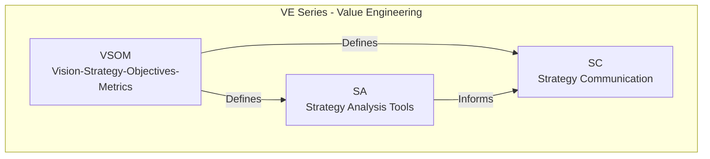
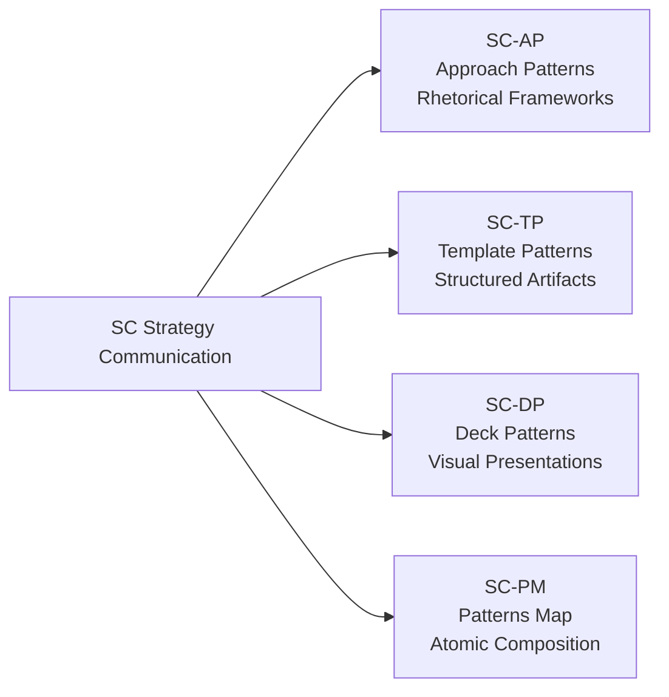
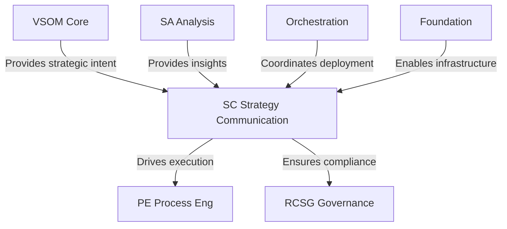
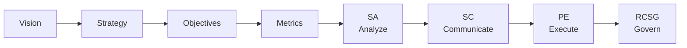
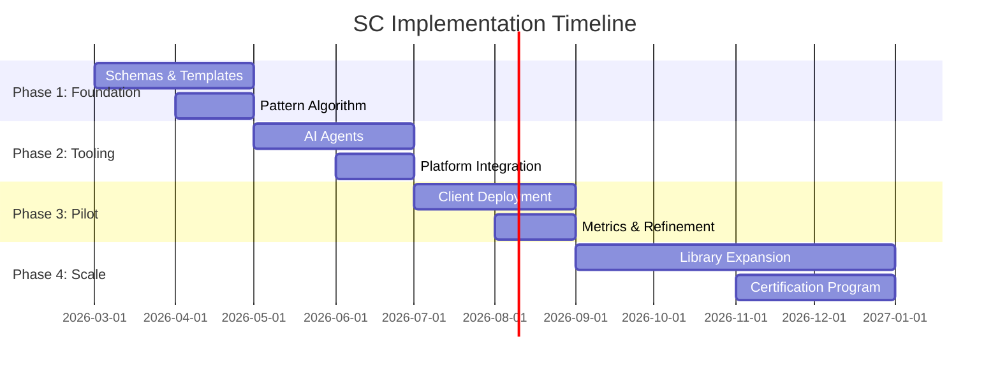

# SC STRATEGY COMMUNICATION ONTOLOGY - COMPLETE DOCUMENTATION PACKAGE

**Version**: 1.0  
**Date**: 2026-02-16  
**Author**: AI/BI Digital Transformation Consultant  
**Series**: VE-03 (Value Engineering Sub-Series)  
**Part of**: PF-Core Ontology Architecture

---

## Package Contents

This comprehensive package contains all documentation for the SC (Strategy Communication) Ontology:

1. **01-SC-Ontology-Overview.md** - Architecture and high-level patterns
2. **02-SC-AP-Approach-Patterns.md** - Rhetorical frameworks (7 patterns)
3. **03-SC-TP-Template-Patterns.md** - Structured artifacts (9+ patterns)
4. **04-SC-DP-Deck-Patterns.md** - Visual presentations (5+ patterns)
5. **05-SC-PM-Patterns-Map.md** - Atomic composition framework
6. **06-SC-Integration-Mappings.md** - Cross-ontology integrations
7. **07-SC-Implementation-Guide.md** - 4-phase deployment roadmap
8. **08-SC-Schemas.json** - JSON-LD schema definitions
9. **09-PF-Core-Summary.md** - Complete ontology series summary

---

## Quick Start

### What is SC?

SC (Strategy Communication) is the third sub-series of the VE (Value Engineering) ontology within PF-Core. It bridges the critical gap between strategic analysis and organizational execution.

**Core Principle**: *"Strategy is nothing without communication, culture, and execution"*

### Why SC Matters

Most organizations fail at strategy execution not because of bad strategy, but because of:
- Poor communication of strategic intent
- Misalignment across stakeholders  
- Inability to translate strategy into action
- Lack of systematic communication patterns

SC solves this by providing **reusable, AI-enabled communication patterns** that ensure strategic initiatives are properly communicated, understood, and executed.

---

## SC Architecture Overview

### Position in VE Series



### Four Pattern Categories



**SC-AP (Approach Patterns)**: HOW to communicate
- 30-Second Answer, Rented Brain, Ars Rhetorica, Fait Accompli, Dramatic Structure, Deconstruction, Scalable Business Machines

**SC-TP (Template Patterns)**: WHAT artifacts to create
- One Slider, Use Case Map, Directional Costing, Priority Map, BSC, Technology Radar, Build-Buy-Partner, Due Diligence, Architecture Definition

**SC-DP (Deck Patterns)**: HOW to present visually
- Ghost Deck, Ask Deck, Strategy Deck, Roadmap Deck, Tactical Plan Deck

**SC-PM (Patterns Map)**: HOW to select and combine
- Pattern selection algorithm, Composition rules, Use case mapping

---

## Integration with PF-Core

### Cross-Ontology Relationships



### Strategy to Execution Flow



---

## Quick Reference: Use Case Pattern Mapping

| Situation | Primary Patterns | Output |
|-----------|------------------|--------|
| **Board Approval Needed** | SC-AP-001 (30-Sec)<br/>SC-DP-002 (Ask Deck) | Approval decision |
| **Org Transformation** | SC-AP-005 (Dramatic)<br/>SC-DP-003 (Strategy Deck) | Aligned organization |
| **Tech Strategy** | SC-TP-006 (Tech Radar)<br/>SC-DP-004 (Roadmap) | Tech roadmap |
| **Client Pitch** | SC-AP-002 (Rented Brain)<br/>SC-DP-002 (Ask Deck) | Client engagement |
| **Scaling Operations** | SC-AP-007 (Scalable Machines)<br/>SC-DP-005 (Tactical) | Execution plan |

---

## Strategic Hypothesis

**"Will SC significantly enhance the ability to deliver and achieve our strategy?"**

### Success Metrics

| Category | Metric | Target |
|----------|--------|--------|
| **Input** | Stakeholder Comprehension | >85% |
| **Input** | Strategic Alignment | +30% improvement |
| **Input** | Decision Velocity | -40% cycle time |
| **Process** | Initiative Adoption | >90% |
| **Process** | Artifact Creation Time | -60% reduction |
| **Outcome** | VSOM Achievement | >80% on time |
| **Outcome** | Execution Success | >85% delivered |

---

## Implementation Roadmap



### Phases Overview

1. **Foundation (Months 1-2)**: Build schemas, templates, algorithms
2. **Tooling (Months 3-4)**: Develop AI agents and integrations
3. **Pilot (Months 5-6)**: Deploy to 2-3 clients, measure effectiveness
4. **Scale (Months 7-12)**: Expand library, create vertical packages, certify practitioners

---

## AI-Led Differentiation

### Agentic Capabilities

**SC-Pattern-Selector-Agent**
- Analyzes audience, context, VSOM phase
- Recommends optimal pattern combinations
- Explains selection rationale

**SC-Content-Generator-Agent**
- Populates templates with VSOM/SA data
- Generates presentation content
- Adapts tone for audience

**SC-Personalization-Agent** (Phase 4)
- Creates audience-specific variants
- Orchestrates multi-touch campaigns
- A/B tests messaging effectiveness

---

## Next Steps

1. **Review individual pattern files** (02-07) for detailed specifications
2. **Examine JSON schemas** (08) for technical implementation
3. **Study integration mappings** (06) for cross-ontology connections
4. **Follow implementation guide** (07) for deployment
5. **Consult PF-Core summary** (09) for complete architecture context

---

## File Manifest

All files in this package use Schema.org base types and follow PF-Core ontology standards:

```
/mnt/user-data/outputs/
├── SC-Ontology-Complete-Package.md (THIS FILE)
├── 01-SC-Ontology-Overview.md
├── 02-SC-AP-Approach-Patterns.md
├── 03-SC-TP-Template-Patterns.md
├── 04-SC-DP-Deck-Patterns.md
├── 05-SC-PM-Patterns-Map.md
├── 06-SC-Integration-Mappings.md
├── 07-SC-Implementation-Guide.md
├── 08-SC-Schemas.json
└── 09-PF-Core-Summary.md
```

---

## Schema.org Foundation

All SC patterns extend standard Schema.org types:

```json
{
  "@context": "https://schema.org",
  "@type": "DefinedTermSet",
  "name": "SC Strategy Communication Patterns",
  "inDefinedTermSet": "VE Value Engineering Ontology"
}
```

---

## Support & Contribution

For implementation support, pattern customization, or contribution to the SC ontology:

- Review implementation guide for deployment steps
- Consult integration mappings for technical details
- Reference individual pattern files for specific use cases
- Follow PF-Core standards for extensions

---

**End of SC Ontology Complete Package Overview**

*Proceed to individual files for detailed specifications*
