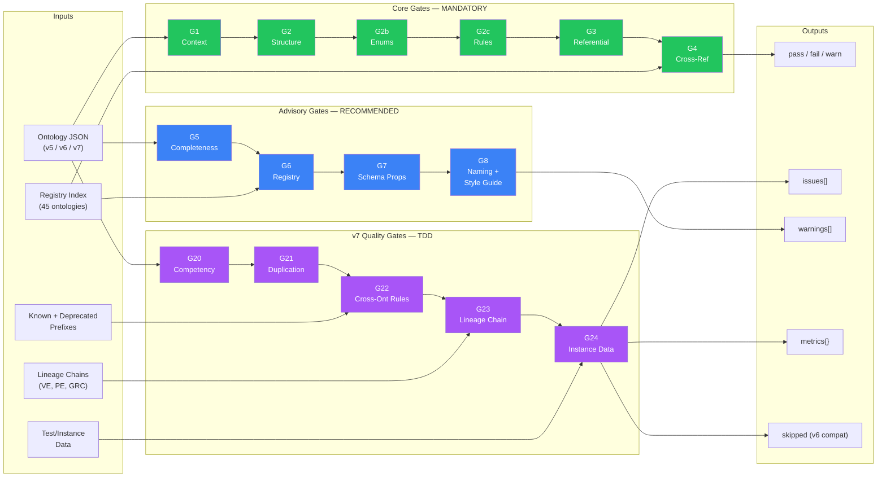
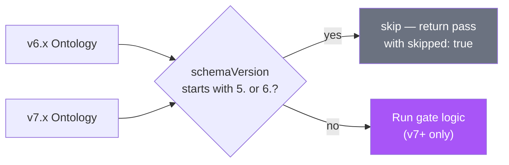
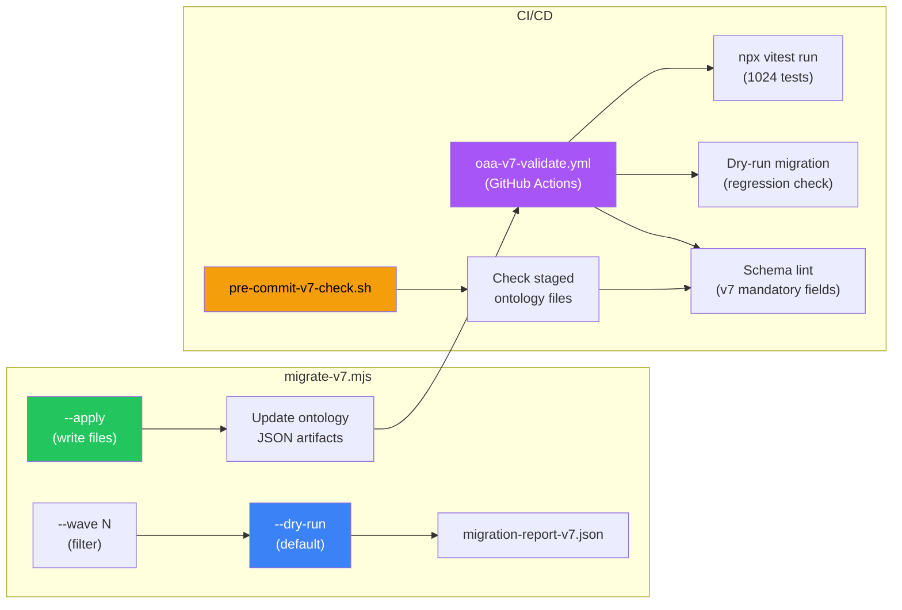

# Audit Engine Architecture

**Module:** `js/audit-engine.js`
**Tests:** `tests/audit-engine.test.js`, `tests/gates-v7.test.js`, `tests/gates-v7-batch2.test.js`, `tests/gates-v7-batch3.test.js`
**Test Count:** 1024 pass (35 files)
**TDD Policy:** Tests written FIRST, implementation SECOND (Epic 21 mandatory)
**OAA Version:** 7.0.0 | **Registry:** v10.0.0

---

## Gate Pipeline

## Gate Detail

```mermaid
flowchart TB
    subgraph G20D["G20: Competency Coverage"]
        CQ["competencyQuestions[]"] --> TE["targetEntities"]
        CQ --> TR["targetRelationships"]
        CQ --> TRU["targetRules"]
        TE --> COV["Coverage %\nentity / rel / rule"]
        TR --> COV
        TRU --> COV
        COV -->|100%| P20["pass"]
        COV -->|below 100%| W20["warn + uncovered list"]
    end

    subgraph G21D["G21: Semantic Duplication"]
        ENT["entities[].description"] --> TOK["tokenJaccard(a, b)"]
        TOK -->|below 70%| P21["pass"]
        TOK -->|70-90%| W21["warn — review"]
        TOK -->|above 90%| F21["fail — likely duplicate"]
    end

    subgraph G22D["G22: Cross-Ontology Rules"]
        REL["relationships with\ncrossOntologyRef"] --> PFX["Extract prefix\nfrom rangeIncludes"]
        PFX -->|known| P22["pass"]
        PFX -->|deprecated| WD["warn — deprecated"]
        PFX -->|unknown| WU["warn — unrecognised"]
    end

    subgraph G23D["G23: Lineage Chain Integrity"]
        CHAIN["Lineage chain\ne.g. VSOM-OKR-VP-PMF-EFS"] --> POS["Find position\nin chain"]
        POS -->|not found| SK["skip"]
        POS -->|found| CHK["Check upstream +\ndownstream refs"]
        CHK -->|both linked| P23["pass"]
        CHK -->|missing| W23["warn — gap in chain"]
    end

    subgraph G24D["G24: Instance Data Quality"]
        TI["testInstances{} or\ntestData{}"] --> SCH["Schema conformance\n(@type resolves?)"]
        SCH -->|all valid| P24S["pass"]
        SCH -->|unresolved| W24S["warn — bad @type"]
        TI --> DIST["Distribution check\n60-20-10-10 target"]
        DIST -->|within 10%| P24D["pass"]
        DIST -->|deviation >10%| W24D["warn — skewed"]
        TI --> CQL["CQ linkage\n(cqRef on instances)"]
        CQL -->|all CQs covered| P24C["pass"]
        CQL -->|uncovered CQs| W24C["warn — gaps"]
    end

    style P20 fill:#22c55e,color:#fff
    style W20 fill:#f59e0b,color:#000
    style P21 fill:#22c55e,color:#fff
    style W21 fill:#f59e0b,color:#000
    style F21 fill:#ef4444,color:#fff
    style P22 fill:#22c55e,color:#fff
    style WD fill:#f59e0b,color:#000
    style WU fill:#f59e0b,color:#000
    style P23 fill:#22c55e,color:#fff
    style W23 fill:#f59e0b,color:#000
    style SK fill:#6b7280,color:#fff
    style P24S fill:#22c55e,color:#fff
    style W24S fill:#f59e0b,color:#000
    style P24D fill:#22c55e,color:#fff
    style W24D fill:#f59e0b,color:#000
    style P24C fill:#22c55e,color:#fff
    style W24C fill:#f59e0b,color:#000
```

## Backward Compatibility

## Migration Pipeline

## Exported Functions

| Function | Gate | Signature | Returns |
|----------|------|-----------|---------|
| `validateG1Context` | G1 | `(data)` | `{gate, status, issues}` |
| `validateG2Structure` | G2 | `(data)` | `{gate, status, issues}` |
| `validateG2bEnums` | G2b | `(data)` | `{gate, status, issues}` |
| `validateG2cRules` | G2c | `(data)` | `{gate, status, issues}` |
| `validateG3Referential` | G3 | `(data)` | `{gate, status, issues}` |
| `validateG4CrossRef` | G4 | `(data, registry)` | `{gate, status, issues}` |
| `validateG5Completeness` | G5 | `(data)` | `{gate, status, warnings}` |
| `validateG6RegistryFormat` | G6 | `(data)` | `{gate, status, warnings}` |
| `validateG7SchemaProperties` | G7 | `(data)` | `{gate, status, warnings}` |
| `validateG8NamingConventions` | G8 | `(data)` | `{gate, status, warnings}` |
| `validateG8StyleGuideCompliance` | G8+ | `(data)` | `{gate, status, issues, warnings, metrics}` |
| `validateG20CompetencyCoverage` | G20 | `(data)` | `{gate, status, issues, warnings, metrics, skipped?}` |
| `validateG21SemanticDuplication` | G21 | `(data)` | `{gate, status, issues, warnings, advisory, skipped?}` |
| `validateG22CrossOntologyRules` | G22 | `(data, knownPrefixes, deprecatedPrefixes)` | `{gate, status, issues, warnings, metrics, skipped?}` |
| `validateG23LineageChainIntegrity` | G23 | `(data, lineageChain)` | `{gate, status, issues, warnings, metrics, skipped?}` |
| `validateG24InstanceDataQuality` | G24 | `(data)` | `{gate, status, issues, warnings, metrics, advisory, skipped?}` |
| `tokenJaccard` | util | `(a, b)` | `number (0.0-1.0)` |
| `computeMultiOntologyScores` | util | `(loadedOntologies)` | `[{ontology, score}]` |
| `extractEntities` | util | `(data)` | `entity[]` |
| `extractRelationships` | util | `(data)` | `relationship[]` |

## Legend

| Colour | Meaning |
|--------|---------|
| Green | Core gates (G1-G4) — mandatory, blocks compliance |
| Blue | Advisory gates (G5-G8+) — recommended, warnings only |
| Purple | v7 Quality gates (G20-G24) — TDD, skip for v6 |
| Grey | Planned / skipped |
| Amber | Warning output |
| Red | Failure output |
