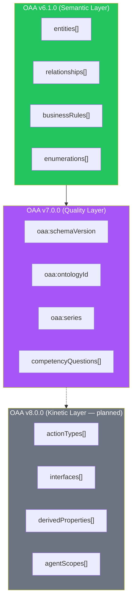
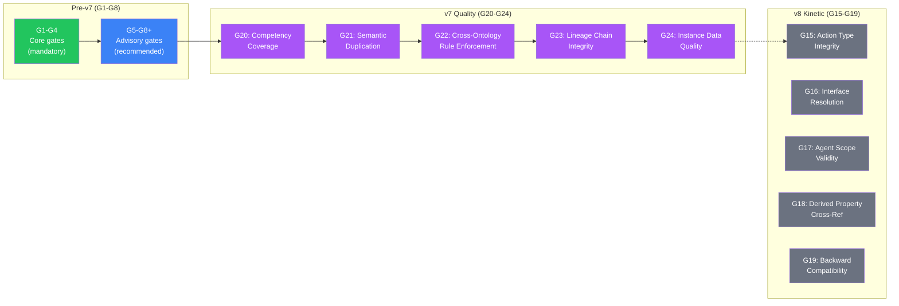
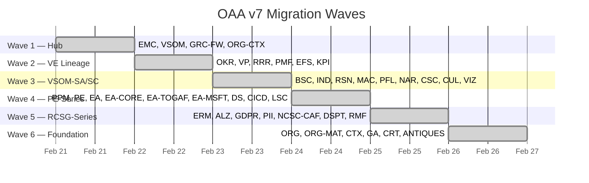
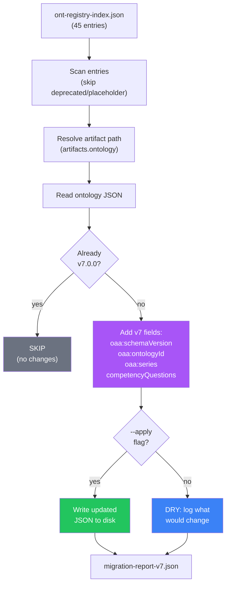
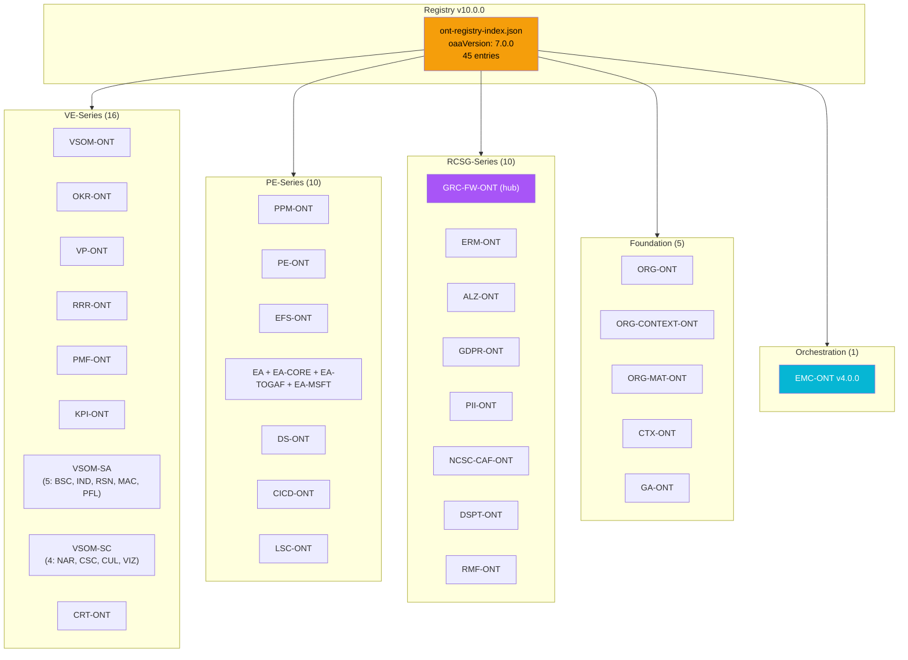
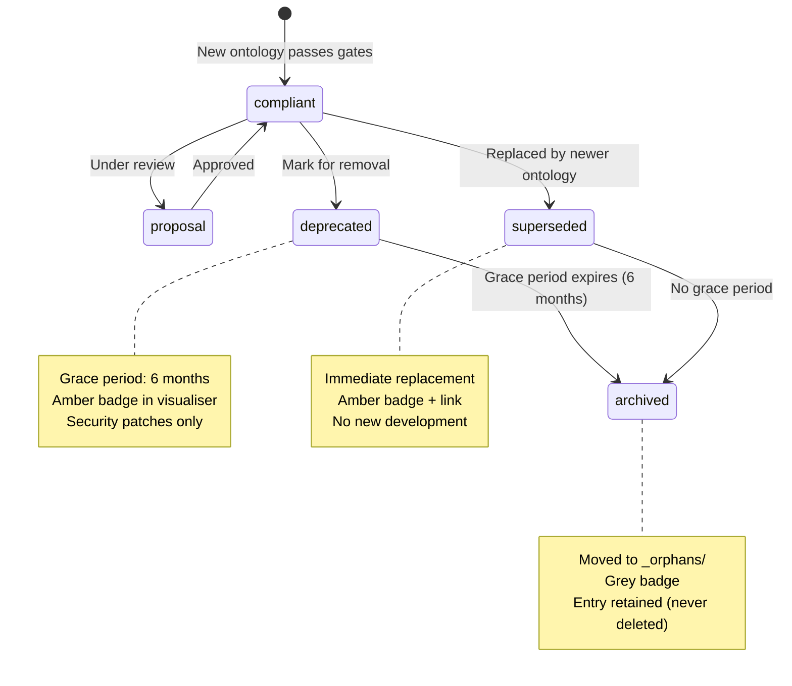
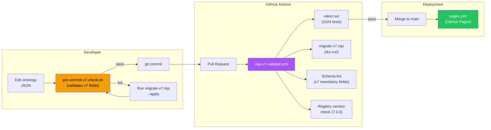

# OAA v7.0.0 Architecture

**Version:** 1.0.0
**Date:** 2026-02-21
**Status:** Production
**Epics:** 21 (#270) + 42 (#608)
**Registry:** v10.0.0 | **Tests:** 1024/1024

---

## 1. Overview

OAA v7.0.0 is the **Quality Foundations** release — a backward-compatible layer adding competency questions, schema identity, and five quality gates (G20-G24) to all 41 active ontologies. The kinetic layer (action types, interfaces, agent scopes) is deferred to v8.



---

## 2. v7 Mandatory Fields

Every v7-compliant ontology artifact MUST contain these four fields:

| Field | Type | Source | Example |
|-------|------|--------|---------|
| `oaa:schemaVersion` | string | Specification version | `"7.0.0"` |
| `oaa:ontologyId` | string | Derived from registry `@id` | `"VSOM-ONT"` |
| `oaa:series` | string | Derived from registry `layer` | `"VE-Series"` |
| `competencyQuestions` | array | 1 CQ per entity (skeleton) | `[{@id: "CQ-001", ...}]` |

### Competency Question Schema

```json
{
  "@id": "CQ-001",
  "question": "What is the role and purpose of ValueProposition within this ontology?",
  "targetEntities": ["vp:ValueProposition"],
  "targetRelationships": ["addressesProblem"],
  "targetRules": ["BR-001"]
}
```

---

## 3. Quality Gate Architecture



### Gate Summary

| Gate | Name | Type | Input | Severity |
|------|------|------|-------|----------|
| G20 | Competency Coverage | Quality | `competencyQuestions[]` | Warning |
| G21 | Semantic Duplication | Quality | `entities[].description` | Advisory |
| G22 | Cross-Ontology Rules | Quality | `relationships[].crossOntologyRef` | Warning |
| G23 | Lineage Chain Integrity | Quality | Lineage chain position | Warning |
| G24 | Instance Data Quality | Quality | `testInstances{}` / `testData{}` | Advisory |

All v7 gates return `skipped: true` for v6.x ontologies (backward compatible).

---

## 4. Migration Architecture

### 6-Wave Strategy



### Migration Tool Flow



---

## 5. Ontology Library Structure (v7)



---

## 6. Deprecation Lifecycle



### Current Status

| Ontology | Status | Replaced By | Badge |
|----------|--------|-------------|-------|
| CA-ONT | deprecated | ORG-CONTEXT-ONT | Amber |
| CL-ONT | deprecated | ORG-CONTEXT-ONT | Amber |
| RCSG-FW v2.0.0 | superseded | GRC-FW-ONT v3.0.0 | Amber |

---

## 7. CI/CD Integration



---

## 8. Backward Compatibility Contract

| Guarantee | Description |
|-----------|-------------|
| **v6 ontologies load without error** | Gates G20-G24 return `skipped` for v6.x |
| **Parser accepts both v6 and v7** | No branching on schema version |
| **Cross-version cross-refs work** | v7 can reference v6 and vice versa |
| **No forced upgrade** | Migration is explicit and opt-in |
| **Rollback safe** | Removing v7 fields returns valid v6 |
| **MAJOR-1 backward compat** | Per OAA-SCHEMA-EVOLUTION-POLICY.md |

---

## 9. Artefacts Inventory

| Artefact | Location | Purpose |
|----------|----------|---------|
| `audit-engine.js` | `js/audit-engine.js` | G1-G8+, G20-G24 gate implementations |
| `migrate-v7.mjs` | `scripts/migrate-v7.mjs` | v6→v7 migration tool (6 waves) |
| `pre-commit-v7-check.sh` | `scripts/pre-commit-v7-check.sh` | Git pre-commit hook |
| `oaa-v7-validate.yml` | `.github/workflows/` | CI/CD pipeline |
| `oaa-v7/system-prompt.md` | `PBS/AGENTS/oaa-v7/` | OAA v7 agent prompt |
| `OAA-SCHEMA-EVOLUTION-POLICY.md` | `PBS/ONTOLOGIES/` | Versioning & deprecation policy |
| `OAA-V7-MIGRATION-RUNBOOK.md` | `PBS/ONTOLOGIES/` | Operator migration guide |
| `OAA-STYLE-GUIDE.md` | `PBS/ONTOLOGIES/` | Entity/relationship naming rules |
| `OAA-NAMESPACE-REGISTRY.md` | `PBS/ONTOLOGIES/` | 45 canonical prefixes |
| `ont-registry-index.json` | `ontology-library/` | Registry v10.0.0, 45 entries |
| `migration-report-v7.json` | `ontology-library/validation-reports/` | Migration audit trail |

---

## 10. Test Architecture

| Test File | Gate Coverage | Count |
|-----------|-------------|-------|
| `audit-engine.test.js` | G1-G8 | Core gates |
| `g8-style-guide.test.js` | G8+ | Style guide enforcement |
| `gates-v7.test.js` | G20, G21 | Competency + duplication |
| `gates-v7-batch2.test.js` | G22, G23 | Cross-ontology + lineage |
| `gates-v7-batch3.test.js` | G24 | Instance data quality (13 tests) |
| 30 other test files | Parser, renderer, UI | Full regression suite |
| **Total** | **G1-G24** | **1024 tests** |
