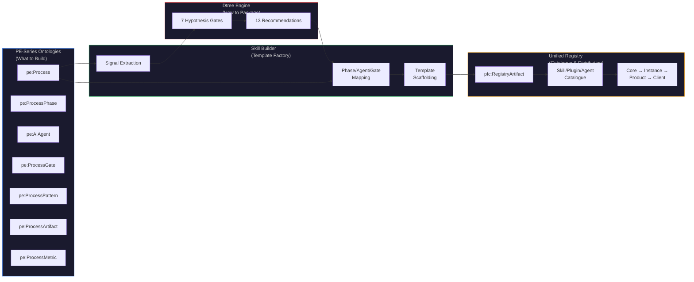
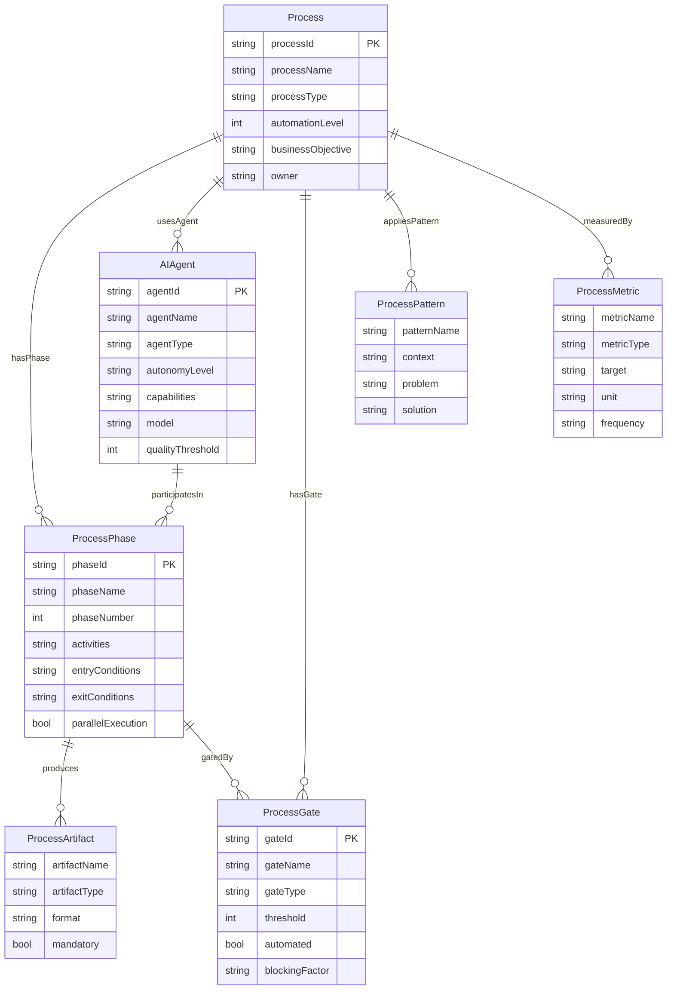
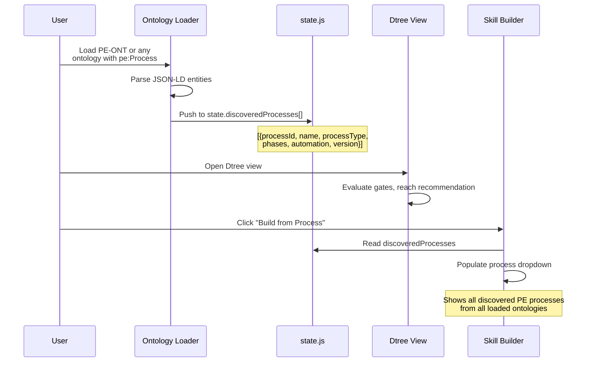
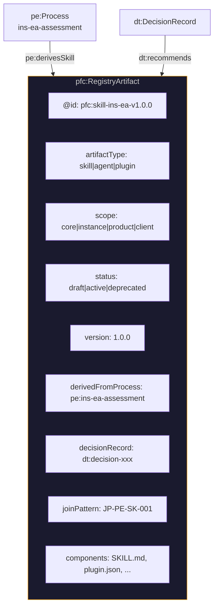
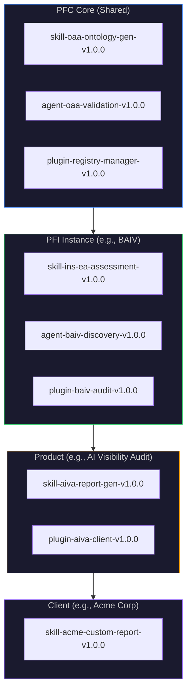
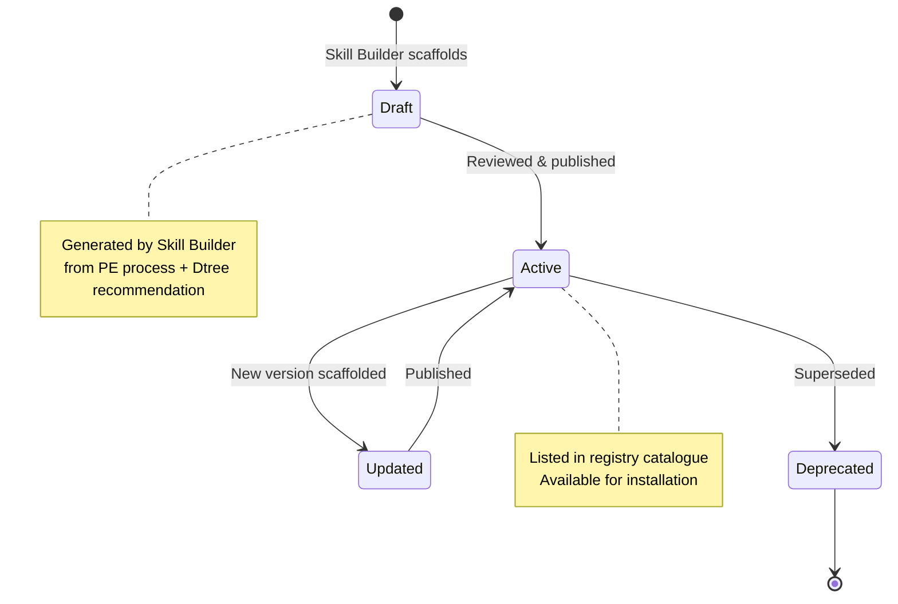
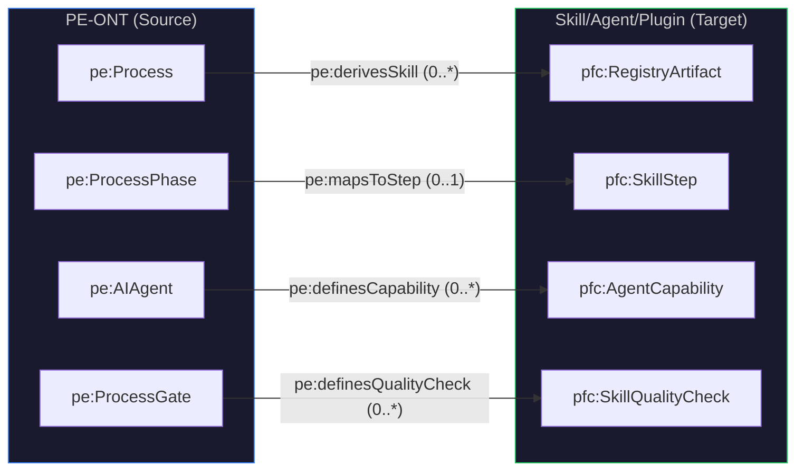
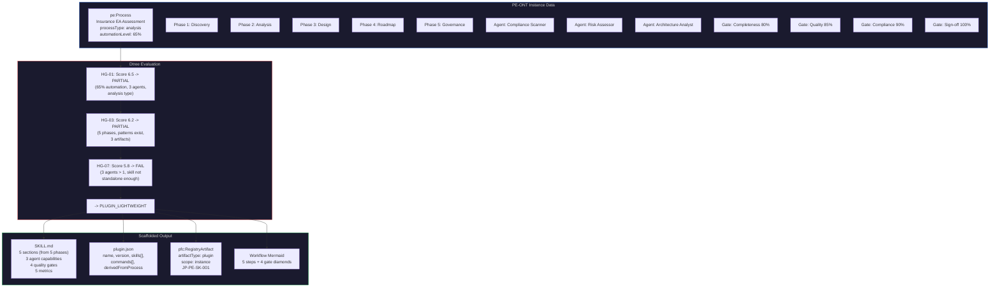
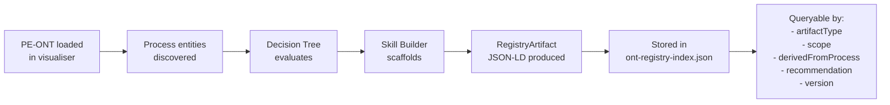
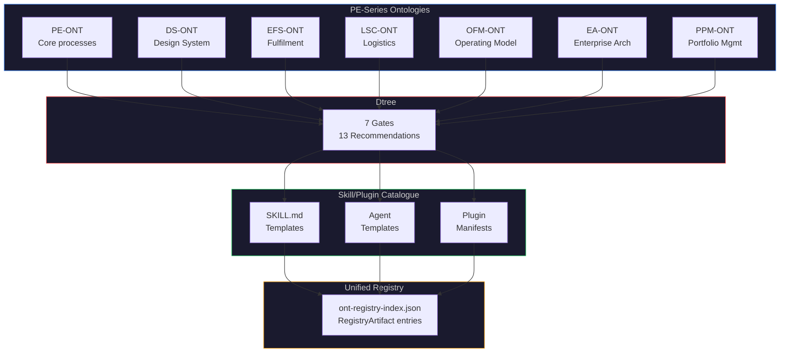

# PE-Series Process Catalogue as Skills & Plugins Foundation

**Feature:** F34.11 — Process-to-Skill Scaffolding
**Join Pattern:** JP-PE-SK-001 (Process-to-Skill Derivation Bridge)
**Version:** 1.0.0
**Date:** 2026-02-25

---

## 1. The Core Thesis

Every well-defined PE-ONT process is a potential skill, plugin, or agent. The PE-Series ontologies provide the **structural definition** (what the process does), while the Dtree engine provides the **mechanism selection** (how it should be packaged), and the Unified Registry provides the **catalogue** (where it's stored, versioned, and distributed).



---

## 2. PE-Series as the Process Catalogue

### 2.1 Process Entity Model

PE-ONT v3.0.0 defines 10 entity types that together describe any process with sufficient detail to scaffold an automation artifact:



### 2.2 Process Catalogue Assumption

**All processes defined in the PE-Series are candidates for skill/plugin cataloguing.** This means:

| PE-Series Ontology | Process Domain | Example Processes |
|---------------------|----------------|-------------------|
| PE-ONT | Process Engineering | Insurance EA Assessment, Cloud Migration, AIRL Assessment |
| DS-ONT | Design System | Token Extraction, Component Audit, Theme Generation |
| EFS-ONT | Enterprise Fulfilment | Order Processing, Supply Chain, Logistics |
| LSC-ONT | Logistics & Supply Chain | Corridor Management, Route Optimisation |
| OFM-ONT | Operating Model | Capability Assessment, Org Restructure |
| EA-ONT | Enterprise Architecture | TOGAF ADM, Architecture Review |
| PPM-ONT | Portfolio Management | Project Prioritisation, Resource Allocation |

Each ontology that defines `pe:Process` entities (directly or via cross-references) contributes processes to the catalogue.

### 2.3 Process Discovery in the Visualiser

The visualiser already discovers PE processes via `state.discoveredProcesses` (populated at ontology load time):



---

## 3. Registry Artifact Model

### 3.1 The pfc:RegistryArtifact

When the Skill Builder scaffolds a template, it produces a `pfc:RegistryArtifact` — the unit of catalogue entry in the Unified Registry:



### 3.2 Catalogue Cascade: Core -> Instance -> Product -> Client

The Unified Registry architecture uses a 4-tier cascade. Each process-derived artifact lives at the appropriate scope level:



| Scope | Who Defines | Example |
|-------|-------------|---------|
| **Core** | PF-Core platform team | OAA ontology generation skill, registry manager plugin |
| **Instance** | PFI instance team (BAIV, W4M, AIRL) | Insurance EA assessment skill, BAIV discovery agent |
| **Product** | Product owner | AI Visibility Audit client plugin |
| **Client** | Client customisation | Client-specific report templates |

### 3.3 Artifact Lifecycle



---

## 4. Join Pattern: JP-PE-SK-001

The Process-to-Skill Derivation Bridge establishes traceability between PE-ONT process structures and the resulting automation artifacts:



| Relationship | Cardinality | Meaning |
|-------------|-------------|---------|
| `pe:derivesSkill` | Process -> RegistryArtifact (0..*) | A process can produce multiple skills/agents/plugins |
| `pe:mapsToStep` | ProcessPhase -> SkillStep (0..1) | Each phase maps to at most one workflow step |
| `pe:definesCapability` | AIAgent -> AgentCapability (0..*) | Each agent defines capabilities in the template |
| `pe:definesQualityCheck` | ProcessGate -> SkillQualityCheck (0..*) | Each gate defines a quality checkpoint |

---

## 5. End-to-End Worked Example

### Insurance EA Assessment -> SKILL_STANDALONE



### Phase-to-Section Mapping Detail

| PE Phase | Skill Section | Mapped Content |
|----------|--------------|----------------|
| Discovery (Phase 1) | Section 1: Discovery | Activities -> Instructions, Entry conditions -> Prerequisites, Exit conditions -> Success criteria |
| Analysis (Phase 2) | Section 2: Analysis | + Gate G1 (Completeness 80%) as quality checkpoint |
| Design (Phase 3) | Section 3: Design | + Gate G2 (Quality 85%) + Artifact: Architecture Blueprint |
| Roadmap (Phase 4) | Section 4: Roadmap | + Gate G3 (Compliance 90%) + Artifact: Roadmap Document |
| Governance (Phase 5) | Section 5: Governance | + Gate G4 (Sign-off 100%) + Artifact: Governance Report |

---

## 6. How the Registry Enables Cataloguing

### 6.1 Discovery Path



### 6.2 Catalogue Query Examples

From the registry, consumers can query:

| Query | Registry Filter | Result |
|-------|----------------|--------|
| "All skills for BAIV instance" | `scope=instance AND instance=BAIV` | Insurance EA Assessment skill, BAIV Discovery agent |
| "All agent templates" | `artifactType=agent` | All agent-type registry artifacts |
| "Skills derived from PE processes" | `joinPattern=JP-PE-SK-001` | All process-derived skills/agents/plugins |
| "Plugins with Cowork UI" | `artifactType=plugin AND cowork=true` | Cowork-enabled plugins |
| "What process defined this skill?" | `derivedFromProcess=pe:ins-ea-assessment` | Back-trace to source PE process |

### 6.3 Cross-Referencing

The `pfc:derivedFromProcess` link in every RegistryArtifact creates a bidirectional reference:

- **Forward**: PE Process -> "What skills/plugins exist for this process?"
- **Backward**: Skill/Plugin -> "What process defined this, and what are its phases/gates/agents?"

This enables:
- **Impact analysis**: If a PE process changes, which skills need updating?
- **Coverage analysis**: Which PE processes have no skills scaffolded yet?
- **Traceability**: From a client using a skill, trace back to the original process definition, its gates, and quality standards

---

## 7. Full PE-Series Coverage Map

Every PE-Series ontology that defines processes contributes to the potential skill catalogue:



---

## 8. PFI Instance Perspective

Each PFI instance declares its `instanceOntologies` in the EMC configuration. The processes within those ontologies define the instance's skill catalogue scope:

| PFI Instance | Instance Ontologies | Available Processes | Potential Catalogue |
|-------------|--------------------|--------------------|-------------------|
| **BAIV** | VP, RRR, KPI, BSC, PE, OFM, LSC, EMC + 8 more | Insurance EA Assessment, AI Visibility Audit, Client Discovery | 16 agents, ~10 skills, ~5 plugins |
| **W4M-WWG** | VP, RRR, LSC, OFM, KPI, BSC, EMC | Supply Chain Management, Corridor Optimisation, Fulfilment Process | ~5 skills, ~3 plugins |
| **AIRL-CAF-AZA** | VP, RRR, KPI, PE, NCSC-CAF, AZALZ | Azure Readiness Assessment, CAF Compliance Audit, Landing Zone Design | ~8 skills, ~3 agents |
| **VHF** (PoC) | VP, RRR, KPI, OFM, BSC, EMC | Customer Journey, Product Catalogue, Support Process | ~4 skills, ~1 agent |

---

## 9. Future Evolution

### 9.1 Automated Catalogue Population

Currently the Skill Builder is manual (user selects process, adjusts parameters, clicks Generate). Future phases could:

1. **Batch scaffolding**: Iterate all `state.discoveredProcesses` and scaffold templates automatically
2. **Registry integration**: Direct publish to `ont-registry-index.json` from the Build Panel
3. **Version management**: Detect when a PE process has changed and prompt re-scaffolding
4. **Diff comparison**: Show what changed between v1.0.0 and v2.0.0 of a scaffolded skill

### 9.2 Cross-Series Skills

Some skills span multiple PE-Series ontologies (e.g., a compliance audit skill needs PE-ONT + GRC-FW-ONT + NCSC-CAF-ONT). The `pfc:dependencies` array in the RegistryArtifact tracks these:

```jsonld
{
  "@type": "pfc:RegistryArtifact",
  "pfc:derivedFromProcess": "pe:caf-compliance-audit",
  "pfc:dependencies": ["PE-ONT", "GRC-FW-ONT", "NCSC-CAF-ONT"],
  "pfc:joinPattern": "JP-PE-SK-001"
}
```

### 9.3 Agent-to-Skill Decomposition

An AGENT_ORCHESTRATOR recommendation may itself contain sub-skills. Future work could recursively scaffold inner skills from sub-agent definitions within the PE process.
