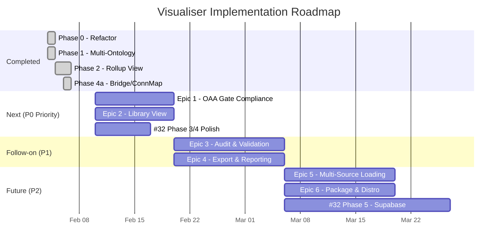

# OAA Ontology Visualiser — Implementation Plan v2.0.0

**Version:** 2.0.0 | **Date:** 2026-02-08 | **Status:** Active
**Supersedes:** [IMPLEMENTATION-PLAN-v1.0.0.md](IMPLEMENTATION-PLAN-v1.0.0.md)
**Project Board:** [AZLAN-1](https://github.com/users/ajrmooreuk/projects/28) | **Milestone:** OAA-VIS-MK3

---

## Current State (v3.0.0)

The visualiser has been refactored from a 2,980-line monolith into **11 ES modules** with zero build step, multi-ontology registry loading (23 ontologies, 6 series), tiered drill-through navigation, bridge node detection, and connection map mode.

| Capability | Status |
|-----------|--------|
| Modular architecture (11 ES modules) | Done |
| Multi-ontology registry loader (23 ONTs) | Done |
| Series Rollup View (Tier 0) | Done |
| VE / PE lineage chain highlighting | Done |
| Bridge node detection & highlighting | Done |
| Connection Map mode | Done |
| Isolated node detection (GATE 2B partial) | Done |
| Connected component count (GATE 2C partial) | Done |
| PNG export | Done |
| Tests | 23/24 passing |

---

## Epic Map

Seven epics govern all remaining work. Epics 1 and 2 are **planned and Ready**; the rest are in Backlog.

| # | Epic | GitHub | Priority | Status | Points |
|---|------|--------|----------|--------|--------|
| 1 | OAA 5.0.0 Verification — Visual Gate Compliance | [#53](https://github.com/ajrmooreuk/Azlan-EA-AAA/issues/53) | P0 | **Ready** | 18 remaining |
| 2 | Sub-Ontology Connections — Library View | [#54](https://github.com/ajrmooreuk/Azlan-EA-AAA/issues/54) | P0 | **Ready** | 16 remaining |
| V3 | Graph Rollup, Drill-Through & DB Integration | [#32](https://github.com/ajrmooreuk/Azlan-EA-AAA/issues/32) | P0 | Ready | ~40 remaining |
| 3 | Enhanced Audit & Validation | [#55](https://github.com/ajrmooreuk/Azlan-EA-AAA/issues/55) | P1 | Backlog | 26 |
| 4 | Export & Reporting | [#56](https://github.com/ajrmooreuk/Azlan-EA-AAA/issues/56) | P1 | Backlog | 28 |
| 5 | Multi-Source Loading | [#57](https://github.com/ajrmooreuk/Azlan-EA-AAA/issues/57) | P2 | Backlog | 25 |
| 6 | Package & Distribution | [#58](https://github.com/ajrmooreuk/Azlan-EA-AAA/issues/58) | P2 | Backlog | 33 |

---

## Next Phase: Epic 1 — OAA 5.0.0 Verification

**Goal:** Complete visual gate compliance checking so ontologies can be validated against OAA 5.0.0 connectivity gates directly in the visualiser.

### Stories (9 remaining, 18 pts)

| Story | Issue | Description | Size |
|-------|-------|-------------|------|
| 1.1.3 | [#59](https://github.com/ajrmooreuk/Azlan-EA-AAA/issues/59) | Click isolated node in Audit panel to focus in graph | S |
| 1.1.4 | [#60](https://github.com/ajrmooreuk/Azlan-EA-AAA/issues/60) | PASS/FAIL badge for GATE 2B | XS |
| 1.2.2 | [#61](https://github.com/ajrmooreuk/Azlan-EA-AAA/issues/61) | Colour connected components differently | S |
| 1.2.3 | [#62](https://github.com/ajrmooreuk/Azlan-EA-AAA/issues/62) | Filter view to single component | S |
| 1.2.4 | [#63](https://github.com/ajrmooreuk/Azlan-EA-AAA/issues/63) | PASS/WARNING badge for GATE 2C | XS |
| 1.3.1 | [#64](https://github.com/ajrmooreuk/Azlan-EA-AAA/issues/64) | Edge-to-node density ratio in stats bar | XS |
| 1.3.2 | [#65](https://github.com/ajrmooreuk/Azlan-EA-AAA/issues/65) | Density traffic-light indicator (green/yellow/red) | S |
| 1.3.3 | [#66](https://github.com/ajrmooreuk/Azlan-EA-AAA/issues/66) | Configurable density threshold (default 0.8) | S |
| 1.4.1 | [#67](https://github.com/ajrmooreuk/Azlan-EA-AAA/issues/67) | Consolidated OAA Gates summary section | S |
| 1.4.2 | [#68](https://github.com/ajrmooreuk/Azlan-EA-AAA/issues/68) | Export validation report as Markdown | S |
| 1.4.3 | [#69](https://github.com/ajrmooreuk/Azlan-EA-AAA/issues/69) | Copy gate results to clipboard | S |

### Suggested Build Order

```
 Batch A (badges & stats)          Batch B (component viz)         Batch C (summary & export)
 ┌──────────────────────┐         ┌──────────────────────┐        ┌──────────────────────┐
 │ #60 GATE 2B badge    │         │ #61 Component colours│        │ #67 OAA Gates panel  │
 │ #63 GATE 2C badge    │         │ #62 Component filter │        │ #68 MD report export │
 │ #64 Density ratio    │         │ #59 Click-to-focus   │        │ #69 Clipboard copy   │
 │ #65 Density indicator│         └──────────────────────┘        └──────────────────────┘
 │ #66 Threshold config │
 └──────────────────────┘
        5 stories                        3 stories                       3 stories
```

Batch A can be implemented independently. Batch B requires graph traversal (BFS/DFS) for component detection. Batch C depends on A and B data being available.

### Exit Criteria
- All three OAA gates (2B, 2C, density) display PASS/FAIL/WARNING badges
- Consolidated gates summary panel at top of Audit section
- Validation report downloadable as Markdown
- Gate results copyable to clipboard for PR comments

---

## Next Phase: Epic 2 — Sub-Ontology Connections (Library View)

**Goal:** Add an ontology library browser panel with drag-to-add and dependency visualisation. (Multi-ontology loading, cross-ontology edges, and bridge nodes already completed under Epic #32.)

### Stories (4 remaining, 16 pts)

| Story | Issue | Description | Size |
|-------|-------|-------------|------|
| 2.4.1 | [#70](https://github.com/ajrmooreuk/Azlan-EA-AAA/issues/70) | Library panel listing all ontologies by series | M |
| 2.4.2 | [#71](https://github.com/ajrmooreuk/Azlan-EA-AAA/issues/71) | Drag ontologies from Library onto graph | S |
| 2.4.3 | [#72](https://github.com/ajrmooreuk/Azlan-EA-AAA/issues/72) | Dependency graph (which ontology imports which) | M |
| 2.2.4 | [#73](https://github.com/ajrmooreuk/Azlan-EA-AAA/issues/73) | Show foundation entity extensions by domain ontologies | S |

### Build Order

```
 #70 Library panel ──→ #71 Drag-to-add ──→ #72 Dependency graph
                                            │
 #73 Foundation extensions (independent) ───┘
```

### Exit Criteria
- Library panel lists all 23 ontologies grouped by series with compliance badges
- Drag-and-drop adds an ontology to the active graph
- Dependency graph shows import/reference relationships between ontologies
- Foundation entity details show which domain ontologies extend them

---

## Epic #32: Graph Rollup — Remaining Work

Phases 0-2 are complete. Open feature issues:

| Issue | Feature | Phase | Status |
|-------|---------|-------|--------|
| [#36](https://github.com/ajrmooreuk/Azlan-EA-AAA/issues/36) | Drill-Through Navigation (Tier 0→1→2) | Phase 3 | Open — core breadcrumb done, entity-level polish remaining |
| [#37](https://github.com/ajrmooreuk/Azlan-EA-AAA/issues/37) | Cross-Ontology Connection Rendering | Phase 4 | Open — core rendering done, edge style refinements remaining |
| [#39](https://github.com/ajrmooreuk/Azlan-EA-AAA/issues/39) | VE/PE Lineage Chain Visualisation | Phase 2/4 | Open — chain logic implemented, UI toggle refinements remaining |
| [#38](https://github.com/ajrmooreuk/Azlan-EA-AAA/issues/38) | Supabase Database Integration | Phase 5 | Open — not started |

---

## Backlog Epics (not yet planned in detail)

### Epic 3: Enhanced Audit & Validation `P1` [#55](https://github.com/ajrmooreuk/Azlan-EA-AAA/issues/55)
Schema validation, naming convention checks (PascalCase/camelCase), completeness scoring (0-100%). 9 stories, 26 pts. Depends on Epic 1 gate infrastructure.

### Epic 4: Export & Reporting `P1` [#56](https://github.com/ajrmooreuk/Azlan-EA-AAA/issues/56)
SVG/Mermaid/D3.js export, validation report (MD/JSON/PDF), ontology version diff and changelog generation. 9 stories, 28 pts. Depends on Epic 1 validation data.

### Epic 5: Multi-Source Loading `P2` [#57](https://github.com/ajrmooreuk/Azlan-EA-AAA/issues/57)
GitHub repo browser with OAuth, URL-based loading, browser local storage with recent files and bookmarks. 8 stories, 25 pts.

### Epic 6: Package & Distribution `P2` [#58](https://github.com/ajrmooreuk/Azlan-EA-AAA/issues/58)
npm package (`@baiv/ontology-visualiser`), CLI tool (`oaa-validate`), Docker image, React/Vue component wrapper. 8 stories, 33 pts.

---

## Delivery Sequence



### Priority Sequence

```
NOW        Epic 1 (Gate Compliance) + Epic 2 (Library View) + #32 polish
NEXT       Epic 3 (Audit) + Epic 4 (Export)
LATER      Epic 5 (Sources) + Epic 6 (Packaging) + Supabase
```

---

## Architecture

```
PBS/TOOLS/ontology-visualiser/
├── browser-viewer.html          ← Shell: HTML structure + module imports
├── css/viewer.css               ← All styles (19.5 KB)
├── js/
│   ├── app.js                   ← Entry point, event wiring, navigation
│   ├── graph-renderer.js        ← vis.js graph, tier 0/1 renderers, series highlight
│   ├── multi-loader.js          ← Registry batch loading, cross-ref detection, lineage
│   ├── ontology-parser.js       ← 9-format auto-detection parser
│   ├── audit-engine.js          ← OAA v6.1.0 validation gates (G1-G6)
│   ├── compliance-reporter.js   ← Compliance panel rendering
│   ├── ui-panels.js             ← Sidebar, audit panel, modals, drill-through
│   ├── state.js                 ← Shared state, constants, series colours
│   ├── library-manager.js       ← IndexedDB ontology library
│   ├── export.js                ← PNG export, audit JSON
│   └── github-loader.js         ← GitHub API / registry index loading
├── test/
│   ├── ontology-parser.test.js
│   └── multi-loader.test.js
├── lib/                         ← Third-party (vis-network v9.1.2, tom-select)
└── docs (BACKLOG, HLD, FEATURE-SPEC, ARCHITECTURE, ADR-LOG, etc.)
```

**Stack:** Vanilla JS ES modules | vis-network v9.1.2 | Zero build step | GitHub Pages

---

## Metrics

| Metric | Value |
|--------|-------|
| Total epics | 7 |
| Stories completed | ~15 |
| Stories remaining | ~63 |
| Story points remaining | ~186 |
| Test coverage | 23/24 passing (96%) |
| Modules | 11 ES modules |
| Live deployment | [GitHub Pages](https://ajrmooreuk.github.io/Azlan-EA-AAA/) |

---

*Implementation Plan v2.0.0 | 08 February 2026*
*Azlan-EA-AAA Ontology Visualiser Toolkit*
