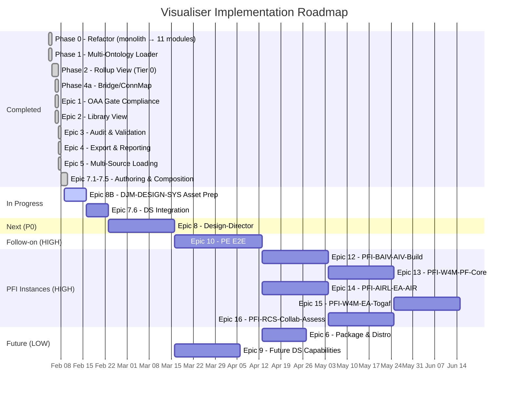

# OAA Ontology Visualiser — Implementation Plan v3.0.0

**Version:** 3.0.0 | **Date:** 2026-02-09 | **Status:** Active
**Supersedes:** [IMPLEMENTATION-PLAN-v2.0.0.md](IMPLEMENTATION-PLAN-v2.0.0.md)
**Project Board:** [AZLAN-1](https://github.com/users/ajrmooreuk/projects/28) | **Milestone:** OAA-VIS-MK3

---

## Current State (v4.6.0)

The visualiser has evolved from a 2,980-line monolith into a **17 ES module** authoring platform with zero build step. Multi-ontology registry loading (23+ ontologies, 6 series), tiered drill-through navigation, cross-ontology bridge detection, OAA v6.1.0 compliance validation, ontology authoring, EMC-driven composition, and domain instance management are all delivered.

| Capability | Status |
|-----------|--------|
| Modular architecture (17 ES modules) | Done |
| Multi-ontology registry loader (23+ ONTs) | Done |
| Series Rollup View (Tier 0) + Drill-Through (Tier 1/2) | Done |
| VE / PE lineage chain highlighting | Done |
| Bridge node detection & cross-ontology edges | Done |
| OAA v6.1.0 gate compliance (G1-G8, 10 gates) | Done |
| Completeness scoring (0-100%) + multi-ontology comparison | Done |
| Connected component colouring & filtering | Done |
| Export: PNG, SVG, Mermaid, D3.js, PDF, Markdown, audit JSON | Done |
| Ontology version diff & changelog generation | Done |
| GitHub integration (repo browser, PAT auth, branch/tag selection) | Done |
| URL loading + CDN registry support | Done |
| Recent files & bookmarks (localStorage) | Done |
| IndexedDB ontology library (3-view panel) | Done |
| Ontology authoring (create, edit, fork, validate, bump) | Done |
| Revision management (changelogs, glossary sync, history) | Done |
| Agentic generation (clipboard-based AI workflow) | Done |
| EMC composition (9 categories, 7 rules, PFI instances) | Done |
| Domain instance management (PFC extension, merge-back) | Done |
| Tests | 350/351 passing |

---

## Epic Map

| # | Epic | GitHub | Priority | Status | Stories |
|---|------|--------|----------|--------|---------|
| 1 | OAA 5.0.0 Verification — Visual Gate Compliance | [#53](https://github.com/ajrmooreuk/Azlan-EA-AAA/issues/53) | P0 | **Done** | 11/11 |
| 2 | Sub-Ontology Connections — Library View | [#54](https://github.com/ajrmooreuk/Azlan-EA-AAA/issues/54) | P0 | **Done** | 4/4 |
| V3 | Graph Rollup, Drill-Through & DB Integration | [#32](https://github.com/ajrmooreuk/Azlan-EA-AAA/issues/32) | P0 | **Closed** | F1-F3 done, F4 absorbed into E8 |
| 3 | Enhanced Audit & Validation | [#55](https://github.com/ajrmooreuk/Azlan-EA-AAA/issues/55) | P1 | **Done** | 9/9 |
| 4 | Export & Reporting | [#56](https://github.com/ajrmooreuk/Azlan-EA-AAA/issues/56) | P1 | **Done** | 9/9 |
| 5 | Multi-Source Loading | [#57](https://github.com/ajrmooreuk/Azlan-EA-AAA/issues/57) | P2 | **Done** | 8/8 |
| 7 | Ontology Authoring, Composition & Instances | [#79](https://github.com/ajrmooreuk/Azlan-EA-AAA/issues/79) | P0 | **In Progress** | 27/61 (7.1-7.5 done, 7.6-7.9 backlog) |
| 8B | DJM-DESIGN-SYS — DS Asset Preparation | [#85](https://github.com/ajrmooreuk/Azlan-EA-AAA/issues/85) | P0 | **Ready** | 0/14 |
| 8 | Design-Director | [#80](https://github.com/ajrmooreuk/Azlan-EA-AAA/issues/80) | P0 | **Ready** | 0/20 |
| 10 | PE Process-Engineer E2E | [#84](https://github.com/ajrmooreuk/Azlan-EA-AAA/issues/84) | HIGH | **Backlog** | 0/36 |
| 10A | Security MVP — Multi-PFI Foundation | [#127](https://github.com/ajrmooreuk/Azlan-EA-AAA/issues/127) | HIGH | **Ready** | 0/15 |
| 11 | Admin-Cleanup | [#86](https://github.com/ajrmooreuk/Azlan-EA-AAA/issues/86) | MED | **Ongoing** | 0/13 |
| 12 | PFI-BAIV-AIV-Build | [#87](https://github.com/ajrmooreuk/Azlan-EA-AAA/issues/87) | HIGH | **TBD** | Scope TBD |
| 13 | PFI-W4M-PF-Core & Client Sub-Instances | [#88](https://github.com/ajrmooreuk/Azlan-EA-AAA/issues/88) | HIGH | **TBD** | Scope TBD |
| 14 | PFI-AIRL-EA-AIR | [#89](https://github.com/ajrmooreuk/Azlan-EA-AAA/issues/89) | HIGH | **TBD** | Scope TBD |
| 15 | PFI-W4M-EA-Togaf | [#90](https://github.com/ajrmooreuk/Azlan-EA-AAA/issues/90) | HIGH | **TBD** | Scope TBD |
| 16 | PFI-RCS-W4M-AIR-Collab-MS-Azure-EA-Assess | [#91](https://github.com/ajrmooreuk/Azlan-EA-AAA/issues/91) | HIGH | **TBD** | Scope TBD |
| 9 | Future Design-System Capabilities | [#81](https://github.com/ajrmooreuk/Azlan-EA-AAA/issues/81) | LOW | **Backlog** | 0/18 |
| 6 | Package & Distribution | [#58](https://github.com/ajrmooreuk/Azlan-EA-AAA/issues/58) | LOW | **Backlog** | 0/8 |

---

## In Progress: Epic 7.6 — Design System Integration

**Prerequisite:** DS-ONT ontology must exist in the library (PE-Series/DS-ONT/).

### Stories (8 stories, 36 pts — all Backlog)

| ID | Story | Points | Status |
|----|-------|--------|--------|
| 7.6.1 | Load DS-ONT and visualise token cascade (Primitive → Semantic → Component) | 5 | Backlog |
| 7.6.2 | Show DS cross-ontology bridges to EFS, EMC, PE in merged graph | 3 | Backlog |
| 7.6.3 | Select PFI/Brand variant to filter DS config, Figma source, tokens | 5 | Backlog |
| 7.6.4 | Author DesignComponents with token bindings in authoring UI | 5 | Backlog |
| 7.6.5 | Define Page/Template entities with layout structure | 5 | Backlog |
| 7.6.6 | Store pages/templates as versioned artefacts | 5 | Backlog |
| 7.6.7 | Visualise full DS e2e workflow path as directed graph | 5 | Backlog |
| 7.6.8 | Export page/template definitions for Design-Director pipeline | 3 | Backlog |

### Build Order

```
DS-ONT creation (ontology library) ──→ 7.6.1 Token cascade ──→ 7.6.2 Cross-bridges
                                                                       │
                                       7.6.3 Brand filtering ─────────┤
                                       7.6.4 Component authoring ─────┤
                                       7.6.5 Page/Template ───────────┤
                                                                       │
                                       7.6.6 Versioned artefacts ─────┤
                                       7.6.7 E2E workflow graph ──────┤
                                       7.6.8 Export for E8 ───────────┘
```

### Exit Criteria
- DS-ONT loads and renders 3-tier token cascade with distinct edge styling
- Cross-ontology bridges visible in merged graph
- Brand variant selection filters the DS graph
- Page/Template entities authorable and exportable for Epic 8

---

## Parallel: Epic 8B — DJM-DESIGN-SYS (DS Asset Preparation)

**Goal:** Formalise existing design system prototype assets as structured data ready for DS-ONT ontology integration and consumption by Epic 8.

**Source:** `PBS/DESIGN-SYSTEM/ds-e2e-prototype-azlan/` — v1 ontology, token taxonomy, React provider, CSS properties, brand configs.

### Features (4 features, 14 stories)

| Feature | Stories | Points | Description |
|---------|---------|--------|-------------|
| 8B.1 | 4 | 17 | DS-ONT Ontology Creation — OAA v6.1.0 ontology, registry, cross-bridges, business rules |
| 8B.2 | 4 | 16 | Token Taxonomy Formalisation — map BAIV tokens to DS-ONT entities |
| 8B.3 | 3 | 8 | Brand & Figma Configuration — upgrade configs, Figma metadata, migrate v1 format |
| 8B.4 | 3 | 11 | Component & Pattern Definitions — provider patterns, E2E workflow, Supabase schema |

### Build Order

```
8B.1 DS-ONT ontology ──→ 8B.2 Token mapping ──→ 8B.4 Component patterns
                    └──→ 8B.3 Brand/Figma config ──┘
```

### Exit Criteria
- DS-ONT ontology passes all OAA v6.1.0 gates
- BAIV tokens mapped to DS-ONT entities with cascade links
- DS config upgraded with ontology references
- E2E workflow formalised as PE process definition

---

## Next Phase: Epic 8 — Design-Director

**Goal:** End-to-end design system process combining DS-ONT, Figma MCP extraction, Supabase token storage, component code generation, and multi-brand resolution via EMC.

### Features (5 features, 20 stories)

| Feature | Stories | Points | Description |
|---------|---------|--------|-------------|
| 8.1 | 4 | 16 | Figma Token Extraction Pipeline — MCP extraction, 3-tier transform, DS-ONT validation |
| 8.2 | 4 | 16 | Token Storage & Resolution — Supabase JSONB, resolve_token() cascade, brand switching |
| 8.3 | 4 | 21 | Component Code Generation — React/Shadcn output, CSS custom properties, Figma Make input |
| 8.4 | 4 | 18 | Multi-Brand EMC Resolution — PFI config drives brand selection, runtime switching |
| 8.5 | 4 | 23 | Agentic Design Workflow — Agent skills for extraction, layout, code gen |

### Dependencies
- DS-ONT ontology in library (Step 2 of current plan)
- Epic 7.6 visualiser integration (for validation/debugging)
- Supabase project provisioned

---

## Parallel: Epic 10A — Security MVP (Multi-PFI Foundation)

**Goal:** Deliver multi-PFI-aware security foundations for the Azlan Ontology Platform — Supabase auth, PFI-scoped RLS, JSONB ontology storage, and append-only audit — starting with the Ont Manager/Visualiser.

**VSOM:** [MVP-Security-VSOM-v1.0.0.md](../../ARCHITECTURE/Security/MVP-Security-VSOM-v1.0.0.md)
**Aligned to:** RRR-ONT v4.0.0, MCSB-ONT v2.0.0

### Features (4 features, 15 stories)

| Feature | Stories | Points | Description |
|---------|---------|--------|-------------|
| 10A.1 | 4 | 14 | Supabase Schema & RLS Foundation — 5 tables, PFI scoping, RLS policies |
| 10A.2 | 4 | 14 | Authentication & User Management — Supabase Auth, PFI assignment, context switcher |
| 10A.3 | 3 | 11 | PFI-Scoped Ontology Storage — replace IndexedDB, PFI filtering, audit logging |
| 10A.4 | 3 | 8 | Minimal Security UI — protected routes, audit viewer, profile display |

### Build Order

```text
10A.1 Schema & RLS ──→ 10A.2 Auth & Users ──→ 10A.3 Ontology Storage ──→ 10A.4 Security UI
```

### Exit Criteria

- Supabase project with 5-table schema and RLS policies deployed
- Email auth integrated in Ont Visualiser
- Users see only ontologies for their assigned PFI(s) + PF-CORE shared
- All mutations logged to append-only audit_log
- 4-role model (pf-owner, pfi-admin, pfi-member, viewer) enforced

---

## Future: Epic 10 — PE Process-Engineer E2E

**Goal:** Integrated idea-to-execution platform combining Program Manager (opportunity → needs → solution) and PF-Manager (agent-led platform operations) across multiple F-Core capabilities and PFI instances.

### Features (6 features, 36 stories)

| Feature | Stories | Points | Description |
|---------|---------|--------|-------------|
| 10.1 | 6 | 37 | Program Manager E2E Workflow |
| 10.2 | 6 | 26 | PFI Instance Configuration & Lifecycle |
| 10.3 | 6 | 26 | F-Core Platform Capabilities |
| 10.4 | 6 | 34 | PF-Manager — Agent-Led Platform Operations |
| 10.5 | 6 | 34 | Agent SDK Orchestration — Claude Code Integration |
| 10.6 | 6 | 31 | Azlan Knowledge Ontology Dashboard |

### Dependencies
- Epic 7 (composition & instances) — Done
- Epic 8 (Design-Director) — provides DS pipeline
- Claude Code Agent SDK — for agent tool definitions

---

## PFI Instance Epics (Scope TBD)

Five product instance epics planned — scopes to be defined as upstream epics (E8, E10) deliver:

| # | Epic | Goal | Key Dependencies |
|---|------|------|-----------------|
| 12 | PFI-BAIV-AIV-Build | First production PFI — BAIV platform using F-Core, DS, EMC | E8, E8B, E10 |
| 13 | PFI-W4M-PF-Core & Client Sub-Instances | W4M multi-tenant platform with PF-Core shared capabilities | E8, E10, E12 |
| 14 | PFI-AIRL-EA-AIR | AI Readiness Lab — EA-AIR assessment & maturity modelling | E10, Foundation/AIR-ONT |
| 15 | PFI-W4M-EA-Togaf | TOGAF EA architecture practice within W4M platform | E10, E13, PE-Series/EA-ONT |
| 16 | PFI-RCS-W4M-AIR-Collab-MS-Azure-EA-Assess | Cross-cutting RCS + W4M + AIR + Azure compliance | E10, E13, E14, RCSG-Series |

**Delivery order:** E12 (reference impl) → E13 (W4M core) → E14 (AIRL) in parallel → E15 (W4M-Togaf) after E13 → E16 (RCS-Collab) after E13+E14

---

## Low Priority Backlog

### Epic 6: Package & Distribution `LOW` [#58](https://github.com/ajrmooreuk/Azlan-EA-AAA/issues/58)
npm package (`@baiv/ontology-visualiser`), CLI tool (`oaa-validate`), Docker image, React/Vue component wrapper. 8 stories, 33 pts.

### Epic 9: Future Design-System Capabilities `LOW`
Figma Make kit generation, pre-release beta testing, FigJam social integration, W3C Design Tokens spec alignment. 18 stories.

---

## Delivery Sequence



### Priority Sequence

```
NOW        Epic 8B (DJM-DESIGN-SYS: DS asset preparation) + Epic 7.6 (DS Integration) + Epic 10A (Security MVP)
NEXT       Epic 8 (Design-Director: Figma + Supabase + code gen + multi-brand)
THEN       Epic 10 (PE E2E: Program Manager + PF-Manager + Agent SDK)
PFI WAVE   Epic 12 (BAIV) → Epic 13 (W4M) → Epic 14 (AIRL) → Epic 15 (W4M-Togaf) → Epic 16 (RCS-Collab)
ONGOING    Epic 11 (Admin-Cleanup: between sprints)
LATER      Epic 6 (Packaging) + Epic 9 (Future DS capabilities)
```

---

## Architecture

```
PBS/TOOLS/ontology-visualiser/
├── browser-viewer.html          <- Shell: HTML structure + module imports
├── css/viewer.css               <- All styles
├── js/
│   ├── app.js                   <- Entry point, event wiring, navigation, window bindings
│   ├── state.js                 <- Shared state, constants, series colours
│   ├── ontology-parser.js       <- 9-format auto-detection parser
│   ├── graph-renderer.js        <- vis.js graph, tier 0/1 renderers, series highlight
│   ├── multi-loader.js          <- Registry batch loading, cross-ref detection, lineage
│   ├── audit-engine.js          <- OAA v6.1.0 validation gates (G1-G8) + completeness scoring
│   ├── compliance-reporter.js   <- Compliance panel rendering + score gauge
│   ├── ui-panels.js             <- Sidebar, audit, modals, drill-through, foundation extensions
│   ├── library-manager.js       <- IndexedDB ontology library + recent files + bookmarks
│   ├── github-loader.js         <- GitHub API browser + PAT management + registry loading
│   ├── export.js                <- PNG/SVG/Mermaid/D3/PDF/audit JSON export
│   ├── diff-engine.js           <- Ontology version diff + changelog
│   ├── ontology-author.js       <- Ontology authoring engine (Epic 7 — Feature 7.1)
│   ├── authoring-ui.js          <- Authoring UI panels (Epic 7 — Feature 7.1)
│   ├── revision-manager.js      <- Revision docs + glossary (Epic 7 — Feature 7.2)
│   ├── agentic-prompts.js       <- Agentic AI generation (Epic 7 — Feature 7.5)
│   ├── emc-composer.js          <- EMC composition engine (Epic 7 — Feature 7.3)
│   └── domain-manager.js        <- Domain instance management (Epic 7 — Feature 7.4)
├── tests/
│   ├── ontology-parser.test.js
│   ├── multi-loader.test.js
│   ├── audit-engine.test.js
│   ├── graph-renderer.test.js
│   ├── diff-engine.test.js
│   ├── library-manager.test.js
│   ├── github-loader.test.js
│   ├── export.test.js
│   ├── ontology-author.test.js
│   ├── authoring-ui.test.js
│   ├── revision-manager.test.js
│   ├── agentic-prompts.test.js
│   ├── emc-composer.test.js
│   └── domain-manager.test.js
└── docs (BACKLOG, ARCHITECTURE, OPERATING-GUIDE, README, ADR-LOG, etc.)
```

**Stack:** Vanilla JS ES modules | vis-network v9.1.2 | Zero build step | GitHub Pages

---

## Completed Epics Summary

| Epic | Key Deliverables | Commits | GitHub |
|------|-----------------|---------|--------|
| V3/#32 | Monolith → modules, multi-ontology, rollup, drill-through, cross-ontology | Multiple | [#32](https://github.com/ajrmooreuk/Azlan-EA-AAA/issues/32) Closed |
| 1 | G1-G8 gates, PASS/FAIL badges, density metrics, gate report export | Multiple | [#53](https://github.com/ajrmooreuk/Azlan-EA-AAA/issues/53) Closed |
| 2 | Library panel, drag-to-add, dependency graph, foundation extensions | Multiple | [#54](https://github.com/ajrmooreuk/Azlan-EA-AAA/issues/54) Closed |
| 3 | Schema validation, naming checks, completeness scoring, multi-ONT comparison | Multiple | [#55](https://github.com/ajrmooreuk/Azlan-EA-AAA/issues/55) Closed |
| 4 | SVG/Mermaid/D3/PDF export, diff engine, changelog, audit JSON | Multiple | [#56](https://github.com/ajrmooreuk/Azlan-EA-AAA/issues/56) Closed |
| 5 | GitHub browser, URL loading, recent files, bookmarks | Multiple | [#57](https://github.com/ajrmooreuk/Azlan-EA-AAA/issues/57) Closed |
| 7 (partial) | Authoring, revision docs, agentic, EMC composition, domain instances | `d6ea46a` `444d9a8` `e685b05` `dcd58c0` | [#79](https://github.com/ajrmooreuk/Azlan-EA-AAA/issues/79) In Progress |

---

## Metrics

| Metric | Value |
|--------|-------|
| Total epics | 18 (6 done, 1 in progress, 11 backlog/TBD) |
| Stories completed | ~72 |
| Stories remaining | ~150 + PFI TBD (E7.6: 8, E7.7: 10, E7.8: 8, E7.9: 8, E8B: 14, E8: 20, E9: 18, E10: 36, E10A: 15, E11: 13, E12-16: TBD) |
| Test coverage | 353/354 passing (99.7%) |
| Modules | 17 ES modules |
| Ontology library | 28 ontologies, 6 series |
| Live deployment | [GitHub Pages](https://ajrmooreuk.github.io/Azlan-EA-AAA/) |

---

## Process: Push-to-Main Checklist

Every push to main must include:

1. **BACKLOG.md** — stories marked Done
2. **ARCHITECTURE.md** — updated
3. **README.md** — updated
4. **OPERATING-GUIDE.md** — updated
5. **IMPLEMENTATION-PLAN** — updated (**trigger for step 6**)
6. **GitHub Projects** — verify board status matches implementation plan
7. **Commit & push** to main

---

*Implementation Plan v3.0.0 | 09 February 2026*
*Azlan-EA-AAA Ontology Visualiser Toolkit*
