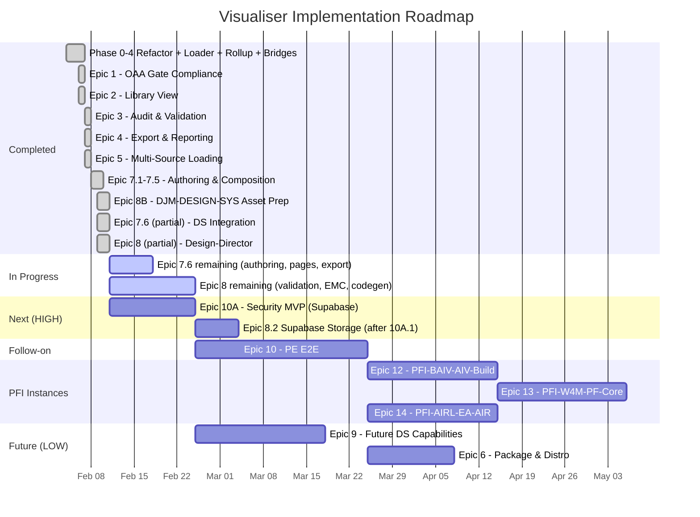

# OAA Ontology Visualiser — Implementation Plan v4.0.0

**Version:** 4.0.0 | **Date:** 2026-02-10 | **Status:** Active — Status Review
**Supersedes:** [IMPLEMENTATION-PLAN-v3.0.0.md](IMPLEMENTATION-PLAN-v3.0.0.md)
**Project Board:** [AZLAN-1](https://github.com/users/ajrmooreuk/projects/28) | [Epic View (View 6)](https://github.com/users/ajrmooreuk/projects/28/views/6)

---

## Current State (v4.7.0)

The visualiser is an **18 ES module** authoring platform with zero build step, now including Design System integration with Figma MCP extraction, multi-brand theming, and CSS custom property injection. 28+ ontologies across 6 series loaded from registry.

| Capability | Status |
|-----------|--------|
| Modular architecture (18 ES modules) | Done |
| Multi-ontology registry loader (28+ ONTs) | Done |
| Series Rollup View (Tier 0) + Drill-Through (Tier 1/2) | Done |
| VE / PE lineage chain highlighting | Done |
| Bridge node detection & cross-ontology edges | Done |
| OAA v6.1.0 gate compliance (G1-G8, 10 gates) | Done |
| Completeness scoring (0-100%) + multi-ontology comparison | Done |
| Export: PNG, SVG, Mermaid, D3.js, PDF, Markdown, audit JSON | Done |
| Ontology version diff & changelog generation | Done |
| GitHub integration (repo browser, PAT auth, branch/tag selection) | Done |
| URL loading + CDN registry support + recent files + bookmarks | Done |
| IndexedDB ontology library (3-view panel) | Done |
| Ontology authoring (create, edit, fork, validate, bump) | Done |
| Revision management (changelogs, glossary sync, history) | Done |
| Agentic generation (clipboard-based AI workflow) | Done |
| EMC composition (9 categories, 7 rules, PFI instances) | Done |
| Domain instance management (PFC extension, merge-back) | Done |
| **DS instance loading + 3-tier token cascade graph** | **Done** |
| **Multi-brand switching (BAIV, VHF) + CSS var injection** | **Done** |
| **Brand theme persistence (localStorage)** | **Done** |
| **DS instance data in sidebar Data tab (entity-filtered)** | **Done** |
| **20 CSS custom properties + full palette derivation** | **Done** |
| Tests | 383/384 passing (99.7%) |

---

## Epic Map — Status Review

| # | Epic | GitHub | Priority | Status | Progress |
|---|------|--------|----------|--------|----------|
| 1 | OAA 5.0.0 Verification | [#53](https://github.com/ajrmooreuk/Azlan-EA-AAA/issues/53) | P0 | **Closed** | 11/11 |
| 2 | Sub-Ontology Connections | [#54](https://github.com/ajrmooreuk/Azlan-EA-AAA/issues/54) | P0 | **Closed** | 4/4 |
| V3 | Graph Rollup & Drill-Through | [#32](https://github.com/ajrmooreuk/Azlan-EA-AAA/issues/32) | P0 | **Closed** | F1-F3 done |
| 3 | Enhanced Audit & Validation | [#55](https://github.com/ajrmooreuk/Azlan-EA-AAA/issues/55) | P1 | **Closed** | 9/9 |
| 4 | Export & Reporting | [#56](https://github.com/ajrmooreuk/Azlan-EA-AAA/issues/56) | P1 | **Closed** | 9/9 |
| 5 | Multi-Source Loading | [#57](https://github.com/ajrmooreuk/Azlan-EA-AAA/issues/57) | P2 | **Closed** | 8/8 |
| 7 | Authoring, Composition & Instances | [#79](https://github.com/ajrmooreuk/Azlan-EA-AAA/issues/79) | P0 | **In Progress** | 33/38 (7.1-7.5 done, 7.6: 3/8 done) |
| **8B** | **DJM-DESIGN-SYS — DS Asset Prep** | [#85](https://github.com/ajrmooreuk/Azlan-EA-AAA/issues/85) | P0 | **Complete** | 14/14 — ready to close |
| **8** | **Design-Director** | [#80](https://github.com/ajrmooreuk/Azlan-EA-AAA/issues/80) | P0 | **In Progress** | 7/20 done, 2 partial |
| 10 | PE Process-Engineer E2E | [#84](https://github.com/ajrmooreuk/Azlan-EA-AAA/issues/84) | HIGH | Backlog | 0/36 |
| 10A | Security MVP | [#127](https://github.com/ajrmooreuk/Azlan-EA-AAA/issues/127) | HIGH | Ready | 0/15 |
| 11 | Admin-Cleanup | [#86](https://github.com/ajrmooreuk/Azlan-EA-AAA/issues/86) | MED | Ongoing | 0/13 |
| 12-16 | PFI Instance Epics | [#87](https://github.com/ajrmooreuk/Azlan-EA-AAA/issues/87)-[#91](https://github.com/ajrmooreuk/Azlan-EA-AAA/issues/91) | HIGH | TBD | Scope TBD |
| 9 | Future DS Capabilities | [#81](https://github.com/ajrmooreuk/Azlan-EA-AAA/issues/81) | LOW | Backlog | 0/16 |
| 6 | Package & Distribution | [#58](https://github.com/ajrmooreuk/Azlan-EA-AAA/issues/58) | LOW | Backlog | 0/8 |

> **Board action required:** Epics 7.6, 8, and 8B have no child story issues filed. 10 stories are closeable immediately. See Section 7.

---

## Epic 8B — DJM-DESIGN-SYS: COMPLETE

**Goal:** Formalise DS prototype assets as structured data for DS-ONT integration.
**Recommendation:** Close this epic.

| Feature | Description | Status | Evidence |
|---------|------------|--------|----------|
| 8B.1 | DS-ONT Ontology Creation | **Done** | `ds-v1.1.0-oaa-v6.json` — 10 entities, 15 rels, 8 BR, 5 enums, OAA v6.1.0 compliant |
| 8B.2 | Token Taxonomy Formalisation | **Done** | 3-tier cascade (Primitive/Semantic/Component), W3C alias pattern |
| 8B.3 | Brand & Figma Configuration | **Done** | 2 brands in Entry-ONT-DS-001.json, Figma keys, instance data paths |
| 8B.4 | Component & Pattern Definitions | **Done** | DesignComponent + DesignPattern entities, atomic levels, PE process |

### Delivered Artefacts

```
ontology-library/PE-Series/DS-ONT/
  ds-v1.0.0-oaa-v6.json                              Schema v1.0
  ds-v1.1.0-oaa-v6.json                              Schema v1.1 (current)
  ds-token-extraction-process-v1.0.0.json             PE Process (4 phases, 4 gates)
  Entry-ONT-DS-001.json                               Registry entry (2 brands)
  instance-data/
    baiv-ds-instance-v1.0.0.jsonld                    BAIV populated (33KB, 100+ tokens)
    baiv-extraction-log.json                          MCP extraction log
    vhf-viridian-ds-instance-v1.0.0.jsonld            VHF populated (30KB)
```

### Key Commits
- `c1f6528` DS-ONT v1.0.0 schema with EFS/EMC/PE bridges
- `16f1e96` DS-ONT v1.1.0 + ORG-CONTEXT bridge
- `ead2ed8` MCP extraction pipeline, BAIV instance, PE process
- `60bc2d4` VHF-Viridian instance copied to Azlan repo

---

## Epic 7.6 — DS Integration: In Progress (3/8 done)

| Story | Description | Pts | Status | Evidence |
|-------|------------|-----|--------|----------|
| 7.6.1 | Load DS-ONT and visualise token cascade | 5 | **Done** | `ds-loader.js`, `buildDSTokenGraph()`, DS panel |
| 7.6.2 | Show DS cross-ontology bridges (EFS, EMC, PE) | 3 | **Done** | 4 cross-ref bridges in v1.1.0, parser renders |
| 7.6.3 | Select PFI/Brand variant to filter DS config | 5 | **Done** | Brand dropdown, `switchDSBrand()`, localStorage |
| 7.6.4 | Author DesignComponents with token bindings | 5 | Backlog | Needs authoring UI extension |
| 7.6.5 | Define Page/Template entities with layout structure | 5 | Backlog | Needs new entity types |
| 7.6.6 | Store pages/templates as versioned artefacts | 5 | Backlog | Needs revision-manager extension |
| 7.6.7 | Visualise full DS e2e workflow path | 5 | Partial | Token cascade graph works; PE→DS→EFS chain needed |
| 7.6.8 | Export page/template definitions for Design-Director | 3 | Backlog | Depends on 7.6.5 |

**Done: 13/36 pts | Remaining: 5 stories (23 pts)**

### Key Commits (7.6)
- `ead2ed8` ds-loader.js module, DS panel, brand dropdown
- `833228f` CSS custom properties (20 `--viz-*` vars)
- `43ddcd1` Full viewer.css conversion (40+ hardcoded hex → vars)
- `87c63e4` `_deriveMissingVars()` — auto-compute palette from brand
- `e040bbf` localStorage brand theme persistence
- `ef99156` DS instance data in sidebar Data tab

---

## Epic 8 — Design-Director: In Progress (7/20 done)

### Feature 8.1: Figma Token Extraction Pipeline — 3/4 Done

| Story | Description | Pts | Status | Evidence |
|-------|------------|-----|--------|----------|
| 8.1.1 | Extract tokens from Figma via MCP | 5 | **Done** | `get_variable_defs` for BAIV + VHF |
| 8.1.2 | Auto-classify into three-tier cascade | 5 | **Done** | `parseDSInstance()` classifies by `@type` |
| 8.1.3 | Validate against DS-ONT schema (BR-DS-001..008) | 3 | Partial | Structure validated, formal gate checks missing |
| 8.1.4 | Extract light/dark mode values | 3 | **Done** | `ds:lightModeValue`/`ds:darkModeValue` in instances |

### Feature 8.2: Token Storage & Resolution — 1/4 Done

| Story | Description | Pts | Status |
|-------|------------|-----|--------|
| 8.2.1 | Supabase JSONB storage | 5 | Backlog (blocked by E10A) |
| 8.2.2 | resolve_token() SQL cascade | 5 | Backlog |
| 8.2.3 | Runtime brand switching | 3 | **Done** — `switchDSBrand()`, CSS var injection |
| 8.2.4 | Token version history and rollback | 3 | Backlog |

### Feature 8.3: Component Code Generation — 2/4 Done

| Story | Description | Pts | Status | Evidence |
|-------|------------|-----|--------|----------|
| 8.3.1 | React/Shadcn wrappers from DesignComponent | 8 | Backlog | |
| 8.3.2 | CSS custom properties from token cascade | 3 | **Done** | `generateCSSVars()`, `_deriveMissingVars()` |
| 8.3.3 | Figma Make input from component output | 5 | **Done** | login-page-tokens.json, landing-page-tokens.json |
| 8.3.4 | Browser sandbox preview | 5 | Backlog | |

### Feature 8.4: Multi-Brand EMC Resolution — 0/4 Done (2 Partial)

| Story | Description | Pts | Status |
|-------|------------|-----|--------|
| 8.4.1 | EMC InstanceConfiguration with DS config ref | 5 | Backlog |
| 8.4.2 | PFI-BAIV→BAIV DS via EMC rules | 5 | Partial — brands work, formal EMC binding missing |
| 8.4.3 | URL-based DS config version control | 3 | Backlog |
| 8.4.4 | Brand switching tests (BAIV, W4M, Azlan-PFC) | 5 | Partial — BAIV + VHF tested, W4M not yet |

### Feature 8.5: Agentic Design Workflow — 1/4 Done

| Story | Description | Pts | Status | Evidence |
|-------|------------|-----|--------|----------|
| 8.5.1 | Agent skill: token extraction via Figma MCP | 8 | Partial | MCP proven manually, not as formal skill |
| 8.5.2 | Agent skill: layout management | 5 | Backlog | |
| 8.5.3 | Agent skill: React/CSS code gen | 5 | Backlog | |
| 8.5.4 | Agent workflows via PE process with gates | 5 | **Done** | `ds-token-extraction-process-v1.0.0.json` |

### Epic 8 Summary

| Metric | Value |
|--------|-------|
| Done | 7/20 stories (~39 pts) |
| Partial | 3 stories |
| Backlog | 10 stories |
| Blocked | 8.2.1-8.2.2 (Supabase — needs E10A security first) |

---

## Epic 10A — Security MVP: Ready (0/15 started)

**Goal:** Supabase auth, PFI-scoped RLS, JSONB ontology storage, append-only audit.

| Feature | Stories | Points | Description |
|---------|---------|--------|-------------|
| 10A.1 | 4 | 14 | Supabase Schema & RLS Foundation |
| 10A.2 | 4 | 14 | Authentication & User Management |
| 10A.3 | 3 | 11 | PFI-Scoped Ontology Storage |
| 10A.4 | 3 | 8 | Minimal Security UI |

**Intersection with Epic 8:** Stories 8.2.1-8.2.2 (Supabase token storage) depend on 10A.1 delivering the schema and RLS foundation.

---

## Cross-Ontology Architecture

```
                    FIGMA (MCP)
                        |
                   get_variable_defs
                        |
                        v
              DS-ONT Schema (v1.1.0)
              10 entities, 4 cross-refs
                   /         \
                  v           v
        BAIV Instance    VHF Instance
        (33KB JSONLD)    (30KB JSONLD)
              |               |
              v               v
        ds-loader.js  <--  parseDSInstance()
              |
              +--- generateCSSVars() --> 20 --viz-* CSS custom properties
              |
              +--- buildDSTokenGraph() --> vis-network sub-graph
              |
              +--- sidebar Data tab (entity-filtered brand tokens)
              |
              +--- localStorage persistence (survives reload)
              |
              v
        Figma Make token outputs
        (login-page, landing-page)
              |
              v
        [Future: React/Shadcn codegen --> Epic 8.3.1]
```

### DS-ONT Cross-Ontology Bridges

| Bridge | From | To | Purpose |
|--------|------|----|---------|
| realizesFeature | ds:DesignComponent | efs:Feature | DS components realise EFS features |
| configuredByInstance | ds:DesignSystem | emc:InstanceConfiguration | PFI brand resolution |
| governedByProcess | ds:DesignSystem | pe:Process | PE extraction workflow |
| ownedByBrand | ds:DesignSystem | org-ctx:Brand | Org-to-DS correlation |

---

## Architecture

```
PBS/TOOLS/ontology-visualiser/
├── browser-viewer.html          <- Shell: HTML structure + module imports
├── css/viewer.css               <- All styles (20 CSS custom properties + full var conversion)
├── js/
│   ├── app.js                   <- Entry point, event wiring, DS panel, localStorage
│   ├── state.js                 <- Shared state (dsInstances, activeDSBrand, dsAppliedCSSVars)
│   ├── ontology-parser.js       <- 10-format auto-detection parser (incl. ds-instance)
│   ├── graph-renderer.js        <- vis.js graph, tier 0/1 renderers, series highlight
│   ├── multi-loader.js          <- Registry batch loading, cross-ref detection, lineage
│   ├── audit-engine.js          <- OAA v6.1.0 validation gates (G1-G8) + completeness scoring
│   ├── compliance-reporter.js   <- Compliance panel rendering + score gauge
│   ├── ui-panels.js             <- Sidebar (Data tab DS integration), audit, modals
│   ├── library-manager.js       <- IndexedDB ontology library + recent files + bookmarks
│   ├── github-loader.js         <- GitHub API browser + PAT management + registry loading
│   ├── export.js                <- PNG/SVG/Mermaid/D3/PDF/audit JSON export
│   ├── diff-engine.js           <- Ontology version diff + changelog
│   ├── ontology-author.js       <- Ontology authoring engine (Epic 7.1)
│   ├── authoring-ui.js          <- Authoring UI panels (Epic 7.1)
│   ├── revision-manager.js      <- Revision docs + glossary (Epic 7.2)
│   ├── agentic-prompts.js       <- Agentic AI generation (Epic 7.5)
│   ├── emc-composer.js          <- EMC composition engine (Epic 7.3)
│   ├── domain-manager.js        <- Domain instance management (Epic 7.4)
│   └── ds-loader.js             <- DS instance loader + CSS var generation (Epic 7.6/8)
├── tests/
│   ├── ... (14 existing test files)
│   └── ds-loader.test.js        <- 23 tests — parse, graph, CSS vars, derivation
└── docs (BACKLOG, ARCHITECTURE, OPERATING-GUIDE, README, ADR-LOG, etc.)
```

**Stack:** Vanilla JS ES modules | vis-network v9.1.2 | Zero build step | GitHub Pages

---

## Delivery Sequence



### Priority Sequence

```
DONE       Epic 8B (DJM-DESIGN-SYS) — ready to close on board
IN PROG    Epic 7.6 (DS Integration: 3/8 stories) + Epic 8 (Design-Director: 7/20 stories)
PARALLEL   Epic 10A (Security MVP) — unblocks E8.2 Supabase storage
NEXT       Epic 8 remaining (EMC binding, codegen, agent skills)
THEN       Epic 10 (PE E2E: Program Manager + PF-Manager + Agent SDK)
PFI WAVE   Epic 12 (BAIV) → Epic 13 (W4M) → Epic 14 (AIRL) → Epic 15/16
ONGOING    Epic 11 (Admin-Cleanup: between sprints)
LATER      Epic 6 (Packaging) + Epic 9 (Future DS: Make kits, W3C, beta)
```

---

## Completed Epics Summary

| Epic | Key Deliverables | GitHub | Status |
|------|-----------------|--------|--------|
| V3/#32 | Monolith → modules, multi-ontology, rollup, drill-through | [#32](https://github.com/ajrmooreuk/Azlan-EA-AAA/issues/32) | Closed |
| 1 | G1-G8 gates, PASS/FAIL badges, density metrics | [#53](https://github.com/ajrmooreuk/Azlan-EA-AAA/issues/53) | Closed |
| 2 | Library panel, drag-to-add, dependency graph | [#54](https://github.com/ajrmooreuk/Azlan-EA-AAA/issues/54) | Closed |
| 3 | Schema validation, completeness scoring, multi-ONT compare | [#55](https://github.com/ajrmooreuk/Azlan-EA-AAA/issues/55) | Closed |
| 4 | SVG/Mermaid/D3/PDF export, diff engine, changelog | [#56](https://github.com/ajrmooreuk/Azlan-EA-AAA/issues/56) | Closed |
| 5 | GitHub browser, URL loading, recent files, bookmarks | [#57](https://github.com/ajrmooreuk/Azlan-EA-AAA/issues/57) | Closed |
| 7.1-7.5 | Authoring, revision docs, agentic, EMC, domains | [#79](https://github.com/ajrmooreuk/Azlan-EA-AAA/issues/79) | 30/30 stories done |
| **8B** | **DS-ONT schema, taxonomy, brands, components, PE process** | [#85](https://github.com/ajrmooreuk/Azlan-EA-AAA/issues/85) | **Complete — close** |

---

## Metrics

| Metric | Value |
|--------|-------|
| Total epics | 18 (7 done/closeable, 2 in progress, 9 backlog/TBD) |
| Stories completed | ~82 |
| Stories remaining | ~130 + PFI TBD |
| Test coverage | 383/384 passing (99.7%) |
| Modules | 18 ES modules |
| Ontology library | 28 ontologies, 6 series |
| DS instances | 2 brands (BAIV, VHF-Viridian) |
| CSS custom properties | 20 `--viz-*` vars with auto-derivation |
| Live deployment | [GitHub Pages](https://ajrmooreuk.github.io/Azlan-EA-AAA/) |

---

## Board Action Items

### 1. Close Epic 8B (#85)
All 4 features delivered. DS-ONT schema + instances + PE process complete.

### 2. File Story Issues (10 closeable immediately)

**Epic 7.6 — file 8 stories, close 3:**
- 7.6.1 Load DS-ONT and visualise token cascade — **CLOSE**
- 7.6.2 Show DS cross-ontology bridges — **CLOSE**
- 7.6.3 Select PFI/Brand variant to filter DS config — **CLOSE**
- 7.6.4 Author DesignComponents with token bindings — OPEN
- 7.6.5 Define Page/Template entities — OPEN
- 7.6.6 Store pages/templates as versioned artefacts — OPEN
- 7.6.7 Visualise full DS e2e workflow path — OPEN (partial)
- 7.6.8 Export page/template definitions — OPEN

**Epic 8 — file 20 stories, close 7:**
- 8.1.1 Extract tokens from Figma via MCP — **CLOSE**
- 8.1.2 Auto-classify into three-tier cascade — **CLOSE**
- 8.1.4 Extract light/dark mode values — **CLOSE**
- 8.2.3 Runtime brand switching — **CLOSE**
- 8.3.2 CSS custom properties from token cascade — **CLOSE**
- 8.3.3 Figma Make input from component output — **CLOSE**
- 8.5.4 Agent workflows via PE process with gates — **CLOSE**
- Remaining 13 — OPEN (backlog)

### 3. Near-term Priority

| Priority | Story | Rationale |
|----------|-------|-----------|
| 1 | 8.1.3 Formal schema validation | Close out Feature 8.1 |
| 2 | 8.4.1-8.4.2 EMC binding | Formalise DS-to-EMC connection |
| 3 | 10A.1 Supabase schema | Unblocks 8.2.1-8.2.2 storage |
| 4 | 7.6.4-7.6.5 Authoring DS entities | Unlock page/template workflow |
| 5 | 8.3.1 React/Shadcn codegen | Unlock Make kits (E9) |

### 4. Design Director Rules (NEW)

Design rules for graph colouring, edge rendering, and dark/light theme compatibility are now formally documented in [DESIGN-RULES.md](./DESIGN-RULES.md) v1.0.0. Key rules:

| Rule | Summary |
|------|---------|
| DR-GRAPH-001..003 | Node contrast >= 3:1 on canvas; darken to 700-900 on light; fonts always `--viz-text-primary` |
| DR-EDGE-001..004 | Edge luminance > 0.15 on dark, < 0.5 on light; highlight swaps per theme; bridges 2px+dash |
| DR-SERIES-001..002 | Series colours use 700-900 alternatives on light; convergence stays distinct |
| DR-DS-001..002 | Token cascade matches entity colour scheme; directional arrows with 50% target opacity |
| DR-STATUS-001 | Status badge text always dark 700-900 |
| DR-FONT-001..002 | Node labels use primary text; edge labels use secondary + bg |

**Epic 8 impact:** Story 8.3.4 (browser sandbox preview) and future light theme support MUST implement these rules. Story 8.1.3 (formal validation) should validate token colour values against DR-DS rules.

### 5. Feature Feedback Loop (NEW)

In-app mechanism to initiate features, stories, and bug reports from within the visualiser, processed via a standardised PE workflow and pushed to GitHub Issues.

**Architecture:**

```
┌─────────────────────────────────────────────────────┐
│  Visualiser UI — Feedback Panel                     │
│  ┌─────────────┐  ┌──────────┐  ┌───────────────┐  │
│  │ Feature Req  │  │  Story   │  │   Bug Report  │  │
│  └──────┬──────┘  └────┬─────┘  └───────┬───────┘  │
│         └──────────────┼────────────────┘           │
│                        v                             │
│              Structured Form                         │
│     (title, description, epic, labels, priority)     │
│                        │                             │
└────────────────────────┼─────────────────────────────┘
                         v
              ┌─────────────────────┐
              │  feedback-engine.js │ <- New module
              │  - validateInput()  │
              │  - mapToTemplate()  │
              │  - submitToGitHub() │
              └──────────┬──────────┘
                         v
              ┌──────────────────────┐
              │  GitHub Issues API   │
              │  (gh api / REST)     │
              │  via github-loader   │
              │  PAT authentication  │
              └──────────┬───────────┘
                         v
              ┌──────────────────────┐
              │  Project Board       │
              │  AZLAN-1 (#28)       │
              │  Auto-labelled:      │
              │  - type:feature/story│
              │  - visualiser        │
              │  - parent epic ref   │
              └──────────────────────┘
```

**Proposed Stories (Epic 7.7 — Feedback Loop):**

| Story | Description | Pts |
|-------|-------------|-----|
| 7.7.1 | Feedback button + panel UI in toolbar | 3 |
| 7.7.2 | Structured form (feature/story/bug templates) | 5 |
| 7.7.3 | Epic selector dropdown populated from GH Issues | 3 |
| 7.7.4 | GitHub Issues API submission via PAT | 5 |
| 7.7.5 | Auto-labelling and project board assignment | 3 |
| 7.7.6 | Feedback history panel (submitted items) | 3 |

**Dependencies:** Requires GitHub PAT (already in github-loader.js). Uses `gh api` pattern already proven for repo browsing.

**PE Process:** Feedback submissions follow a lightweight version of the PE review process — validate input, apply template, create issue with labels, assign to project board.

### 6. Discussion Points

1. **Close Epic 8B?** All 4 features delivered
2. **W4M brand extraction** — next brand after BAIV/VHF proves multi-brand fully
3. **Supabase timing** — E10A.1 unblocks E8.2 (token storage). Run in parallel?
4. **Authoring stories (7.6.4-7.6.6)** — separate feature or stay in 7.6?
5. **Epic 9 gating** — Make kits (9.1) depend on 8.3 codegen
6. **Design Rules** — DESIGN-RULES.md v1.0.0 published. Implement light theme when?
7. **Feature Feedback Loop** — Epic 7.7 proposed. Priority relative to E8 remaining?

---

## Process: Push-to-Main Checklist

1. **BACKLOG.md** — stories marked Done
2. **ARCHITECTURE.md** — updated
3. **README.md** — updated
4. **OPERATING-GUIDE.md** — updated
5. **IMPLEMENTATION-PLAN** — updated (trigger for step 6)
6. **GitHub Projects** — verify board status matches implementation plan
7. **Commit & push** to main

---

*Implementation Plan v4.0.0 | 10 February 2026*
*Azlan-EA-AAA Ontology Visualiser Toolkit*
