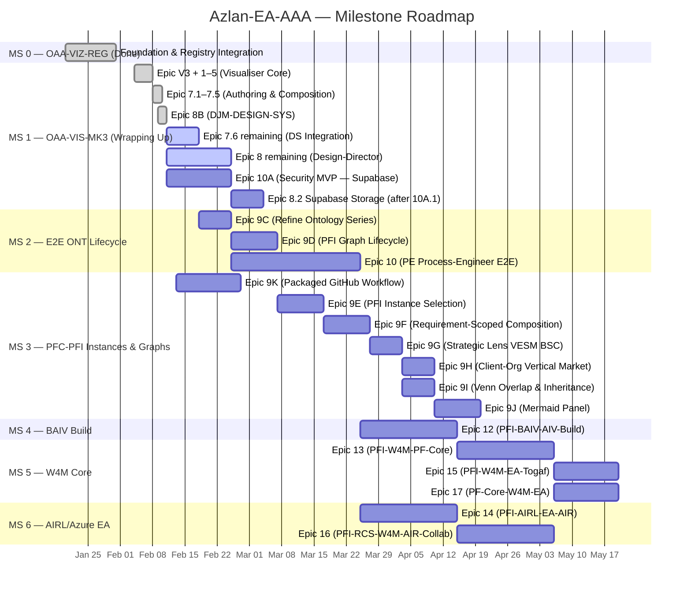

# Azlan-EA-AAA — Implementation Plan v5.0.0

**Version:** 5.0.0 | **Date:** 2026-02-11 | **Status:** Active
**Supersedes:** [IMPLEMENTATION-PLAN-v4.0.0.md](IMPLEMENTATION-PLAN-v4.0.0.md)
**Project Board:** [AZLAN-1](https://github.com/users/ajrmooreuk/projects/28) | [Epic View (View 6)](https://github.com/users/ajrmooreuk/projects/28/views/6)
**Repository:** [Azlan-EA-AAA](https://github.com/ajrmooreuk/Azlan-EA-AAA)

---

## Milestone Overview

| # | Milestone | Due | Status | Epics | Open/Closed |
|---|-----------|-----|--------|-------|-------------|
| 0 | MS-0.00 OAA-VIZ-REG Integration | 2026-01-31 | Complete | Pre-numbered epics | 0/10 |
| 1 | MS 1.00 OAA-VIS-MK3 | 2026-02-06 | Wrapping Up | V3, 1–5, 6, 7, 8, 8B, 10A | 4/39 |
| 2 | MS 2 OAA-Azlan-Viz-Goes-E2E ONT Lifecycle | 2026-02-10 | In Progress | 9C, 9D, 10 | 4/6 |
| 3 | MS 3.00 PFC-PFI-ONT Instance & Client/Market/Product | 2026-02-13 | Next | 9E–9J, 9K | 0/0 |
| 4 | MS 4.00 BAIV Build MVP & Ecommerce Fork | TBD | Future | 12 | 0/0 |
| 5 | MS 5.00 W4M Core Builds | TBD | Future | 13, 15, 17 | 0/0 |
| 6 | MS 6.00 AIRL/Azure EA Builds | TBD | Future | 14, 16 | 0/0 |
| — | Cross-cutting (no milestone) | — | Ongoing | 9, 6, 11 | — |

---

## MS-0.00 — OAA-VIZ-REG Integration (Complete)

> **Due:** 2026-01-31 | **Status:** All issues closed

Pre-numbered foundation work: registry integration, initial visualiser scaffolding. All 10 issues closed. No open work.

---

## MS 1.00 — OAA-VIS-MK3 (Wrapping Up)

> **Due:** 2026-02-06 | **Status:** 4 open / 39 closed — near complete

The core visualiser milestone. Delivered the modular rewrite, multi-ontology support, OAA compliance, export, multi-source loading, authoring, composition, and Design System integration.

### Completed Epics

| # | Epic | Issue | Stories | Status |
|---|------|-------|---------|--------|
| V3 | Visualiser v3 — Graph Rollup, Drill-Through & DB Integration | [#32](https://github.com/ajrmooreuk/Azlan-EA-AAA/issues/32) | F1–F3 done | **Closed** |
| 1 | OAA 5.0.0 Verification — Visual Gate Compliance | [#53](https://github.com/ajrmooreuk/Azlan-EA-AAA/issues/53) | 11/11 | **Closed** |
| 2 | Sub-Ontology Connections — Multi-Ontology & Library View | [#54](https://github.com/ajrmooreuk/Azlan-EA-AAA/issues/54) | 4/4 | **Closed** |
| 3 | Enhanced Audit & Validation — Schema & Completeness | [#55](https://github.com/ajrmooreuk/Azlan-EA-AAA/issues/55) | 9/9 | **Closed** |
| 4 | Export & Reporting — Formats, Diffs & CI Integration | [#56](https://github.com/ajrmooreuk/Azlan-EA-AAA/issues/56) | 9/9 | **Closed** |
| 5 | Multi-Source Loading — GitHub, URL & Local Storage | [#57](https://github.com/ajrmooreuk/Azlan-EA-AAA/issues/57) | 8/8 | **Closed** |
| 8B | DJM-DESIGN-SYS — DS Asset Preparation | [#85](https://github.com/ajrmooreuk/Azlan-EA-AAA/issues/85) | 14/14 | **Closed** |

### In Progress Epics

#### Epic 7: Ontology Authoring, Composition & Instances — [#79](https://github.com/ajrmooreuk/Azlan-EA-AAA/issues/79)

**Priority:** P0 | **Progress:** 33/38 stories (F7.1–7.5 done, F7.6: 3/8 done)

| Feature | Description | Status | Remaining |
|---------|------------|--------|-----------|
| 7.1 | Ontology authoring engine | **Done** | — |
| 7.2 | Revision management & glossary | **Done** | — |
| 7.3 | EMC composition engine | **Done** | — |
| 7.4 | Domain instance management | **Done** | — |
| 7.5 | Agentic AI generation | **Done** | — |
| 7.6 | DS Integration | **3/8 done** | 7.6.4–7.6.8 (authoring, pages, export) |

#### Epic 8: Design-Director — DS-ONT + Figma + Supabase + Multi-Brand — [#80](https://github.com/ajrmooreuk/Azlan-EA-AAA/issues/80)

**Priority:** P0 | **Progress:** 7/20 stories, 3 partial

| Feature | Description | Done | Remaining |
|---------|------------|------|-----------|
| 8.1 | Figma Token Extraction Pipeline | 3/4 | 8.1.3 formal schema validation |
| 8.2 | Token Storage & Resolution | 1/4 | 8.2.1–8.2.2 blocked by E10A (Supabase) |
| 8.3 | Component Code Generation | 2/4 | 8.3.1 React/Shadcn, 8.3.4 sandbox |
| 8.4 | Multi-Brand EMC Resolution | 0/4 | 2 partial — formal EMC binding needed |
| 8.5 | Agentic Design Workflow | 1/4 | 8.5.1–8.5.3 agent skills |

### Backlog Epics

#### Epic 6: Package & Distribution — npm, CLI & Docker — [#58](https://github.com/ajrmooreuk/Azlan-EA-AAA/issues/58)

**Priority:** P2 | **Progress:** 0/8 | **Status:** Backlog
Packaging the visualiser for distribution. Low priority until core features stabilise.

#### Epic 10A: Security MVP — Multi-PFI Foundation — [#127](https://github.com/ajrmooreuk/Azlan-EA-AAA/issues/127)

**Priority:** P0 | **Progress:** 0/15 | **Status:** Ready

| Feature | Stories | Points | Description |
|---------|---------|--------|-------------|
| 10A.1 | 4 | 14 | Supabase Schema & RLS Foundation |
| 10A.2 | 4 | 14 | Authentication & User Management |
| 10A.3 | 3 | 11 | PFI-Scoped Ontology Storage |
| 10A.4 | 3 | 8 | Minimal Security UI |

**Critical dependency:** Unblocks Epic 8 stories 8.2.1–8.2.2 (Supabase token storage).

---

## MS 2 — OAA-Azlan-Viz-Goes-E2E ONT Lifecycle (In Progress)

> **Due:** 2026-02-10 | **Status:** 4 open / 6 closed

End-to-end ontology lifecycle: process engineering, series refinement, and graph lifecycle architecture.

#### Epic 10: PE Process-Engineer E2E — Program Manager & PF-Manager — [#84](https://github.com/ajrmooreuk/Azlan-EA-AAA/issues/84)

**Priority:** P0 | **Progress:** 0/36 | **Status:** Ready
Full PE workflow for program management and PF-Manager. Large scope — 36 stories across multiple features.

#### Epic 9C: Refine Ontology Series — [#136](https://github.com/ajrmooreuk/Azlan-EA-AAA/issues/136)

**Priority:** P0 | **Progress:** Ready
Refine and improve existing ontology series definitions, ensuring OAA compliance across all 28+ ontologies.

#### Epic 9D: PFI Graph Lifecycle Architecture — Composition Filter Bridge — [#138](https://github.com/ajrmooreuk/Azlan-EA-AAA/issues/138)

**Priority:** Backlog
Architecture for graph lifecycle: composition, filtering, and bridging across PFI instances.

---

## MS 3.00 — PFC-PFI-ONT Instance & Client/Market/Product Graphs (Next)

> **Due:** 2026-02-13 | **Status:** 0/0 — not started

PFI instance creation, client/market graph configuration, and advanced graph capabilities. This is the main feature-expansion milestone.

#### Epic 9E: PFI Instance Selection & Core/Instance View — [#139](https://github.com/ajrmooreuk/Azlan-EA-AAA/issues/139)

**Priority:** Backlog
User-facing PFI instance selection with core vs instance view switching.

#### Epic 9F: Requirement-Scoped Graph Composition — [#140](https://github.com/ajrmooreuk/Azlan-EA-AAA/issues/140)

**Priority:** Backlog
Compose graphs scoped to specific requirements, filtering ontologies to relevant subsets.

#### Epic 9G: Strategic Lens VESM BSC Role Authority — [#146](https://github.com/ajrmooreuk/Azlan-EA-AAA/issues/146)

**Priority:** Backlog

| Feature | Issue | Status |
|---------|-------|--------|
| F9G.1 | Strategic Lens Filters — VESM, BSC & Role-Authority Views ([#164](https://github.com/ajrmooreuk/Azlan-EA-AAA/issues/164)) | Backlog |

#### Epic 9H: Client-Org and Vertical Market Configuration — [#147](https://github.com/ajrmooreuk/Azlan-EA-AAA/issues/147)

**Priority:** Backlog
Configure client organisations and vertical market contexts for PFI instances.

#### Epic 9I: Venn Overlap and Inheritance Analysis — [#148](https://github.com/ajrmooreuk/Azlan-EA-AAA/issues/148)

**Priority:** Backlog
Venn diagram overlaps and inheritance analysis across ontology series.

#### Epic 9J: Mermaid Panel — File Loading, Registry & Library Integration — [#150](https://github.com/ajrmooreuk/Azlan-EA-AAA/issues/150)

**Priority:** Backlog
Mermaid diagram panel with file loading, registry lookup, and library integration.

#### Epic 9K: Packaged GitHub Workflow — Template Repo, Reusable Actions & Claude Plugin — [#155](https://github.com/ajrmooreuk/Azlan-EA-AAA/issues/155)

**Priority:** P0 | **Status:** NEW

Package the Azlan GitHub workflow conventions into a distributable system for sibling projects.

| Feature | Issue | Description |
|---------|-------|-------------|
| F9K.1 | [#168](https://github.com/ajrmooreuk/Azlan-EA-AAA/issues/168) | GitHub Template Repo — Issue Templates, PR Template & Label Config |
| F9K.2 | [#169](https://github.com/ajrmooreuk/Azlan-EA-AAA/issues/169) | Reusable GitHub Actions — Enforcement Workflows via `workflow_call` |
| F9K.3 | [#170](https://github.com/ajrmooreuk/Azlan-EA-AAA/issues/170) | Setup Scripts — Idempotent `gh` CLI for Labels, Branch Protection & Project Boards |
| F9K.4 | [#171](https://github.com/ajrmooreuk/Azlan-EA-AAA/issues/171) | Claude Code Plugin — Skills for Repo Setup, Issue Creation & Compliance Audit |
| F9K.5 | [#172](https://github.com/ajrmooreuk/Azlan-EA-AAA/issues/172) | Documentation & Onboarding Guide — Sibling Project Adoption |

---

## MS 4.00 — BAIV Build MVP & Ecommerce Fork (Future)

> **Due:** TBD | **Status:** Not started

#### Epic 12: PFI-BAIV-AIV-Build — [#87](https://github.com/ajrmooreuk/Azlan-EA-AAA/issues/87)

**Priority:** Ready | **Status:** Scope TBD
Build the BAIV PFI instance as a complete MVP, then fork for ecommerce clients.

---

## MS 5.00 — W4M Core Builds (Future)

> **Due:** TBD | **Status:** Not started

#### Epic 13: PFI-W4M-PF-Core and Client Sub-Instances — [#88](https://github.com/ajrmooreuk/Azlan-EA-AAA/issues/88)

**Priority:** Ready | **Status:** Scope TBD

#### Epic 15: PFI-W4M-EA-Togaf — [#90](https://github.com/ajrmooreuk/Azlan-EA-AAA/issues/90)

**Priority:** Backlog | **Status:** Scope TBD

#### Epic 17: PF-Core-[W4M-EA] — Engineering EA into PF Core — [#141](https://github.com/ajrmooreuk/Azlan-EA-AAA/issues/141)

**Priority:** Backlog | **Status:** Scope TBD
Engineering EA capabilities into PF Core to add value across all instances.

---

## MS 6.00 — AIRL/Azure EA Builds (Future)

> **Due:** TBD | **Status:** Not started

#### Epic 14: PFI-AIRL-EA-AIR — [#89](https://github.com/ajrmooreuk/Azlan-EA-AAA/issues/89)

**Priority:** P1 | **Status:** Ready

#### Epic 16: PFI-RCS-W4M-AIR-Collab-MS-Azure-EA-Assess — [#91](https://github.com/ajrmooreuk/Azlan-EA-AAA/issues/91)

**Priority:** Backlog | **Status:** Scope TBD

---

## Cross-Cutting (Ongoing / No Milestone)

#### Epic 9: Future Design-System Capabilities — Make Kits, Beta & W3C — [#81](https://github.com/ajrmooreuk/Azlan-EA-AAA/issues/81)

**Priority:** P2 | **Progress:** 0/16 | **Status:** Backlog
Long-term DS roadmap: Make kits, W3C design tokens, beta programme. Gated by Epic 8.3 (codegen).

#### Epic 11: Admin-Cleanup — Repository Housekeeping — [#86](https://github.com/ajrmooreuk/Azlan-EA-AAA/issues/86)

**Priority:** Medium | **Progress:** 0/13 | **Status:** Ongoing
Run between sprints. Case-sensitivity fixes, orphan cleanup, documentation sync.

---

## Full Epic Index (Sorted by Milestone then Number)

| MS | # | Epic | Issue | Priority | State | Board Status |
|----|---|------|-------|----------|-------|-------------|
| 0 | — | Pre-numbered foundation | — | — | Closed | Done |
| 1 | V3 | Visualiser v3 — Graph Rollup & Drill-Through | [#32](https://github.com/ajrmooreuk/Azlan-EA-AAA/issues/32) | P0 | Closed | Done |
| 1 | 1 | OAA 5.0.0 Verification | [#53](https://github.com/ajrmooreuk/Azlan-EA-AAA/issues/53) | P0 | Closed | Done |
| 1 | 2 | Sub-Ontology Connections | [#54](https://github.com/ajrmooreuk/Azlan-EA-AAA/issues/54) | P0 | Closed | Done |
| 1 | 3 | Enhanced Audit & Validation | [#55](https://github.com/ajrmooreuk/Azlan-EA-AAA/issues/55) | P1 | Closed | Done |
| 1 | 4 | Export & Reporting | [#56](https://github.com/ajrmooreuk/Azlan-EA-AAA/issues/56) | P1 | Closed | Done |
| 1 | 5 | Multi-Source Loading | [#57](https://github.com/ajrmooreuk/Azlan-EA-AAA/issues/57) | P2 | Closed | Done |
| 1 | 6 | Package & Distribution | [#58](https://github.com/ajrmooreuk/Azlan-EA-AAA/issues/58) | P2 | Open | Backlog |
| 1 | 7 | Ontology Authoring, Composition & Instances | [#79](https://github.com/ajrmooreuk/Azlan-EA-AAA/issues/79) | P0 | Open | In Progress |
| 1 | 8 | Design-Director — DS-ONT + Figma + Multi-Brand | [#80](https://github.com/ajrmooreuk/Azlan-EA-AAA/issues/80) | P0 | Open | Ready |
| 1 | 8B | DJM-DESIGN-SYS — DS Asset Preparation | [#85](https://github.com/ajrmooreuk/Azlan-EA-AAA/issues/85) | P0 | Closed | Done |
| 1 | 10A | Security MVP — Multi-PFI Foundation | [#127](https://github.com/ajrmooreuk/Azlan-EA-AAA/issues/127) | P0 | Open | In Progress |
| 2 | 9C | Refine Ontology Series | [#136](https://github.com/ajrmooreuk/Azlan-EA-AAA/issues/136) | P0 | Open | Ready |
| 2 | 9D | PFI Graph Lifecycle Architecture | [#138](https://github.com/ajrmooreuk/Azlan-EA-AAA/issues/138) | — | Open | Backlog |
| 2 | 10 | PE Process-Engineer E2E | [#84](https://github.com/ajrmooreuk/Azlan-EA-AAA/issues/84) | P0 | Open | Ready |
| 3 | 9E | PFI Instance Selection & Core/Instance View | [#139](https://github.com/ajrmooreuk/Azlan-EA-AAA/issues/139) | — | Open | Backlog |
| 3 | 9F | Requirement-Scoped Graph Composition | [#140](https://github.com/ajrmooreuk/Azlan-EA-AAA/issues/140) | — | Open | Backlog |
| 3 | 9G | Strategic Lens VESM BSC Role Authority | [#146](https://github.com/ajrmooreuk/Azlan-EA-AAA/issues/146) | — | Open | Backlog |
| 3 | 9H | Client-Org and Vertical Market Configuration | [#147](https://github.com/ajrmooreuk/Azlan-EA-AAA/issues/147) | — | Open | Backlog |
| 3 | 9I | Venn Overlap and Inheritance Analysis | [#148](https://github.com/ajrmooreuk/Azlan-EA-AAA/issues/148) | — | Open | Backlog |
| 3 | 9J | Mermaid Panel — File Loading & Registry | [#150](https://github.com/ajrmooreuk/Azlan-EA-AAA/issues/150) | — | Open | Backlog |
| 3 | 9K | Packaged GitHub Workflow — Template, Actions & Plugin | [#155](https://github.com/ajrmooreuk/Azlan-EA-AAA/issues/155) | P0 | Open | Backlog |
| 4 | 12 | PFI-BAIV-AIV-Build | [#87](https://github.com/ajrmooreuk/Azlan-EA-AAA/issues/87) | — | Open | Ready |
| 5 | 13 | PFI-W4M-PF-Core and Client Sub-Instances | [#88](https://github.com/ajrmooreuk/Azlan-EA-AAA/issues/88) | — | Open | Ready |
| 5 | 15 | PFI-W4M-EA-Togaf | [#90](https://github.com/ajrmooreuk/Azlan-EA-AAA/issues/90) | — | Open | In Progress |
| 5 | 17 | PF-Core-[W4M-EA] — Engineering EA into PF Core | [#141](https://github.com/ajrmooreuk/Azlan-EA-AAA/issues/141) | — | Open | Backlog |
| 6 | 14 | PFI-AIRL-EA-AIR | [#89](https://github.com/ajrmooreuk/Azlan-EA-AAA/issues/89) | P1 | Open | Ready |
| 6 | 16 | PFI-RCS-W4M-AIR-Collab-MS-Azure-EA-Assess | [#91](https://github.com/ajrmooreuk/Azlan-EA-AAA/issues/91) | — | Open | In Progress |
| — | 9 | Future DS Capabilities — Make Kits, Beta & W3C | [#81](https://github.com/ajrmooreuk/Azlan-EA-AAA/issues/81) | P2 | Open | Backlog |
| — | 11 | Admin-Cleanup — Repository Housekeeping | [#86](https://github.com/ajrmooreuk/Azlan-EA-AAA/issues/86) | MED | Open | Ready |

**Totals:** 29 epics — 8 closed, 21 open (3 in progress, 7 ready, 11 backlog)

---

## Delivery Roadmap



### Priority Sequence

```
WRAPPING UP   MS 1: Epic 7.6 (3/8) + Epic 8 (7/20) + Epic 10A (Supabase unblock)
IN PARALLEL   MS 3: Epic 9K (Packaged Workflow — P0, HIGH)
NEXT          MS 2: Epic 9C (Series Refinement) → 9D (Graph Lifecycle) → 10 (PE E2E)
THEN          MS 3: Epic 9E–9J (PFI Graphs, Lens, Venn, Mermaid)
PFI WAVE 1    MS 4: Epic 12 (BAIV) → MS 5: Epic 13 (W4M)
PFI WAVE 2    MS 6: Epic 14 (AIRL) + Epic 16 (RCS)
ONGOING       Epic 11 (Admin-Cleanup — between sprints)
LATER         Epic 6 (Packaging) + Epic 9 (Future DS: Make kits, W3C)
```

---

## Dependency Graph

```
Epic 10A (Security MVP)
  └──► Epic 8.2 (Supabase Token Storage)
         └──► Epic 8.4 (Multi-Brand EMC Resolution)

Epic 8.3 (Component Code Generation)
  └──► Epic 9 (Future DS — Make Kits)

Epic 7.6 (DS Integration)
  └──► Epic 8 remaining (Design-Director)

Epic 9C (Refine Series)
  └──► Epic 9D (Graph Lifecycle)
         └──► Epic 9E (PFI Instance Selection)
                └──► Epic 9F (Requirement-Scoped Composition)

Epic 9K (Packaged Workflow) — No dependencies, can run in parallel

Epic 10 (PE E2E)
  └──► Epic 12 (BAIV Build)
         └──► Epic 13 (W4M Core)
  └──► Epic 14 (AIRL Build)
         └──► Epic 16 (RCS Collab)
```

---

## GitHub Project Board — Sorting by Milestone

### Current State

The AZLAN-1 project board (#28) has these fields available:

| Field | Type | Options |
|-------|------|---------|
| Status | Single Select | Backlog, Ready, In Progress, In Review, Done |
| Priority | Single Select | P0, P1, P2 |
| Size | Single Select | — |
| Estimate | Number | — |
| Start date | Date | — |
| Target date | Date | — |

### How to Group by Milestone in GitHub Projects v2

GitHub Projects v2 supports **Group By** on any field, including **Milestone**:

1. **Open the project board** → select any view (Table or Board)
2. **Click the "Group" button** (or add via View menu → Group by)
3. **Select "Milestone"** as the grouping field
4. Issues will be grouped under each milestone, with "No milestone" at the bottom

### Recommended Views to Create

| View | Layout | Group By | Sort By | Filter |
|------|--------|----------|---------|--------|
| **Milestone Roadmap** | Table | Milestone | Priority → Epic # | — |
| **Epic Progress** | Table | — | Milestone → Epic # | `label:type:epic` |
| **Active Sprint** | Board | Status | Priority | `milestone:"MS 1.00 OAA-VIS-MK3"` |
| **PFI Pipeline** | Table | Milestone | Epic # | `label:type:epic` + Epics 12–17 |

### Milestone Assignment Actions Required

The following epics currently have **no milestone** and should be assigned:

| Epic | Suggested Milestone | Command |
|------|-------------------|---------|
| [#79](https://github.com/ajrmooreuk/Azlan-EA-AAA/issues/79) Epic 7 | MS 1.00 OAA-VIS-MK3 | `gh issue edit 79 --milestone "MS 1.00 OAA-VIS-MK3"` |
| [#136](https://github.com/ajrmooreuk/Azlan-EA-AAA/issues/136) Epic 9C | MS 2 | `gh issue edit 136 --milestone "MS 2 - OAA-Azlan-Viz-Goes-E2E ONT Lifecycle"` |
| [#138](https://github.com/ajrmooreuk/Azlan-EA-AAA/issues/138) Epic 9D | MS 2 | `gh issue edit 138 --milestone "MS 2 - OAA-Azlan-Viz-Goes-E2E ONT Lifecycle"` |
| [#139](https://github.com/ajrmooreuk/Azlan-EA-AAA/issues/139) Epic 9E | MS 3.00 | `gh issue edit 139 --milestone "MS 3.00 -PFC-PFI-ONT Instance and Client/Market/Product Graphs"` |
| [#140](https://github.com/ajrmooreuk/Azlan-EA-AAA/issues/140) Epic 9F | MS 3.00 | `gh issue edit 140 --milestone "MS 3.00 -PFC-PFI-ONT Instance and Client/Market/Product Graphs"` |
| [#146](https://github.com/ajrmooreuk/Azlan-EA-AAA/issues/146) Epic 9G | MS 3.00 | `gh issue edit 146 --milestone "MS 3.00 -PFC-PFI-ONT Instance and Client/Market/Product Graphs"` |
| [#147](https://github.com/ajrmooreuk/Azlan-EA-AAA/issues/147) Epic 9H | MS 3.00 | `gh issue edit 147 --milestone "MS 3.00 -PFC-PFI-ONT Instance and Client/Market/Product Graphs"` |
| [#148](https://github.com/ajrmooreuk/Azlan-EA-AAA/issues/148) Epic 9I | MS 3.00 | `gh issue edit 148 --milestone "MS 3.00 -PFC-PFI-ONT Instance and Client/Market/Product Graphs"` |
| [#150](https://github.com/ajrmooreuk/Azlan-EA-AAA/issues/150) Epic 9J | MS 3.00 | `gh issue edit 150 --milestone "MS 3.00 -PFC-PFI-ONT Instance and Client/Market/Product Graphs"` |
| [#155](https://github.com/ajrmooreuk/Azlan-EA-AAA/issues/155) Epic 9K | MS 3.00 | `gh issue edit 155 --milestone "MS 3.00 -PFC-PFI-ONT Instance and Client/Market/Product Graphs"` |
| [#87](https://github.com/ajrmooreuk/Azlan-EA-AAA/issues/87) Epic 12 | MS 4.00 | `gh issue edit 87 --milestone "MS 4.00 BAIV Build MVP and Fork for Ecommerce Clients"` |
| [#88](https://github.com/ajrmooreuk/Azlan-EA-AAA/issues/88) Epic 13 | MS 5.00 | `gh issue edit 88 --milestone "MS 5.00 W4M Core Builds"` |
| [#90](https://github.com/ajrmooreuk/Azlan-EA-AAA/issues/90) Epic 15 | MS 5.00 | `gh issue edit 90 --milestone "MS 5.00 W4M Core Builds"` |
| [#141](https://github.com/ajrmooreuk/Azlan-EA-AAA/issues/141) Epic 17 | MS 5.00 | `gh issue edit 141 --milestone "MS 5.00 W4M Core Builds"` |
| [#91](https://github.com/ajrmooreuk/Azlan-EA-AAA/issues/91) Epic 16 | MS 6.00 | `gh issue edit 91 --milestone "MS 6.00 AIRL/Azure EA Builds"` |

**Cross-cutting (keep without milestone):**
- [#81](https://github.com/ajrmooreuk/Azlan-EA-AAA/issues/81) Epic 9 (Future DS) — spans multiple milestones
- [#86](https://github.com/ajrmooreuk/Azlan-EA-AAA/issues/86) Epic 11 (Admin-Cleanup) — ongoing

---

## Metrics

| Metric | Value |
|--------|-------|
| Total epics | 29 (8 closed, 21 open) |
| Total milestones | 7 (1 complete, 2 active, 4 future) |
| Epics in progress | 3 (E7, E8, E10A) |
| Epics ready | 7 |
| Epics backlog | 11 |
| Stories completed | ~82 |
| Stories remaining | ~130 + PFI scope TBD |
| Test coverage | 383/384 passing (99.7%) |
| Modules | 18 ES modules |
| Ontology library | 28+ ontologies, 6 series |
| Live deployment | [GitHub Pages](https://ajrmooreuk.github.io/Azlan-EA-AAA/) |

---

## Process: Push-to-Main Checklist

1. **BACKLOG.md** — stories marked Done
2. **ARCHITECTURE.md** — updated
3. **README.md** — updated
4. **OPERATING-GUIDE.md** — updated
5. **IMPLEMENTATION-PLAN** — updated (this file)
6. **GitHub Projects** — verify board status matches implementation plan
7. **Commit & push** to main

---

*Implementation Plan v5.0.0 | 11 February 2026*
*Azlan-EA-AAA — Full Project Roadmap by Milestone*
