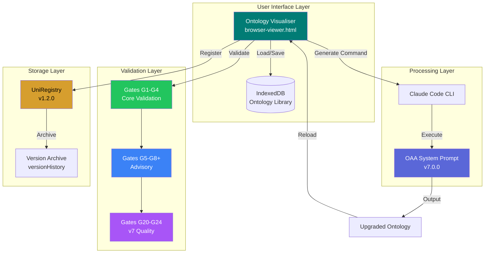
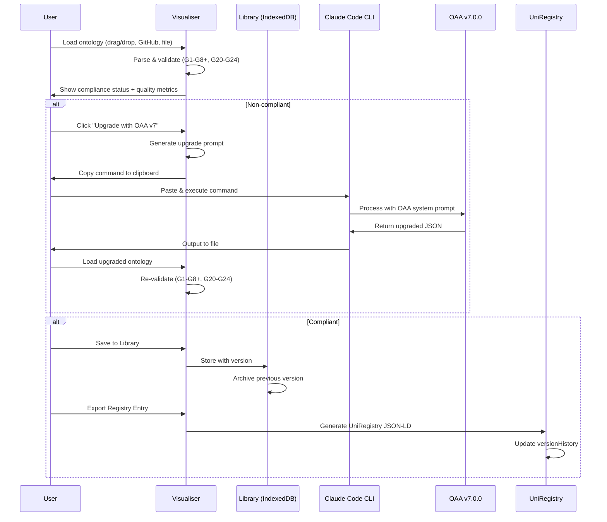
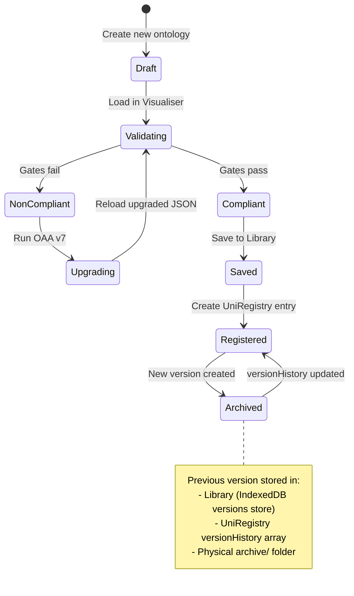

# OAA Ontology Workbench

**Version:** 2.0.0
**Status:** Production
**Last Updated:** 2026-02-21
**OAA Version:** 7.0.0 | **Registry:** v10.0.0

---

## Overview

The **OAA Ontology Workbench** is an integrated toolchain for ontology lifecycle management, combining:

| Component | Purpose | Location |
|-----------|---------|----------|
| **Ontology Visualiser** | Visual inspection, validation, library management | Azlan-EA-AAA |
| **OAA System Prompt v7.0.0** | AI-powered ontology creation and upgrade | Azlan-EA-AAA |
| **Ontology Library** | 45 ontologies (41 active) across 5 series | Azlan-EA-AAA |
| **UniRegistry Schema** | Centralized artifact versioning and audit trail | PF-Core-BAIV |

This integration enables a complete **create → validate → upgrade → archive** workflow for enterprise ontologies.

---

## Architecture



---

## Component Integration

### Data Flow Architecture



---

## Validation Gates

The Workbench enforces **OAA v7.0.0 compliance** through three gate categories:

### Core Gates (G1-G4 — Required for Compliance)

| Gate | Name | Validation |
|------|------|------------|
| **G1** | Schema Structure | Valid JSON-LD with @context, entities array |
| **G2** | Relationship Cardinality | All relationships have domainIncludes/rangeIncludes |
| **G2B** | Entity Connectivity | Every entity participates in ≥1 relationship |
| **G2C** | Graph Connectivity | Single connected component (no islands) |
| **G3** | Business Rules | Rules in IF-THEN format with severity |
| **G4** | Semantic Consistency | No duplicate IDs, valid references |

### Advisory Gates (G5-G8+ — Warnings Only)

| Gate | Name | Recommendation |
|------|------|----------------|
| **G5** | Completeness | Descriptions ≥20 chars, test data coverage |
| **G6** | UniRegistry Format | Registered in UniRegistry with metadata |
| **G7** | Schema Properties | Required entity/relationship props, @id uniqueness |
| **G8** | Naming Conventions | PascalCase entities, camelCase relationships, prefix consistency |
| **G8+** | Style Guide | Full OAA style guide compliance (namespace registry, join patterns) |

### v7 Quality Gates (G20-G24 — Implemented)

| Gate | Name | Category | Feature | Status |
|------|------|----------|---------|--------|
| **G20** | Competency Coverage | Quality | F21.9 | Implemented |
| **G21** | Semantic Duplication Audit | Quality | F21.10 | Implemented |
| **G22** | Cross-Ontology Rule Enforcement | Quality | F21.11 | Implemented |
| **G23** | Lineage Chain Integrity | Quality | F21.15 | Implemented |
| **G24** | Instance Data Quality | Quality (advisory) | F21.18 | Implemented |

### Planned Gates (v8 Kinetic Layer)

| Gate | Name | Category | Status |
|------|------|----------|--------|
| **G9-G14** | CAF/DSPT Domain Gates | Domain | Reserved (Epic 20) |
| **G15** | Action Type Integrity | Kinetic | Planned (v8) |
| **G16** | Interface Resolution | Kinetic | Planned (v8) |
| **G17** | Agent Scope Validity | Kinetic | Planned (v8) |
| **G18** | Derived Property Cross-Ref | Kinetic | Planned (v8) |
| **G19** | Backward Compatibility | Kinetic | Planned (v8) |

> **Gate Registry Authority:** See [ARCH-OAA-V7.md](ARCH-OAA-V7.md) and [ARCH-AUDIT-ENGINE.md](ARCH-AUDIT-ENGINE.md) for full definitions. G1-G8+ and G20-G24 implemented in `audit-engine.js` (1024 tests). v7 quality gates return `skipped` for v6.x ontologies.

```mermaid
graph LR
    subgraph "Core Gates - Must Pass"
        G1[G1: Schema]
        G2[G2: Cardinality]
        G2B[G2B: Connectivity]
        G2C[G2C: Graph]
        G3[G3: Rules]
        G4[G4: Semantic]
    end

    subgraph "Advisory Gates - Recommended"
        G5[G5: Completeness]
        G6[G6: Registry]
        G7[G7: Schema Props]
        G8[G8: Naming + Style]
    end

    subgraph "v7 Quality Gates - Implemented"
        G20[G20: Competency]
        G21[G21: Duplication]
        G22[G22: Cross-Ont Rules]
        G23[G23: Lineage Chain]
        G24[G24: Instance Data]
    end

    G1 --> G2 --> G2B --> G2C --> G3 --> G4
    G4 -.->|Pass all core| PASS[Compliant]
    G4 -.->|Any fail| FAIL[Non-Compliant]

    PASS --> G5 --> G6 --> G7 --> G8
    G8 -.-> G20 --> G21 --> G22 --> G23 --> G24

    style G1 fill:#22c55e,color:#fff
    style G2 fill:#22c55e,color:#fff
    style G2B fill:#22c55e,color:#fff
    style G2C fill:#22c55e,color:#fff
    style G3 fill:#22c55e,color:#fff
    style G4 fill:#22c55e,color:#fff
    style G5 fill:#3b82f6,color:#fff
    style G6 fill:#3b82f6,color:#fff
    style G7 fill:#3b82f6,color:#fff
    style G8 fill:#3b82f6,color:#fff
    style G20 fill:#a855f7,color:#fff
    style G21 fill:#a855f7,color:#fff
    style G22 fill:#a855f7,color:#fff
    style G23 fill:#a855f7,color:#fff
    style G24 fill:#a855f7,color:#fff
```



---

## Version Management Workflow



---

## Step-by-Step Operations

### Operation 1: Validate an Existing Ontology

```
1. Open Visualiser: https://ajrmooreuk.github.io/Azlan-EA-AAA/
2. Load ontology via:
   - Drag & drop JSON file
   - Paste GitHub raw URL
   - Select from Library
3. View "OAA v7.0.0 Compliance" panel
4. Review gate status (✅ pass, ⚠️ warn, ❌ fail)
```

### Operation 2: Upgrade a Non-Compliant Ontology

```
1. Load non-compliant ontology in Visualiser
2. Click "Upgrade with OAA v7" button
3. In modal, click "Copy Command"
4. Open terminal with Claude Code installed
5. Paste and execute:
   claude -p '<prompt>' > ontology-oaa-v5-upgraded.json
6. Wait for Claude to generate upgraded ontology
7. Load output file back into Visualiser
8. Verify all gates pass
```

### Operation 3: Save to Library with Version History

```
1. Load compliant ontology
2. Click "Save to Library"
3. Enter:
   - Name (e.g., "Customer Order Ontology")
   - Category (e.g., "Commerce")
   - Version (auto-incremented if updating)
   - Notes (optional)
4. Click "Save"
5. Previous version auto-archived to versions store
```

### Operation 4: View Version History

```
1. Click "Library" button
2. Find ontology in list
3. Click "History" button
4. View all previous versions with:
   - Version number
   - Archive timestamp
   - Notes
5. Click "Restore" to load any previous version
```

### Operation 5: Create UniRegistry Entry

```
1. Load compliant ontology
2. Export registry entry:
   - Click "Export" → "UniRegistry Entry"
   - Or manually create JSON-LD following schema
3. Include in registry entry:
   - registryMetadata (entryType, name, version, status)
   - artifactDefinition (capabilities, entities, relationships)
   - qualityMetrics (compliance scores, gates passed)
   - versionHistory (empty for new, populated on updates)
4. Save to artifact's registry-entry-v*.jsonld file
```

---

## UniRegistry Schema v1.2.0

The UniRegistry supports full version tracking:

```json
{
  "@context": "https://baiv.co.uk/context/uniregistry/v1",
  "@type": "UniRegistryEntry",
  "@id": "baiv:uniregistry:ontology:example",
  "registryMetadata": {
    "entryType": "ontology",
    "entryId": "Entry-ONT-001",
    "name": "Example Ontology",
    "version": "2.0.0",
    "status": "active"
  },
  "versionHistory": [
    {
      "version": "1.0.0",
      "archivedAt": "2026-01-31T10:00:00Z",
      "archivedBy": "OAA-v7.0.0",
      "registryEntryPath": "archive/registry-entry-v1.0.0.jsonld",
      "artifactPath": "archive/example-ontology-v1.0.0.json",
      "changeReason": "Upgraded to OAA v7.0.0 compliance",
      "qualityMetricsSnapshot": {
        "overallScore": 65,
        "validationStatus": "non-compliant",
        "gatesPassed": 3
      }
    }
  ]
}
```

---

## File Organization

### Recommended Artifact Structure

```
ontology-name/
├── ontology-name-v2.0.0.json           # Current version
├── registry-entry-v2.0.0.jsonld        # Current registry entry
├── glossary-v2.0.0.md                  # Glossary (if applicable)
├── test-data-v2.0.0.json               # Test instances
├── README.md                           # Documentation
└── archive/
    ├── ontology-name-v1.0.0.json       # Archived version
    ├── registry-entry-v1.0.0.jsonld    # Archived registry
    └── upgrade-notes-v1-to-v2.md       # Change documentation
```

---

## Integration Points

### Claude Code CLI Commands

```bash
# Upgrade ontology with inline prompt
claude -p 'You are OAA v7.0.0. Upgrade this ontology...' > output.json

# Upgrade ontology from file
claude -p "Upgrade to OAA v7.0.0 compliance" < input.json > output.json

# Use OAA system prompt file
claude --system-prompt system-prompt.md < input.json  # From oaa-v7/ directory
```

### GitHub Actions Integration

```yaml
# Validate ontologies on PR (oaa-v7-validate.yml)
- name: Validate Ontology
  run: |
    npx vitest run                    # Full test suite (1024 tests)
    node scripts/migrate-v7.mjs      # Dry-run migration (regression check)
    # Fails if any core gate (G1-G4) fails or v7 mandatory fields missing
```

### Programmatic Access (IndexedDB)

```javascript
// Access Library from browser console
const db = await indexedDB.open('OntologyLibrary', 1);
const tx = db.transaction(['ontologies', 'versions'], 'readonly');

// Get all ontologies
const ontologies = await tx.objectStore('ontologies').getAll();

// Get version history for ontology ID
const versions = await tx.objectStore('versions').index('ontologyId').getAll(ontologyId);
```

---

## Naming: OAA Ontology Workbench

Recommended name: **OAA Ontology Workbench**

| Alternative | Pros | Cons |
|-------------|------|------|
| OAA Ontology Workbench | Clear purpose, includes OAA branding | Slightly long |
| Ontology Lifecycle Platform | Descriptive, enterprise-friendly | Doesn't mention OAA |
| OAV Stack | Short, technical | Not self-explanatory |
| OAA Design Studio | Creative, modern | "Design" may be misleading |
| Unified Ontology Manager | Clear scope | Generic |

**Recommendation:** Use "OAA Ontology Workbench" for the integrated toolchain, with component-specific names:
- **OAA Visualiser** - The browser-based viewer
- **OAA Architect** - The Claude-powered upgrade agent
- **UniRegistry** - The version-controlled artifact registry

---

## Roadmap

### Current (v1.0)
- [x] Visualiser with OAA v7.0.0 validation (G1-G8+, G20-G24)
- [x] Claude Code CLI integration for upgrades
- [x] IndexedDB Library with version history
- [x] UniRegistry schema with versionHistory

### Delivered (v1.1 — OAA v7.0.0)
- [x] v7 Quality Gates G20-G24 (competency, duplication, cross-ontology, lineage, instance data)
- [x] CI/CD pipeline (GitHub Actions + pre-commit hook)
- [x] 6-wave migration tool (migrate-v7.mjs)
- [x] Deprecation badges and lifecycle management
- [x] 45 ontologies across 5 series (41 active)

### Planned (v1.2)
- [ ] Direct file write via File System Access API
- [ ] Export to multiple formats (OWL, SKOS)
- [ ] Collaborative editing via Supabase

### Future (v2.0 — OAA v8 Kinetic Layer)
- [ ] Action types, interfaces, derived properties, agent scopes
- [ ] Kinetic layer gates G15-G19
- [ ] Visual ontology editor (drag & drop)
- [ ] Real-time streaming from Claude API

---

## References

| Resource | Path |
|----------|------|
| Ontology Visualiser | `Azlan-EA-AAA/PBS/TOOLS/ontology-visualiser/` |
| OAA System Prompt v7.0.0 | `Azlan-EA-AAA/PBS/AGENTS/oaa-v7/` |
| Ontology Library | `Azlan-EA-AAA/PBS/ONTOLOGIES/ontology-library/` |
| Registry Index | `Azlan-EA-AAA/PBS/ONTOLOGIES/ontology-library/ont-registry-index.json` |
| Test Ontology (non-compliant) | `Azlan-EA-AAA/PBS/TOOLS/ontology-visualiser/test-data/test-non-compliant-ontology.json` |
| UniRegistry Schema v1.2 (PF-Core) | `PF-Core-BAIV/PBS/ARCHITECTURE/unified-register/uniregistry-mvp-v1.0/` |

---

*OAA Ontology Workbench v2.0.0 | OAA v7.0.0 | Be AI Visible Platform*
