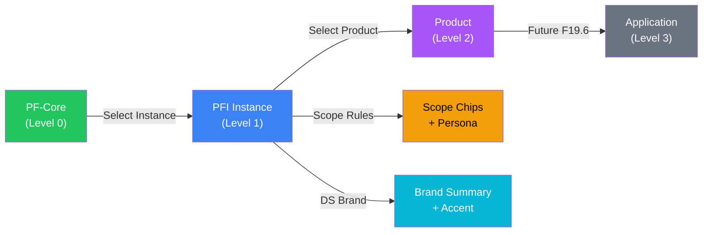

# Release Bulletin: EMC Cascade Navigation Bar

**Date:** 2026-02-23
**Visualiser Version:** 5.4.0
**Scope:** Epic 19, Feature 19.4+ — PFC → PFI → Product → App cascade navigation

---

## What's New

### EMC Cascade Navigation Bar — Always-Visible Hierarchy Selector

The old hidden Core/Instance toggle and instance picker have been replaced by a prominent **EMC Cascade Navigation Bar** that is visible immediately on page load. The bar uses a breadcrumb pattern showing the full EMC hierarchy:

```
[PF-Core]  ›  [Instance ▼]  ›  [Product ▼]  ›  [App]   |  scope-chips  persona-chips   |  DS: brand  tier
```



---

### Feature Summary

| Feature | Description |
|---------|-------------|
| **Always-visible bar** | EMC nav bar appears immediately on page load with PF-Core active — no need to click Load Registry first |
| **4-level cascade** | PFC → PFI → Product → App breadcrumb with dropdown selectors at each active level |
| **PFI dropdown** | Shows all 8 registered instances with scope pills, brand, vertical market, and maturity level |
| **Product selector** | NEW — dropdown populated from selected PFI's `products[]` array. Multi-product instances (e.g., AIRL with CAF-Audit + Cyber-Insurance-Advisory) show all products |
| **Auto-selection** | First product auto-selected on PFI selection (matches existing defaulting behaviour) |
| **Scope chips relocated** | Requirement scope chips and persona chips moved into the nav bar for unified hierarchy context |
| **Brand summary** | Right-aligned summary shows DS brand name and vertical market/tier |
| **Accent bar** | 4px left accent strip coloured by active brand context |
| **App placeholder** | Level 3 greyed out — ready for F19.6 Application-Tier Scope Rules |
| **Breadcrumb reset** | Click any parent level to cascade-reset children (e.g., click PF-Core to return to full graph) |

---

## How to Use

### 1. Page Load (PFC Mode)

The EMC nav bar is visible immediately showing **PF-Core** as the active level. PFI and Product dropdowns are disabled (greyed out).

### 2. Load Registry

Click **Load Registry** — the PFI dropdown enables, showing all 8 registered instances.

### 3. Select Instance

Click the **Instance** dropdown → select a PFI instance (e.g., PFI-BAIV). The bar updates to:

```
[PF-Core]  ›  [BAIV Instance ▼]  ›  [AIV ▼]  ›  [App]   |  PRODUCT  COMPETITIVE  STRATEGIC   |  DS: BAIV-MarTech  AIV | MarTech | PF-Instance
```

The graph filters via EMC composition, DS brand tokens apply, scope chips appear.

### 4. Switch Product

For multi-product instances, click the **Product** dropdown to switch products. Example: AIRL instance shows:
- CAF-Audit
- Cyber-Insurance-Advisory

Selecting a different product recomposes the graph with product-specific scope rules.

### 5. Reset to PFC

Click **PF-Core** in the breadcrumb to reset to the full core graph. All child levels reset.

---

## How to Test

### Prerequisites

- Open visualiser in browser (`browser-viewer.html`)
- Registry must contain `pfiInstances[]` with at least one entry

### Test Checklist

| # | Test | Steps | Expected Result |
|---|------|-------|-----------------|
| 1 | Bar visible on load | Open visualiser | EMC nav bar visible, PF-Core active, PFI/Product/App disabled |
| 2 | PFI enables after registry | Click Load Registry | Instance dropdown becomes clickable |
| 3 | PFI dropdown content | Click Instance dropdown | PF-Core option + 8 instances with scope pills, brand, market, maturity |
| 4 | Instance selection | Select PFI-BAIV | Label shows "BAIV Instance", separator appears, Product enables with "AIV" |
| 5 | Product auto-select | Select PFI-BAIV | Product label shows "AIV" (auto-selected first product) |
| 6 | Multi-product dropdown | Select PFI-AIRL-CAF-AZA, click Product | Shows "CAF-Audit" and "Cyber-Insurance-Advisory" |
| 7 | Product switch | Select Cyber-Insurance-Advisory | Product label updates, graph recomposes |
| 8 | Breadcrumb reset | Click PF-Core | Full graph restored, all child labels reset |
| 9 | Scope chips in bar | Select any PFI | Scope chips appear inside nav bar (not toolbar) |
| 10 | Brand summary | Select PFI-BAIV | Right side shows "DS: BAIV-MarTech" and tier info |
| 11 | Outside click close | Open dropdown, click elsewhere | Dropdown closes |
| 12 | App placeholder | Inspect App button | Greyed out, disabled, italic |

---

## Files Changed

### New Files

| File | Purpose |
|------|---------|
| `tests/emc-nav-bar.test.js` | 39 unit tests for EMC nav bar functions |
| `RELEASE-BULLETIN-EMC-Nav-Bar.md` | This release bulletin |

### Modified Files

| File | Change |
|------|--------|
| `js/state.js` | +`activeProductCode`, +`emcNavLevel` state properties |
| `browser-viewer.html` | +EMC nav bar HTML (4 cascade levels, chips, summary); old context-toggle, instance-picker, context-identity-bar hidden |
| `css/viewer.css` | +~100 lines `.emc-nav-bar` styles (accent, levels, dropdowns, chips, summary) |
| `js/app.js` | +`initEMCNavBar()`, `setEMCLevel()`, `toggleEMCDropdown()`, `selectEMCInstance()`, `selectEMCProduct()` + 10 helpers; wired to `loadRegistry()` + `DOMContentLoaded`; `updateContextBar()` updated |
| `ARCHITECTURE.md` | +EMC Cascade Navigation Bar section, updated module list, version bump |
| `OPERATING-GUIDE.md` | +Workflow 21: EMC Cascade Navigation |

---

## Test Results

| Metric | Before | After |
|--------|--------|-------|
| Test files | 42 | 43 |
| Tests passing | 1380 | 1419 |
| Test failures | 0 | 0 |

---

## Breaking Changes

**None.** The old context-toggle, instance-picker, and context-identity-bar elements remain in the DOM (hidden via `display:none !important`) for backward compatibility. All existing `setContextLevel()`, `selectPFIInstance()`, and `composeMultiCategory()` functions are unchanged — the new EMC nav functions call them as wrappers.

---

## Known Limitations

1. **Product selection is UI-only** — selecting a product updates the `productCode` parameter in `composeMultiCategory()` but scope rules must have `product-match` conditions to filter differently per product. Currently only BAIV has product-specific scope rules.
2. **App level is placeholder** — the Application tier button is disabled pending F19.6 (Application-Tier Scope Rules) and the `ApplicationContext` entity type in EMC v5.1.0.
3. **No product-specific DS tokens** — brand resolution is per-instance, not per-product. All products within an instance share the same DS brand.

---

## What's Next

| Feature | Description |
|---------|-------------|
| F19.6 | Application-Tier Scope Rules — activate Level 3 with `ApplicationContext` entity type and `application-match` conditions |
| F19.7 | Product-specific scope rules for all PFI instances (currently only BAIV) |
| Product DS tokens | Per-product brand token overrides via `productOverrides` in `appSkeletonConfig` |

---

*OAA Ontology Visualiser v5.4.0 — Release Bulletin*
