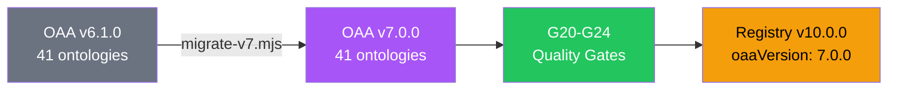
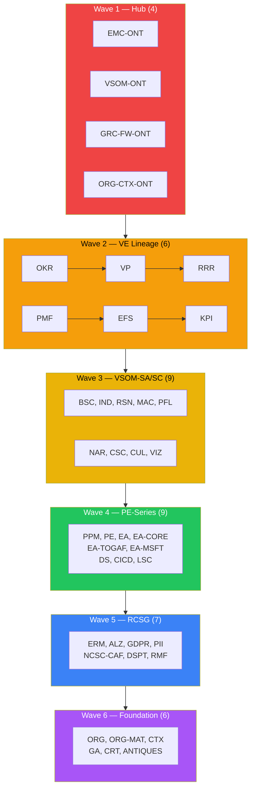

# Release Bulletin: OAA v7.0.0 — Epics 21 & 42

**Date:** 2026-02-21
**Visualiser Version:** 5.0.0
**OAA Version:** 7.0.0
**Registry Version:** 10.0.0
**Scope:** Epic 21 Phase 1.5 (Quality Foundations) + Epic 42 (CI/CD & Migration Pipeline)

---

## What's New

### OAA v7.0.0 — Quality Foundations

All 41 active ontologies have been migrated from OAA v6.1.0 to v7.0.0 with four new mandatory fields and five quality gates.



---

### Epic 21 Phase 1.5 — Quality Gates (8 features, 11/21 total)

| Feature | Gate | Description |
|---------|------|-------------|
| **F21.9** | G20 | Competency question coverage — validates every entity, relationship, and rule is exercised by at least one CQ |
| **F21.10** | G21 | Semantic duplication audit — detects near-duplicate entity descriptions using token-based Jaccard similarity |
| **F21.11** | G22 | Cross-ontology rule enforcement — validates cross-ontology references use known/non-deprecated prefixes |
| **F21.13** | — | Gate numbering reconciliation — authoritative G1-G24 registry with no conflicts |
| **F21.15** | G23 | Lineage chain integrity — validates upstream/downstream references in VE, PE, GRC chains |
| **F21.16** | — | Schema evolution policy — MAJOR/MINOR/PATCH versioning + deprecation lifecycle |
| **F21.17** | G8+ | Cross-series consistency — style guide, namespace registry, join pattern registry |
| **F21.18** | G24 | Instance data quality — schema conformance, 60-20-10-10 distribution, CQ-test linkage |
| **F21.19** | — | Join pattern registry — 82 cross-ontology join patterns validated |

### Epic 42 — CI/CD & Migration Pipeline (4 features, all complete)

| Feature | Description |
|---------|-------------|
| **F42.1** | GitHub Actions workflow (`oaa-v7-validate.yml`) + pre-commit hook |
| **F42.2** | 6-wave migration executed — all 41 ontologies upgraded |
| **F42.3** | Registry bumped to v10.0.0 / OAA 7.0.0 + v7 agent prompt created |
| **F42.4** | Migration runbook + training documentation |

---

## v7 Mandatory Fields

Every ontology artifact now contains:

```json
{
  "oaa:schemaVersion": "7.0.0",
  "oaa:ontologyId": "VSOM-ONT",
  "oaa:series": "VE-Series",
  "competencyQuestions": [
    {
      "@id": "CQ-001",
      "question": "What is the role and purpose of Vision within this ontology?",
      "targetEntities": ["vsom:Vision"],
      "targetRelationships": [],
      "targetRules": []
    }
  ]
}
```

---

## Deprecation Badges

The library panel now renders status-specific badges for all ontology statuses:

| Status | Badge Colour | Border | Opacity |
|--------|-------------|--------|---------|
| `compliant` | Green | Solid | 100% |
| `deprecated` | Amber | Dashed amber | 65% |
| `superseded` | Amber-gold | Dashed amber | 65% |
| `placeholder` | Brown | Dashed brown | 70% |
| `proposal` | Blue | Solid blue | 100% |

Deprecated and superseded entries show their deprecation reason beneath the namespace.

---

## Migration Waves



---

## Quality Gate Results

All 41 active ontologies pass G20-G24 with the following aggregate metrics:

| Gate | Status | Notes |
|------|--------|-------|
| G20: Competency Coverage | warn | Skeleton CQs generated — requires manual refinement for full coverage |
| G21: Semantic Duplication | pass | No duplicates detected above 90% threshold |
| G22: Cross-Ontology Rules | pass | All cross-refs use known prefixes |
| G23: Lineage Chain Integrity | pass/skip | Lineage-aware ontologies have valid up/downstream refs |
| G24: Instance Data Quality | warn/skip | Advisory — most ontologies lack test data instances |

---

## CI/CD Pipeline

### GitHub Actions (`oaa-v7-validate.yml`)

Triggers on:
- PRs modifying `PBS/ONTOLOGIES/ontology-library/**/*.json`
- Pushes to `main` with ontology changes
- Manual dispatch

Validates:
1. Full vitest suite (1024 tests)
2. Migration dry-run (regression detection)
3. Registry version check (7.0.0)
4. Schema lint (v7 mandatory fields)

### Pre-Commit Hook (`pre-commit-v7-check.sh`)

Install:
```bash
cp PBS/TOOLS/ontology-visualiser/scripts/pre-commit-v7-check.sh .git/hooks/pre-commit
```

Blocks commits with ontology files missing v7 mandatory fields.

---

## Files Changed

### New Files

| File | Purpose |
|------|---------|
| `PBS/AGENTS/oaa-v7/system-prompt.md` | OAA v7 agent prompt (546 lines) |
| `PBS/ONTOLOGIES/OAA-SCHEMA-EVOLUTION-POLICY.md` | Versioning & deprecation policy |
| `PBS/ONTOLOGIES/OAA-V7-MIGRATION-RUNBOOK.md` | Operator migration guide |
| `.github/workflows/oaa-v7-validate.yml` | CI/CD validation pipeline |
| `scripts/pre-commit-v7-check.sh` | Git pre-commit hook |
| `tests/gates-v7-batch3.test.js` | G24 TDD tests (13 tests) |
| `ARCH-OAA-V7.md` | v7 architecture document |

### Modified Files

| File | Change |
|------|--------|
| 41 ontology JSON files | +v7 mandatory fields + competency questions |
| `ont-registry-index.json` | v9.5.0 → v10.0.0, oaaVersion 6.1.0 → 7.0.0 |
| `js/audit-engine.js` | +validateG24InstanceDataQuality |
| `scripts/migrate-v7.mjs` | Fixed version upgrade logic + wave definitions |
| `js/app.js` | Deprecation badge rendering, series metrics |
| `css/viewer.css` | Deprecated/superseded/proposal badge styles |
| `.github/workflows/pages.yml` | Added oaa-v7 path trigger |
| `ARCH-AUDIT-ENGINE.md` | Added G24, updated test count + diagrams |

---

## Commits

| SHA | Description |
|-----|-------------|
| `7eab5ec` | Wave 1 migration (EMC, VSOM, GRC-FW, ORG-CONTEXT) |
| `a410961` | Waves 2-6 migration (37 ontologies) |
| `b36ae8c` | Wave definition fix |
| `ff9635b` | Registry bump v10.0.0 / OAA 7.0.0 |
| `9397b52` | OAA v7 agent system prompt |
| `590dc01` | Schema evolution policy + deprecation badges |
| `5a11bca` | G24 Instance Data Quality gate (TDD) |
| `33c0680` | CI/CD pipeline + pre-commit hook |
| `4929288` | Migration runbook |

---

## Test Results

| Metric | Before | After |
|--------|--------|-------|
| Test files | 34 | 35 |
| Tests passing | 999 | 1024 |
| Test failures | 0 | 0 |
| Gate coverage | G1-G23 | G1-G24 |

---

## Breaking Changes

**None.** OAA v7.0.0 is fully backward compatible. v6.x ontologies continue to work without modification. All v7 gates return `skipped` for v6 ontologies.

---

## Known Limitations

1. **Skeleton CQs** — competency questions are auto-generated placeholders (1 per entity). They require manual refinement for meaningful coverage validation.
2. **G24 advisory** — Instance data quality is advisory-only and never blocks compliance. Most ontologies lack formal test data files.
3. **G15-G19 planned** — Kinetic layer gates deferred to v8.

---

## What's Next (v8 Roadmap)

| Feature | Description |
|---------|-------------|
| Action Types | Declare permissible mutations per ontology |
| Interfaces | Cross-series polymorphism system |
| Derived Properties | Computed fields from entity relationships |
| Agent Scopes | Role-based action bindings with audit trail |
| G15-G19 | Kinetic layer compliance gates |
