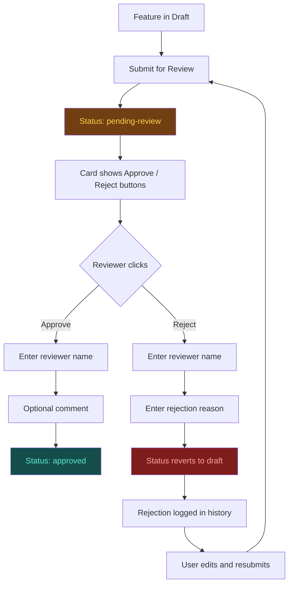

# Release Bulletin — Epic 8C: Feature Backlog Manager + AI Quick Capture + HITL Approval

**Version:** 5.0.0
**Date:** February 2026
**Branch:** `main`

---

## Summary

Epic 8C adds a full Feature Backlog Manager to the OAA Visualiser with four views (Overview, Daily Review, Weekly Sprint, Priority Matrix), IndexedDB-backed feature and epic CRUD, AI-assisted Quick Capture via Claude CLI, and a Human-In-The-Loop (HITL) approval gate with reviewer name, comments, and rejection audit trail.

---

## Quick Capture Workflow


## Feature Status Lifecycle

```mermaid
stateDiagram-v2
    [*] --> draft : Create / Quick Capture
    draft --> pending_review : Submit for Review
    pending_review --> approved : Approve (reviewer)
    pending_review --> draft : Reject (with reason)
    approved --> proposed : Propose
    proposed --> prioritised : Prioritise into Epic
    prioritised --> in_progress : Start Work
    in_progress --> done : Complete
    done --> archived : Archive

    state draft {
        direction LR
    }

    note right of pending_review
        Reviewer enters name + comment
        Rejection logs to audit trail
    end note
```

## HITL Approval Flow



---

## New Features

### Feature Backlog Manager (Base)
- **Backlog Panel** — slide-out drawer with 4 view tabs (Overview, Daily, Weekly, Priority)
- **Feature CRUD** — create, edit, delete features with title, category, epic assignment, user story, acceptance criteria, value/significance scores, status, tags, notes
- **Epic CRUD** — create, edit, delete epics to group features
- **Value x Significance Priority** — computed score (1-25) with 5 bands: Low, Medium, High, Very High, Critical
- **5x5 Priority Matrix** — visual CSS Grid showing features positioned by value vs significance
- **Daily Review** — focus features, blockers, sprint goal, quick status toggles
- **Weekly Sprint** — drag-reorder features, sprint goal, weekly notes, collapsible epic groups
- **Import/Export** — JSON and Markdown export, JSON/Markdown import
- **Search & Filter** — real-time text search across feature titles and descriptions

### AI Quick Capture
- **Quick Capture button** (purple) in the backlog action bar
- **Brief idea textarea** — user types 1-3 sentences describing a feature
- **Prompt builder** — `buildFeaturePrompt()` constructs a structured Claude CLI prompt requesting JSON output with title, description, category, user story, acceptance criteria, value/significance scores, tags, and notes
- **Copy-paste CLI pattern** — matches the existing `showOAAModal()` pattern; no API keys required
- **JSON paste-back** — user pastes Claude's JSON output; validated and parsed into a feature record
- **Pre-filled form** — feature form opens with all fields populated for review/editing
- **AI tag** — features generated via Claude show a small "AI" badge in cards

### HITL Approval Gate
- **Submit for Review** button in the feature form (visible when status is `draft`)
- **pending-review status** — amber/gold badge, review banner with Approve/Reject buttons on feature cards
- **Approve** — prompts for reviewer name + optional comment; sets status to `approved` (teal/cyan badge)
- **Reject** — prompts for reviewer name + mandatory reason; reverts to `draft` and logs rejection to audit trail
- **Rejection history** — visible in the feature form as a timeline with reviewer, date, and reason
- **Approval info** — approved features show reviewer name, date, and comment in the form

---

## Data Model

### Feature Record
```js
{
  id: Number,                     // auto-increment PK
  title: String,                  // feature title
  description: String,            // detailed description
  category: String,               // 'ontology' | 'visualiser' | 'toolkit' | 'workbench'
  epicId: Number | null,          // FK to epic
  userStory: String,              // As a [role], I want...
  acceptanceCriteria: String[],   // Given/When/Then items
  valueScore: Number,             // 1-5
  significanceScore: Number,      // 1-5
  computedPriority: Number,       // valueScore * significanceScore (1-25)
  status: String,                 // draft | pending-review | approved | proposed | prioritised | in-progress | done | archived
  tags: String[],
  notes: String,
  dailyFocus: Boolean,
  blockerReason: String | null,

  // AI Capture metadata
  generatedBy: String | null,     // 'claude-cli' | 'manual' | null
  captureInput: String | null,    // original brief text the user typed

  // Review / HITL fields
  reviewerName: String | null,    // who approved/rejected
  reviewComment: String | null,   // approval or rejection comment
  reviewedAt: String | null,      // ISO timestamp of review action
  rejectionHistory: Array,        // [{reviewer, comment, timestamp}]

  created: String,                // ISO timestamp
  updated: String,                // ISO timestamp
}
```

### Priority Bands
| Score Range | Band | CSS Class | Colour |
|-------------|------|-----------|--------|
| 1-5 | Low | `low` | Green |
| 6-10 | Medium | `medium` | Yellow |
| 11-15 | High | `high` | Orange |
| 16-20 | Very High | `very-high` | Red-orange |
| 21-25 | Critical | `critical` | Red |

---

## Technical Details

### Storage Architecture
| Data | Storage | Reason |
|------|---------|--------|
| Features | IndexedDB (`backlog-features`) | Structured records with indexes |
| Epics | IndexedDB (`backlog-epics`) | Structured records with indexes |
| Review state (sprint goal, weekly notes) | localStorage | Lightweight key-value |
| Saved selections | localStorage | Lightweight key-value |

### IndexedDB Schema (v3)
| Store | Key | Indexes |
|-------|-----|---------|
| `backlog-features` | `id` (auto) | `epicId`, `status`, `category`, `computedPriority`, `updated` |
| `backlog-epics` | `id` (auto) | `status`, `sortOrder` |

### New/Modified Modules
- **`js/backlog-manager.js`** (new) — Feature/Epic CRUD, `computePriority`, `buildPriorityMatrix`, `buildFeaturePrompt`, `submitForReview`, `approveFeature`, `rejectFeature`, JSON/Markdown export/import
- **`js/backlog-ui.js`** (new) — Panel rendering, 4 view renderers, feature/epic forms, Quick Capture modals, HITL review actions, drag-reorder, search/filter
- **`js/state.js`** — 8 backlog state properties, `DB_VERSION` 2→3, `FEATURE_STATUSES`, `FEATURE_CATEGORIES`, `PRIORITY_BANDS`, `EPIC_STATUSES`
- **`js/library-manager.js`** — `backlog-features` + `backlog-epics` stores in `onupgradeneeded`
- **`js/app.js`** — Imports both backlog modules, 36 window bindings
- **`browser-viewer.html`** — Backlog panel, Feature/Epic/Import/Quick Capture/Paste modals
- **`css/viewer.css`** — Full backlog styling (panel, cards, badges, matrix, review banner, capture inputs)

### New HTML Elements
| ID | Purpose |
|----|---------|
| `#backlog-panel` | Slide-out backlog drawer |
| `#feature-form-modal` | Feature create/edit form |
| `#epic-form-modal` | Epic create/edit form |
| `#import-backlog-modal` | JSON/Markdown import |
| `#capture-modal` | Quick Capture brief idea entry |
| `#capture-paste-modal` | Paste Claude CLI JSON output |
| `#capture-prompt-overlay` | Generated CLI command display |
| `#feature-review-section` | Review info, rejection history, submit button |

---

## Test Coverage

| Test File | Tests | Status |
|-----------|-------|--------|
| Existing tests (13 files) | 383 | 382 pass, 1 pre-existing failure |
| **Total** | **384** | **383 pass** |

The pre-existing failure is `detectCrossReferences > skips placeholder ontologies` — unrelated to Epic 8C.

---

## Files Changed

| File | Change Type |
|------|-------------|
| `js/backlog-manager.js` | **New** — Data layer (503 lines) |
| `js/backlog-ui.js` | **New** — UI layer (1042 lines) |
| `js/state.js` | Modified — Backlog state + constants |
| `js/library-manager.js` | Modified — IndexedDB v3 stores |
| `js/app.js` | Modified — Imports + 36 window bindings |
| `browser-viewer.html` | Modified — Panel + 5 modals + review section |
| `css/viewer.css` | Modified — ~120 lines of backlog styles |
| `RELEASE-BULLETIN-Epic-8C.md` | **New** — This file |

---

## Access

**URL:** https://ajrmooreuk.github.io/Azlan-EA-AAA/PBS/TOOLS/ontology-visualiser/browser-viewer.html

Click **Backlog** in the top toolbar to open the panel.
