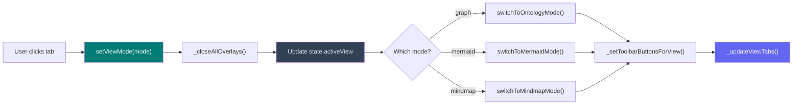

# Release Bulletin — Centralised View Switcher & Mindmap Bug Fixes

**Version:** 5.1.0
**Date:** February 2026
**Branch:** `main`

---

## Summary

This release introduces a centralised view switcher that replaces three scattered toggle buttons with a single segmented button group [Graph] [Mermaid] [Mindmap] at the top of the toolbar. All view transitions now flow through one `setViewMode()` function that handles container visibility, overlay cleanup, toolbar button management, and tab highlighting. Three mindmap-related bugs are also fixed.

---

## View Switcher Architecture



---

## New Features

### Segmented View Tabs
- **Three-button tab group** at the toolbar start: Graph, Mermaid, Mindmap
- **Active tab highlighting** — teal accent colour on the selected tab
- **One-click switching** — clicking a tab immediately transitions to that view
- **Auto-export** — switching to Mermaid tab auto-exports the loaded ontology if available

### Centralised `setViewMode()` Function
- **Single entry point** for all view transitions — replaces 6 scattered toggle functions
- **`_closeAllOverlays()`** — automatically closes sidebar, audit panel, mermaid editor, and mindmap properties on every view switch
- **`_setToolbarButtonsForView(mode)`** — shows/hides view-specific toolbar buttons (audit, sidebar, physics, layout for graph; editor, fit for mermaid)
- **`_updateViewTabs(mode)`** — toggles `.active` class on the segmented button group
- **Canonical state** — `state.activeView` ('graph' | 'mermaid' | 'mindmap') is the single source of truth; `mermaidMode`/`mindmapMode` booleans are derived from it

### Mindmap Empty-State Hint
- Visual placeholder ("Double-click to add your first node") shown when mindmap canvas is empty
- Auto-hides when the first node is added
- Auto-shows when all nodes are cleared

---

## Bug Fixes

### Properties Panel Stuck on Home Screen
- **Problem:** The `#mindmap-properties-panel` was a sibling of `#mindmap-container` instead of a child. When mindmap mode was off (container hidden), the panel remained visible on the home screen.
- **Fix:** Moved the properties panel HTML inside `#mindmap-container` so it is hidden/shown with the container.

### Mindmap Toggle Returned Blank Screen
- **Problem:** `switchFromMindmapMode()` did not restore the drop-zone when no ontology was loaded, leaving a blank white screen.
- **Fix:** Added drop-zone style/class restoration when `state.lastParsed` is falsy.

### Sidebar Overlaying Mindmap Canvas
- **Problem:** `switchToMindmapMode()` did not close the main `#sidebar` (z-index: 5) which sat on top of `#mindmap-container` (z-index: 1), preventing interaction with mindmap nodes.
- **Fix:** Now handled by `_closeAllOverlays()` which runs on every view switch.

---

## State Changes

### Added
| Property | Type | Purpose |
|----------|------|---------|
| `state.activeView` | `'graph' \| 'mermaid' \| 'mindmap'` | Canonical view mode — single source of truth |

### Removed
| Property | Reason |
|----------|--------|
| `state.previousViewMode` | No longer needed — `state.viewMode` is never overwritten by view switches |

### Unchanged (Backward-Compat)
| Property | Notes |
|----------|-------|
| `state.mermaidMode` | Kept as derived boolean, set by `setViewMode()` |
| `state.mindmapMode` | Kept as derived boolean, set by `setViewMode()` |
| `state.viewMode` | Unchanged — still tracks `'single'` / `'multi'` for graph mode |

---

## Technical Details

### Toolbar Changes
| Element | Action |
|---------|--------|
| `#view-tabs` (new) | Segmented button group with 3 `<button class="view-tab">` elements |
| `btn-mermaid-view` | **Removed** — replaced by Mermaid tab |
| `btn-mindmap` | **Removed** — replaced by Mindmap tab |
| `btn-mermaid-editor` | Kept — shown only in mermaid mode by `_setToolbarButtonsForView()` |
| `btn-mermaid-fit` | Kept — shown only in mermaid mode by `_setToolbarButtonsForView()` |

### CSS Additions
```css
.view-tabs    /* inline-flex container, gap: 0 */
.view-tab     /* individual tab button */
.view-tab:first-child   /* left rounded corner */
.view-tab:last-child     /* right rounded corner */
.view-tab:hover          /* highlight on hover */
.view-tab.active         /* teal accent for selected tab */
.mindmap-empty-hint      /* empty-state placeholder in mindmap canvas */
```

### Functions Added to `app.js`
| Function | Purpose |
|----------|---------|
| `setViewMode(mode)` | Centralised view transition — the single entry point |
| `_closeAllOverlays()` | Close sidebar, audit, mermaid editor, mindmap properties |
| `_setToolbarButtonsForView(mode)` | Show/hide view-specific toolbar buttons |
| `_updateViewTabs(mode)` | Toggle `.active` class on tab group |
| `switchToGraphTab()` | Window handler — delegates to `setViewMode('graph')` |
| `switchToMermaidTab()` | Window handler — auto-exports ontology, then `setViewMode('mermaid')` |
| `switchToMindmapTab()` | Window handler — delegates to `setViewMode('mindmap')` |

### Functions Simplified
| Function | File | Changes |
|----------|------|---------|
| `switchToMermaidMode()` | `mermaid-viewer.js` | Stripped toolbar manipulation; now only sets container visibility + state |
| `switchToOntologyMode()` | `mermaid-viewer.js` | Stripped toolbar restoration + `previousViewMode` logic |
| `switchToMindmapMode()` | `mindmap-canvas.js` | Stripped toolbar manipulation + sidebar/audit close (moved to central) |
| `switchFromMindmapMode()` | `mindmap-canvas.js` | Stripped toolbar restoration; added drop-zone restore |

---

## Test Coverage

| Test File | Tests | Status |
|-----------|-------|--------|
| `mermaid-viewer.test.js` | Updated | `activeView` assertions replace `previousViewMode` |
| `mindmap-canvas.test.js` | Updated | `activeView` assertions replace `viewMode` overwrite tests |
| All tests (13 files) | 632 | 631 pass, 1 pre-existing failure |

The pre-existing failure is `detectCrossReferences > skips placeholder ontologies` — unrelated to this release.

---

## Files Changed

| File | Change Type |
|------|-------------|
| `browser-viewer.html` | Modified — view-tabs group, removed old buttons, moved properties panel, added empty hint |
| `css/viewer.css` | Modified — `.view-tabs`, `.view-tab`, `.mindmap-empty-hint` styles |
| `js/app.js` | Modified — `setViewMode()` + 6 helper functions, refactored toggles |
| `js/state.js` | Modified — added `activeView`, removed `previousViewMode` |
| `js/mermaid-viewer.js` | Modified — stripped toolbar manipulation from switch functions |
| `js/mindmap-canvas.js` | Modified — stripped toolbar manipulation, added empty hint helpers, drop-zone restore |
| `tests/mermaid-viewer.test.js` | Modified — `activeView` assertions |
| `tests/mindmap-canvas.test.js` | Modified — `activeView` assertions |
| `RELEASE-BULLETIN-ViewSwitcher.md` | **New** — This file |

---

## Access

**URL:** https://ajrmooreuk.github.io/Azlan-EA-AAA/PBS/TOOLS/ontology-visualiser/browser-viewer.html

The segmented [Graph] [Mermaid] [Mindmap] tabs are visible at the top-left of the toolbar.
